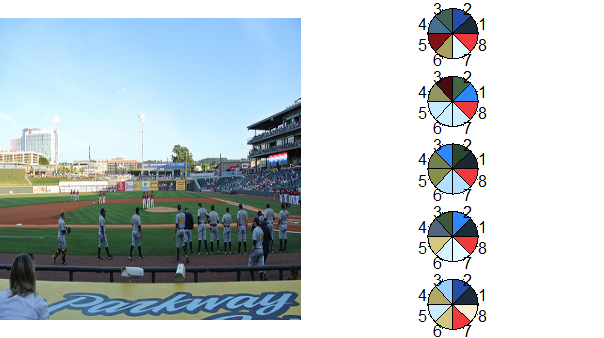

```{r echo=F, warning= F, message=F, cache = F}
require(knitr)
require(shiny)

opts_chunk$set(
  message = FALSE,
  warning = FALSE,
  error = FALSE,
  tidy = FALSE,
  cache = FALSE,
  results = 'asis',
  fig.keep='all',
  fig.width = 10,
  fig.height = 6
)
```

<style>
.container { width: 750px; }

body{
  font-family: 'Oxygen', sans-serif;
  font-size: 16px;
  line-height: 24px;
}

h1,h2,h3,h4 {
  font-family: 'Raleway', sans-serif;
}

h3 {
  background-color: #D4DAEC;
  text-indent: 100px; 
}

h4 {
  text-indent: 100px;
}
</style>

<a href="https://github.com/timelyportfolio/rCharts_dimple"></a>


# Palette of Colors from Image %>% ggplot2 %>% rCharts + dimple.js

The five purposes of this post/experiment are not really related, but I figured it would be an interesting challenge to combine them.

- Highlight the great blog [MetaEvoPhyloEcoOmics](http://www.mepheoscience.com/) from [Russell Dinnage](http://www.mepheoscience.com/aboutme/)
- Explore the new world of color in R provided by [Jo-Fai Chow](http://www.jofaichow.co.uk/) through [`rPlotter`](http://github.com/woodbe/rPlotter)
- Continue Experimenting with [`magrittr`](http://github.com/smbache/magrittr)
- Examine `ggplot_build` as proposed by [Carson Sievert](http://cpsievert.github.io/cv.html) in [Visualizing ggplot2 internals with shiny and D3](http://cpsievert.github.io/2014/06/visualizing-ggplot2-internals-with-shiny-and-d3/)
- Test the use of alternate colors in [`rCharts`](http://rcharts.io) and [`dimple.js`](http://dimplejs.org)


## Color From Image

In the [MetaEvoPhyloEcoOmics](http://www.mepheoscience.com/) blog post [Colourful Ecology Part 1: Selecting colours for scientific figures from an image using community ecology methods](http://www.mepheoscience.com/colourful-ecology-part-1-extracting-colours-from-an-image-and-selecting-them-using-community-phylogenetics-theory/), we learn how to use [`rPlotter`](http://github.com/woodbe/rPlotter) from [Jo-Fai Chow](http://www.jofaichow.co.uk/) to get color palettes from an image in R.  The code below is almost an exact copy except I use a little [`magrittr`](http://github.com/smbache/magrittr) and instead choose an image from a recent Birmingham Barons Minor League Baseball game for my color seed.

```{r eval=F}
# attribution belongs to
# the wonderful blog www.mepheoscience.com
# Colourful Ecology Part 1
# with solid contributions from Jo-Fai Chow
# http://blenditbayes.blogspot.co.uk/2014/05/towards-yet-another-r-colour-palette.html
# https://github.com/woobe/rPlotter

# to get started we will need
# devtools::install_github("woobe/rPlotter")

library(rPlotter)
library(magrittr)

## get 5 best 6 colour palettes for MPD
## code copied almost exactly from www.mepheoscience.com
## only change is to use magrittr in pieces
"https://farm6.staticflickr.com/5153/14226682300_849ec58f3f_d.jpg" %T>%
  assign("path",.,pos=globalenv()) %>%
  extract_colours(256, 200) %>%
  mpd_select_colours(
    sat.thresh = 0.3
    , dark.thresh = 0.1
    , ncolours = 8
    , nreturn = 5
  ) -> newpal

## plot palettes
photo <- readImage( path )
h <- split.screen(c(1,2))
par(mar = c(0,0,0,0)) # set zero margins on all 4 sides
plot(x = NULL, y = NULL, xlim = c(0,1500), ylim = c(0,1500), pch = '',
     xaxt = 'n', yaxt = 'n', xlab = '', ylab = '', xaxs = 'i', yaxs = 'i',
     bty = 'n', asp=1) # plot empty figure
rasterImage(photo, xleft = 0, ybottom = 0, xright = 1500, ytop = 1500) # plot jpeg
screen(2)
par(mar=c(0,0,0,0))
h <- split.screen(c(5,1))
for (i in 1:length(newpal)) {
  screen(2+i)
  pie(rep(1, length(newpal[[i]])), col = newpal[[i]])
}
```



### ggplot2 Does Everything But the Plotting

I discussed in my post [I Want ggplot2/lattice and d3 (gridSVG–The Glue)](http://timelyportfolio.blogspot.com/2013/08/gridsvganother-glue-for-r-to-svg.html) what I thought were the three types of glue between R and interactive graphics.  When I read [Carson Sievert's](http://cpsievert.github.io/cv.html) post [Visualizing ggplot2 internals with shiny and D3](http://cpsievert.github.io/2014/06/visualizing-ggplot2-internals-with-shiny-and-d3/), I realized there is a 4th glue that combines 1 & 2.  In this next bit of code, we'll build a `ggplot2` density plot (for fun from the `lattice` documentation) and pass the data into `rCharts` to plot with `dimple.js`.  Then to tie it together, we will use our new color palette from above.  You might notice a little bit of `afterScript` that helps solve a minor axis issue that bothers me with `dimple.js`.


--- .RAW

```{r}
# combine lattice docs example with ggplot2 for sample density plot
# use chains from magrittr as a continuation of experiment
library(dplyr)
library(rCharts)

singer %>%
  ggplot( data = ., aes( x = height, colour = voice.part ) ) %>%
    + geom_density() %T>% print %>%
  ggplot_build %>% extract2(1) %>% extract2(1) %>%
  mutate( "voice.part" = levels(singer$voice.part)[group], "x" = round(x,2) ) %>%
  select( x, density, voice.part ) %>%
  dPlot(
    data = .
    , y = "density"
    , x = "x"
    , groups = "voice.part"
    , type = "line"
    , height = 400
    , width = 600
    , yAxis = list(outputFormat = ".1%")
  ) %T>%
  .$set(defaultColors = newpal[[5]]) %T>%
  .$setTemplate(afterScript = "
<script>
{{chartId}}[0].axes[0].shapes.call(
  d3.svg.axis()
    .orient('bottom')
    .scale(d3.scale.linear()
      .range(d3.extent({{chartId}}[0].axes[0]._scale.range()))
      .domain(d3.extent(
        {{chartId}}[0].axes[0]._scale.domain()
          .splice(0,{{chartId}}[0].axes[0]._scale.domain().length-1))
      )
    )
    .ticks(5)
 )
{{chartId}}[0].svg.append('text')
  .style('font-size','150%')
  .attr('x',20)
  .attr('y',20)
  .text('rCharts + dimple.js with ggplot2 data')
</script>
") -> dp
```

```{r echo = F}
paste0(noquote(capture.output(dp$show("inline"))),collapse="\n") %>% HTML %>% print
```
