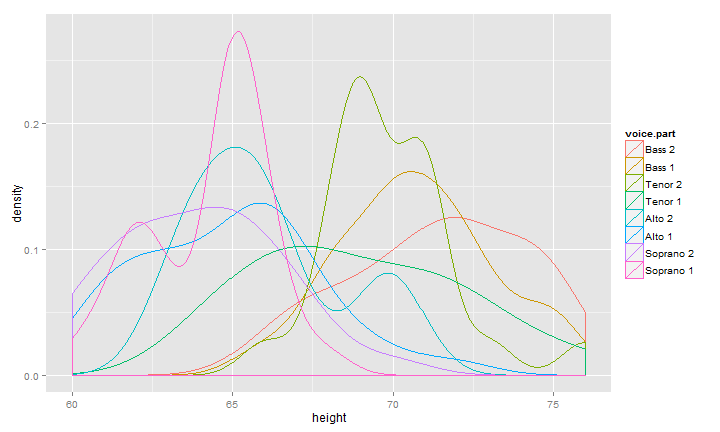

<style>
.container { width: 750px; }

body{
  font-family: 'Oxygen', sans-serif;
  font-size: 16px;
  line-height: 24px;
}

h1,h2,h3,h4 {
  font-family: 'Raleway', sans-serif;
}

h3 {
  background-color: #D4DAEC;
  text-indent: 100px; 
}

h4 {
  text-indent: 100px;
}
</style>

<a href="https://github.com/timelyportfolio/rCharts_dimple"></a>


# Palette of Colors from Image %>% ggplot2 %>% rCharts + dimple.js

The five purposes of this post/experiment are not really related, but I figured it would be an interesting challenge to combine them.

- Highlight the great blog [MetaEvoPhyloEcoOmics](http://www.mepheoscience.com/) from [Russell Dinnage](http://www.mepheoscience.com/aboutme/)
- Explore the new world of color in R provided by [Jo-Fai Chow](http://www.jofaichow.co.uk/) through [`rPlotter`](http://github.com/woodbe/rPlotter)
- Continue Experimenting with [`magrittr`](http://github.com/smbache/magrittr)
- Examine `ggplot_build` as proposed by [Carson Sievert](http://cpsievert.github.io/cv.html) in [Visualizing ggplot2 internals with shiny and D3](http://cpsievert.github.io/2014/06/visualizing-ggplot2-internals-with-shiny-and-d3/)
- Test the use of alternate colors in [`rCharts`](http://rcharts.io) and [`dimple.js`](http://dimplejs.org)


## Color From Image

In the [MetaEvoPhyloEcoOmics](http://www.mepheoscience.com/) blog post [Colourful Ecology Part 1: Selecting colours for scientific figures from an image using community ecology methods](http://www.mepheoscience.com/colourful-ecology-part-1-extracting-colours-from-an-image-and-selecting-them-using-community-phylogenetics-theory/), we learn how to use [`rPlotter`](http://github.com/woodbe/rPlotter) from [Jo-Fai Chow](http://www.jofaichow.co.uk/) to get color palettes from an image in R.  The code below is almost an exact copy except I use a little [`magrittr`](http://github.com/smbache/magrittr) and instead choose an image from a recent Birmingham Barons Minor League Baseball game for my color seed.


```r
# attribution belongs to
# the wonderful blog www.mepheoscience.com
# Colourful Ecology Part 1
# with solid contributions from Jo-Fai Chow
# http://blenditbayes.blogspot.co.uk/2014/05/towards-yet-another-r-colour-palette.html
# https://github.com/woobe/rPlotter

# to get started we will need
# devtools::install_github("woobe/rPlotter")

library(rPlotter)
library(magrittr)

## get 5 best 6 colour palettes for MPD
## code copied almost exactly from www.mepheoscience.com
## only change is to use magrittr in pieces
"https://farm6.staticflickr.com/5153/14226682300_849ec58f3f_d.jpg" %T>%
  assign("path",.,pos=globalenv()) %>%
  extract_colours(256, 200) %>%
  mpd_select_colours(
    sat.thresh = 0.3
    , dark.thresh = 0.1
    , ncolours = 8
    , nreturn = 5
  ) -> newpal

## plot palettes
photo <- readImage( path )
h <- split.screen(c(1,2))
par(mar = c(0,0,0,0)) # set zero margins on all 4 sides
plot(x = NULL, y = NULL, xlim = c(0,1500), ylim = c(0,1500), pch = '',
     xaxt = 'n', yaxt = 'n', xlab = '', ylab = '', xaxs = 'i', yaxs = 'i',
     bty = 'n', asp=1) # plot empty figure
rasterImage(photo, xleft = 0, ybottom = 0, xright = 1500, ytop = 1500) # plot jpeg
screen(2)
par(mar=c(0,0,0,0))
h <- split.screen(c(5,1))
for (i in 1:length(newpal)) {
  screen(2+i)
  pie(rep(1, length(newpal[[i]])), col = newpal[[i]])
}
```


### ggplot2 Does Everything But the Plotting

I discussed in my post [I Want ggplot2/lattice and d3 (gridSVG–The Glue)](http://timelyportfolio.blogspot.com/2013/08/gridsvganother-glue-for-r-to-svg.html) what I thought were the three types of glue between R and interactive graphics.  When I read [Carson Sievert's](http://cpsievert.github.io/cv.html) post [Visualizing ggplot2 internals with shiny and D3](http://cpsievert.github.io/2014/06/visualizing-ggplot2-internals-with-shiny-and-d3/), I realized there is a 4th glue that combines 1 & 2.  In this next bit of code, we'll build a `ggplot2` density plot (for fun from the `lattice` documentation) and pass the data into `rCharts` to plot with `dimple.js`.  Then to tie it together, we will use our new color palette from above.  You might notice a little bit of `afterScript` that helps solve a minor axis issue that bothers me with `dimple.js`.


--- .RAW


```r
# combine lattice docs example with ggplot2 for sample density plot
# use chains from magrittr as a continuation of experiment
library(dplyr)
library(rCharts)

singer %>%
  ggplot( data = ., aes( x = height, colour = voice.part ) ) %>%
    + geom_density() %T>% print %>%
  ggplot_build %>% extract2(1) %>% extract2(1) %>%
  mutate( "voice.part" = levels(singer$voice.part)[group], "x" = round(x,2) ) %>%
  select( x, density, voice.part ) %>%
  dPlot(
    data = .
    , y = "density"
    , x = "x"
    , groups = "voice.part"
    , type = "line"
    , height = 400
    , width = 600
    , yAxis = list(outputFormat = ".1%")
  ) %T>%
  .$set(defaultColors = newpal[[5]]) %T>%
  .$setTemplate(afterScript = "
<script>
{{chartId}}[0].axes[0].shapes.call(
  d3.svg.axis()
    .orient('bottom')
    .scale(d3.scale.linear()
      .range(d3.extent({{chartId}}[0].axes[0]._scale.range()))
      .domain(d3.extent(
        {{chartId}}[0].axes[0]._scale.domain()
          .splice(0,{{chartId}}[0].axes[0]._scale.domain().length-1))
      )
    )
    .ticks(5)
 )
{{chartId}}[0].svg.append('text')
  .style('font-size','150%')
  .attr('x',20)
  .attr('y',20)
  .text('rCharts + dimple.js with ggplot2 data')
</script>
") -> dp
```

 


<div id = 'chart20c445692f14' class = 'rChart dimple'></div>
<script>
var chart20c445692f14 = (function() {
  var opts = {
 "dom": "chart20c445692f14",
"width":    600,
"height":    400,
"xAxis": {
 "type": "addCategoryAxis",
"showPercent": false 
},
"yAxis": {
 "type": "addMeasureAxis",
"showPercent": false,
"outputFormat": ".1%" 
},
"zAxis": [],
"colorAxis": [],
"defaultColors": [ "#2B8AF3", "#386644", "#516579", "#53789B", "#764739", "#C8ECFE", "#D5C77F", "#F13A3E" ],
"layers": [],
"legend": [],
"x": "x",
"y": "density",
"groups": "voice.part",
"type": "line",
"id": "chart20c445692f14" 
},
    data = [{"x":60,"density":2.17021382307899e-007,"voice.part":"Bass 2"},{"x":60.03,"density":2.43495880397297e-007,"voice.part":"Bass 2"},{"x":60.06,"density":2.72238407863551e-007,"voice.part":"Bass 2"},{"x":60.09,"density":3.0592361263244e-007,"voice.part":"Bass 2"},{"x":60.13,"density":3.41876486851635e-007,"voice.part":"Bass 2"},{"x":60.16,"density":3.82869544903552e-007,"voice.part":"Bass 2"},{"x":60.19,"density":4.28575179985706e-007,"voice.part":"Bass 2"},{"x":60.22,"density":4.77411156617703e-007,"voice.part":"Bass 2"},{"x":60.25,"density":5.35133791144791e-007,"voice.part":"Bass 2"},{"x":60.28,"density":5.96711730167416e-007,"voice.part":"Bass 2"},{"x":60.31,"density":6.65683829214498e-007,"voice.part":"Bass 2"},{"x":60.34,"density":7.43367337622778e-007,"voice.part":"Bass 2"},{"x":60.38,"density":8.25747418735156e-007,"voice.part":"Bass 2"},{"x":60.41,"density":9.22524821609e-007,"voice.part":"Bass 2"},{"x":60.44,"density":1.02634880854505e-006,"voice.part":"Bass 2"},{"x":60.47,"density":1.14070567607345e-006,"voice.part":"Bass 2"},{"x":60.5,"density":1.27069979111833e-006,"voice.part":"Bass 2"},{"x":60.53,"density":1.40850778752667e-006,"voice.part":"Bass 2"},{"x":60.56,"density":1.56740482737593e-006,"voice.part":"Bass 2"},{"x":60.59,"density":1.73973993513978e-006,"voice.part":"Bass 2"},{"x":60.63,"density":1.92658493359429e-006,"voice.part":"Bass 2"},{"x":60.66,"density":2.14076176836361e-006,"voice.part":"Bass 2"},{"x":60.69,"density":2.3676921982002e-006,"voice.part":"Bass 2"},{"x":60.72,"density":2.62478604847649e-006,"voice.part":"Bass 2"},{"x":60.75,"density":2.90641350396709e-006,"voice.part":"Bass 2"},{"x":60.78,"density":3.20725427839964e-006,"voice.part":"Bass 2"},{"x":60.81,"density":3.55470488487642e-006,"voice.part":"Bass 2"},{"x":60.85,"density":3.92258217985641e-006,"voice.part":"Bass 2"},{"x":60.88,"density":4.33251037029254e-006,"voice.part":"Bass 2"},{"x":60.91,"density":4.78564003422146e-006,"voice.part":"Bass 2"},{"x":60.94,"density":5.26304815972199e-006,"voice.part":"Bass 2"},{"x":60.97,"density":5.81800020462842e-006,"voice.part":"Bass 2"},{"x":61,"density":6.40512456215294e-006,"voice.part":"Bass 2"},{"x":61.03,"density":7.04925117539419e-006,"voice.part":"Bass 2"},{"x":61.06,"density":7.76710666322145e-006,"voice.part":"Bass 2"},{"x":61.1,"density":8.52298523115506e-006,"voice.part":"Bass 2"},{"x":61.13,"density":9.38653685571206e-006,"voice.part":"Bass 2"},{"x":61.16,"density":1.03091048925248e-005,"voice.part":"Bass 2"},{"x":61.19,"density":1.13065528759555e-005,"voice.part":"Bass 2"},{"x":61.22,"density":1.24263496500143e-005,"voice.part":"Bass 2"},{"x":61.25,"density":1.36045677437669e-005,"voice.part":"Bass 2"},{"x":61.28,"density":1.49288568239002e-005,"voice.part":"Bass 2"},{"x":61.32,"density":1.63562114254642e-005,"voice.part":"Bass 2"},{"x":61.35,"density":1.78784199615621e-005,"voice.part":"Bass 2"},{"x":61.38,"density":1.95985043487857e-005,"voice.part":"Bass 2"},{"x":61.41,"density":2.1406671693537e-005,"voice.part":"Bass 2"},{"x":61.44,"density":2.34081415844802e-005,"voice.part":"Bass 2"},{"x":61.47,"density":2.55826164073405e-005,"voice.part":"Bass 2"},{"x":61.5,"density":2.78720785897206e-005,"voice.part":"Bass 2"},{"x":61.53,"density":3.04739726090924e-005,"voice.part":"Bass 2"},{"x":61.57,"density":3.32062092452598e-005,"voice.part":"Bass 2"},{"x":61.6,"density":3.61874599017112e-005,"voice.part":"Bass 2"},{"x":61.63,"density":3.94495043236418e-005,"voice.part":"Bass 2"},{"x":61.66,"density":4.2862116756745e-005,"voice.part":"Bass 2"},{"x":61.69,"density":4.67192235492488e-005,"voice.part":"Bass 2"},{"x":61.72,"density":5.07845189875549e-005,"voice.part":"Bass 2"},{"x":61.75,"density":5.51611893106247e-005,"voice.part":"Bass 2"},{"x":61.78,"density":5.9980252095719e-005,"voice.part":"Bass 2"},{"x":61.82,"density":6.50169121092448e-005,"voice.part":"Bass 2"},{"x":61.85,"density":7.06249644454988e-005,"voice.part":"Bass 2"},{"x":61.88,"density":7.65814143134181e-005,"voice.part":"Bass 2"},{"x":61.91,"density":8.29142650353362e-005,"voice.part":"Bass 2"},{"x":61.94,"density":8.99255436940931e-005,"voice.part":"Bass 2"},{"x":61.97,"density":9.72453864350383e-005,"voice.part":"Bass 2"},{"x":62,"density":0.000105282179563839,"voice.part":"Bass 2"},{"x":62.04,"density":0.000113876908939212,"voice.part":"Bass 2"},{"x":62.07,"density":0.000122908835303173,"voice.part":"Bass 2"},{"x":62.1,"density":0.000132955435400801,"voice.part":"Bass 2"},{"x":62.13,"density":0.000143431435275774,"voice.part":"Bass 2"},{"x":62.16,"density":0.000154783909417234,"voice.part":"Bass 2"},{"x":62.19,"density":0.000166997812929889,"voice.part":"Bass 2"},{"x":62.22,"density":0.00017969586057633,"voice.part":"Bass 2"},{"x":62.25,"density":0.000193874193323604,"voice.part":"Bass 2"},{"x":62.29,"density":0.000208639935432478,"voice.part":"Bass 2"},{"x":62.32,"density":0.000224447081762544,"voice.part":"Bass 2"},{"x":62.35,"density":0.000241542634549828,"voice.part":"Bass 2"},{"x":62.38,"density":0.000259295610625227,"voice.part":"Bass 2"},{"x":62.41,"density":0.000278849620511976,"voice.part":"Bass 2"},{"x":62.44,"density":0.000299347691464261,"voice.part":"Bass 2"},{"x":62.47,"density":0.000321044279420461,"voice.part":"Bass 2"},{"x":62.5,"density":0.000344613635194787,"voice.part":"Bass 2"},{"x":62.54,"density":0.000369058807201086,"voice.part":"Bass 2"},{"x":62.57,"density":0.000395643740776741,"voice.part":"Bass 2"},{"x":62.6,"density":0.000423672314526377,"voice.part":"Bass 2"},{"x":62.63,"density":0.000453030268404739,"voice.part":"Bass 2"},{"x":62.66,"density":0.000485039734957669,"voice.part":"Bass 2"},{"x":62.69,"density":0.000518193909324344,"voice.part":"Bass 2"},{"x":62.72,"density":0.000553826450226222,"voice.part":"Bass 2"},{"x":62.76,"density":0.000591579517496709,"voice.part":"Bass 2"},{"x":62.79,"density":0.000630742826678434,"voice.part":"Bass 2"},{"x":62.82,"density":0.000673568710152741,"voice.part":"Bass 2"},{"x":62.85,"density":0.000717862449370045,"voice.part":"Bass 2"},{"x":62.88,"density":0.000764948613999269,"voice.part":"Bass 2"},{"x":62.91,"density":0.00081504428770164,"voice.part":"Bass 2"},{"x":62.94,"density":0.000866745139379313,"voice.part":"Bass 2"},{"x":62.97,"density":0.000923002397814103,"voice.part":"Bass 2"},{"x":63.01,"density":0.000981298782056927,"voice.part":"Bass 2"},{"x":63.04,"density":0.00104264677333391,"voice.part":"Bass 2"},{"x":63.07,"density":0.00110813736608589,"voice.part":"Bass 2"},{"x":63.1,"density":0.00117563340741399,"voice.part":"Bass 2"},{"x":63.13,"density":0.00124824520379949,"voice.part":"Bass 2"},{"x":63.16,"density":0.00132383660717716,"voice.part":"Bass 2"},{"x":63.19,"density":0.00140264895135331,"voice.part":"Bass 2"},{"x":63.23,"density":0.00148700624806718,"voice.part":"Bass 2"},{"x":63.26,"density":0.00157382030388844,"voice.part":"Bass 2"},{"x":63.29,"density":0.00166623494250609,"voice.part":"Bass 2"},{"x":63.32,"density":0.001762811367138,"voice.part":"Bass 2"},{"x":63.35,"density":0.00186265084290706,"voice.part":"Bass 2"},{"x":63.38,"density":0.0019697203542501,"voice.part":"Bass 2"},{"x":63.41,"density":0.00207974031675891,"voice.part":"Bass 2"},{"x":63.44,"density":0.00219572671078854,"voice.part":"Bass 2"},{"x":63.48,"density":0.00231731001431895,"voice.part":"Bass 2"},{"x":63.51,"density":0.0024420392725009,"voice.part":"Bass 2"},{"x":63.54,"density":0.00257595379728996,"voice.part":"Bass 2"},{"x":63.57,"density":0.00271334552678694,"voice.part":"Bass 2"},{"x":63.6,"density":0.00285690572666061,"voice.part":"Bass 2"},{"x":63.63,"density":0.00300774568571184,"voice.part":"Bass 2"},{"x":63.66,"density":0.00316225992234404,"voice.part":"Bass 2"},{"x":63.69,"density":0.00332648672471698,"voice.part":"Bass 2"},{"x":63.73,"density":0.00349556750303697,"voice.part":"Bass 2"},{"x":63.76,"density":0.0036708141339959,"voice.part":"Bass 2"},{"x":63.79,"density":0.00385524471609993,"voice.part":"Bass 2"},{"x":63.82,"density":0.00404387734501945,"voice.part":"Bass 2"},{"x":63.85,"density":0.00424251758106891,"voice.part":"Bass 2"},{"x":63.88,"density":0.00444759021941777,"voice.part":"Bass 2"},{"x":63.91,"density":0.00465858954070712,"voice.part":"Bass 2"},{"x":63.95,"density":0.00488084691297457,"voice.part":"Bass 2"},{"x":63.98,"density":0.00510780691007422,"voice.part":"Bass 2"},{"x":64.01,"density":0.00534479335667343,"voice.part":"Bass 2"},{"x":64.04,"density":0.00558994454465,"voice.part":"Bass 2"},{"x":64.07,"density":0.00584052886973436,"voice.part":"Bass 2"},{"x":64.1,"density":0.00610453634445635,"voice.part":"Bass 2"},{"x":64.13,"density":0.00637368927882982,"voice.part":"Bass 2"},{"x":64.16,"density":0.00665258201497341,"voice.part":"Bass 2"},{"x":64.2,"density":0.00694145233072118,"voice.part":"Bass 2"},{"x":64.23,"density":0.00723561378931591,"voice.part":"Bass 2"},{"x":64.26,"density":0.00754413780498127,"voice.part":"Bass 2"},{"x":64.29,"density":0.00785876448508063,"voice.part":"Bass 2"},{"x":64.32,"density":0.00818252939662103,"voice.part":"Bass 2"},{"x":64.35,"density":0.00851806622349191,"voice.part":"Bass 2"},{"x":64.38,"density":0.00885920073113875,"voice.part":"Bass 2"},{"x":64.41,"density":0.00921413198363806,"voice.part":"Bass 2"},{"x":64.45,"density":0.00957667799801238,"voice.part":"Bass 2"},{"x":64.48,"density":0.00994746023956474,"voice.part":"Bass 2"},{"x":64.51,"density":0.0103316682489219,"voice.part":"Bass 2"},{"x":64.54,"density":0.0107216436564286,"voice.part":"Bass 2"},{"x":64.57,"density":0.0111244583126353,"voice.part":"Bass 2"},{"x":64.6,"density":0.0115362907387984,"voice.part":"Bass 2"},{"x":64.63,"density":0.0119551976497352,"voice.part":"Bass 2"},{"x":64.67,"density":0.0123889041103034,"voice.part":"Bass 2"},{"x":64.7,"density":0.0128283818766161,"voice.part":"Bass 2"},{"x":64.73,"density":0.0132793866697646,"voice.part":"Bass 2"},{"x":64.76,"density":0.0137405761940181,"voice.part":"Bass 2"},{"x":64.79,"density":0.0142074912373785,"voice.part":"Bass 2"},{"x":64.82,"density":0.0146901392355266,"voice.part":"Bass 2"},{"x":64.85,"density":0.0151783793669075,"voice.part":"Bass 2"},{"x":64.88,"density":0.0156765459385943,"voice.part":"Bass 2"},{"x":64.92,"density":0.0161856932765205,"voice.part":"Bass 2"},{"x":64.95,"density":0.0167003017468095,"voice.part":"Bass 2"},{"x":64.98,"density":0.0172286255770835,"voice.part":"Bass 2"},{"x":65.01,"density":0.0177633463690574,"voice.part":"Bass 2"},{"x":65.04,"density":0.0183061977254897,"voice.part":"Bass 2"},{"x":65.07,"density":0.0188603223770876,"voice.part":"Bass 2"},{"x":65.1,"density":0.0194194381648247,"voice.part":"Bass 2"},{"x":65.14,"density":0.0199899641659761,"voice.part":"Bass 2"},{"x":65.17,"density":0.0205672735942348,"voice.part":"Bass 2"},{"x":65.2,"density":0.021150836706387,"voice.part":"Bass 2"},{"x":65.23,"density":0.0217453436778766,"voice.part":"Bass 2"},{"x":65.26,"density":0.0223441680273628,"voice.part":"Bass 2"},{"x":65.29,"density":0.022951937251499,"voice.part":"Bass 2"},{"x":65.32,"density":0.0235663496004235,"voice.part":"Bass 2"},{"x":65.35,"density":0.0241851851730448,"voice.part":"Bass 2"},{"x":65.39,"density":0.0248139214409253,"voice.part":"Bass 2"},{"x":65.42,"density":0.0254461123608366,"voice.part":"Bass 2"},{"x":65.45,"density":0.0260847659366072,"voice.part":"Bass 2"},{"x":65.48,"density":0.0267293126494305,"voice.part":"Bass 2"},{"x":65.51,"density":0.0273769422680164,"voice.part":"Bass 2"},{"x":65.54,"density":0.0280320363937775,"voice.part":"Bass 2"},{"x":65.57,"density":0.0286898749449545,"voice.part":"Bass 2"},{"x":65.6,"density":0.0293518254875831,"voice.part":"Bass 2"},{"x":65.64,"density":0.0300182635310956,"voice.part":"Bass 2"},{"x":65.67,"density":0.0306867083316275,"voice.part":"Bass 2"},{"x":65.7,"density":0.0313594817102873,"voice.part":"Bass 2"},{"x":65.73,"density":0.0320341348390551,"voice.part":"Bass 2"},{"x":65.76,"density":0.0327108222928734,"voice.part":"Bass 2"},{"x":65.79,"density":0.0333899368782126,"voice.part":"Bass 2"},{"x":65.82,"density":0.0340698831219532,"voice.part":"Bass 2"},{"x":65.86,"density":0.0347513079289652,"voice.part":"Bass 2"},{"x":65.89,"density":0.0354331807881698,"voice.part":"Bass 2"},{"x":65.92,"density":0.0361154053501404,"voice.part":"Bass 2"},{"x":65.95,"density":0.0367973970026106,"voice.part":"Bass 2"},{"x":65.98,"density":0.0374790029686316,"voice.part":"Bass 2"},{"x":66.01,"density":0.0381596701352212,"voice.part":"Bass 2"},{"x":66.04,"density":0.0388388339308627,"voice.part":"Bass 2"},{"x":66.07,"density":0.03951715216334,"voice.part":"Bass 2"},{"x":66.11,"density":0.0401920919947842,"voice.part":"Bass 2"},{"x":66.14,"density":0.0408654500565646,"voice.part":"Bass 2"},{"x":66.17,"density":0.0415359986243082,"voice.part":"Bass 2"},{"x":66.2,"density":0.0422026733369466,"voice.part":"Bass 2"},{"x":66.23,"density":0.0428673349291297,"voice.part":"Bass 2"},{"x":66.26,"density":0.0435261685653305,"voice.part":"Bass 2"},{"x":66.29,"density":0.0441818075957181,"voice.part":"Bass 2"},{"x":66.32,"density":0.0448333839175627,"voice.part":"Bass 2"},{"x":66.36,"density":0.0454784491944537,"voice.part":"Bass 2"},{"x":66.39,"density":0.0461204518697238,"voice.part":"Bass 2"},{"x":66.42,"density":0.0467549218065427,"voice.part":"Bass 2"},{"x":66.45,"density":0.0473843202001389,"voice.part":"Bass 2"},{"x":66.48,"density":0.0480090404328388,"voice.part":"Bass 2"},{"x":66.51,"density":0.0486245429915085,"voice.part":"Bass 2"},{"x":66.54,"density":0.0492361167468991,"voice.part":"Bass 2"},{"x":66.58,"density":0.0498392308517859,"voice.part":"Bass 2"},{"x":66.61,"density":0.0504353063606608,"voice.part":"Bass 2"},{"x":66.64,"density":0.0510266925399016,"voice.part":"Bass 2"},{"x":66.67,"density":0.0516063150839911,"voice.part":"Bass 2"},{"x":66.7,"density":0.052181383027638,"voice.part":"Bass 2"},{"x":66.73,"density":0.0527478156921303,"voice.part":"Bass 2"},{"x":66.76,"density":0.0533053561146101,"voice.part":"Bass 2"},{"x":66.79,"density":0.0538581781849732,"voice.part":"Bass 2"},{"x":66.83,"density":0.0543981701288817,"voice.part":"Bass 2"},{"x":66.86,"density":0.0549327296136374,"voice.part":"Bass 2"},{"x":66.89,"density":0.0554591447681017,"voice.part":"Bass 2"},{"x":66.92,"density":0.0559751438854109,"voice.part":"Bass 2"},{"x":66.95,"density":0.0564862050015528,"voice.part":"Bass 2"},{"x":66.98,"density":0.0569851726345666,"voice.part":"Bass 2"},{"x":67.01,"density":0.0574775626208051,"voice.part":"Bass 2"},{"x":67.05,"density":0.0579628299994228,"voice.part":"Bass 2"},{"x":67.08,"density":0.058436696553985,"voice.part":"Bass 2"},{"x":67.11,"density":0.0589057205954876,"voice.part":"Bass 2"},{"x":67.14,"density":0.0593640607738207,"voice.part":"Bass 2"},{"x":67.17,"density":0.0598150866907566,"voice.part":"Bass 2"},{"x":67.2,"density":0.0602603678839436,"voice.part":"Bass 2"},{"x":67.23,"density":0.0606939822160817,"voice.part":"Bass 2"},{"x":67.26,"density":0.0611231599182198,"voice.part":"Bass 2"},{"x":67.3,"density":0.0615435383595214,"voice.part":"Bass 2"},{"x":67.33,"density":0.0619564345885936,"voice.part":"Bass 2"},{"x":67.36,"density":0.0623651226897405,"voice.part":"Bass 2"},{"x":67.39,"density":0.0627627267704203,"voice.part":"Bass 2"},{"x":67.42,"density":0.0631565815704739,"voice.part":"Bass 2"},{"x":67.45,"density":0.0635437728810827,"voice.part":"Bass 2"},{"x":67.48,"density":0.0639239951990195,"voice.part":"Bass 2"},{"x":67.51,"density":0.064300796718167,"voice.part":"Bass 2"},{"x":67.55,"density":0.0646694226946129,"voice.part":"Bass 2"},{"x":67.58,"density":0.0650345086757928,"voice.part":"Bass 2"},{"x":67.61,"density":0.0653950900953623,"voice.part":"Bass 2"},{"x":67.64,"density":0.0657499453092742,"voice.part":"Bass 2"},{"x":67.67,"density":0.0661023719884841,"voice.part":"Bass 2"},{"x":67.7,"density":0.0664495639398769,"voice.part":"Bass 2"},{"x":67.73,"density":0.0667940123757936,"voice.part":"Bass 2"},{"x":67.77,"density":0.0671359286543416,"voice.part":"Bass 2"},{"x":67.8,"density":0.0674740649592654,"voice.part":"Bass 2"},{"x":67.83,"density":0.0678108942745005,"voice.part":"Bass 2"},{"x":67.86,"density":0.0681452169279534,"voice.part":"Bass 2"},{"x":67.89,"density":0.0684781642300039,"voice.part":"Bass 2"},{"x":67.92,"density":0.0688101946856265,"voice.part":"Bass 2"},{"x":67.95,"density":0.0691409921269441,"voice.part":"Bass 2"},{"x":67.98,"density":0.0694716478756046,"voice.part":"Bass 2"},{"x":68.02,"density":0.0698021116786894,"voice.part":"Bass 2"},{"x":68.05,"density":0.0701330561320316,"voice.part":"Bass 2"},{"x":68.08,"density":0.0704642937984532,"voice.part":"Bass 2"},{"x":68.11,"density":0.0707971403457044,"voice.part":"Bass 2"},{"x":68.14,"density":0.0711310341051295,"voice.part":"Bass 2"},{"x":68.17,"density":0.0714664987762013,"voice.part":"Bass 2"},{"x":68.2,"density":0.0718046439509945,"voice.part":"Bass 2"},{"x":68.23,"density":0.072144163187821,"voice.part":"Bass 2"},{"x":68.27,"density":0.0724875516584192,"voice.part":"Bass 2"},{"x":68.3,"density":0.0728334463121266,"voice.part":"Bass 2"},{"x":68.33,"density":0.0731820563389902,"voice.part":"Bass 2"},{"x":68.36,"density":0.073535703245322,"voice.part":"Bass 2"},{"x":68.39,"density":0.0738916529914034,"voice.part":"Bass 2"},{"x":68.42,"density":0.0742529768523547,"voice.part":"Bass 2"},{"x":68.45,"density":0.0746184331295073,"voice.part":"Bass 2"},{"x":68.49,"density":0.0749871369443906,"voice.part":"Bass 2"},{"x":68.52,"density":0.0753631832181691,"voice.part":"Bass 2"},{"x":68.55,"density":0.0757422532883665,"voice.part":"Bass 2"},{"x":68.58,"density":0.0761274576567519,"voice.part":"Bass 2"},{"x":68.61,"density":0.0765184159227029,"voice.part":"Bass 2"},{"x":68.64,"density":0.0769126116780873,"voice.part":"Bass 2"},{"x":68.67,"density":0.077316203755981,"voice.part":"Bass 2"},{"x":68.7,"density":0.0777233005388583,"voice.part":"Bass 2"},{"x":68.74,"density":0.0781366288001542,"voice.part":"Bass 2"},{"x":68.77,"density":0.078557161374485,"voice.part":"Bass 2"},{"x":68.8,"density":0.0789813128874629,"voice.part":"Bass 2"},{"x":68.83,"density":0.0794148609718083,"voice.part":"Bass 2"},{"x":68.86,"density":0.0798529636291319,"voice.part":"Bass 2"},{"x":68.89,"density":0.0802968652314997,"voice.part":"Bass 2"},{"x":68.92,"density":0.0807491110274685,"voice.part":"Bass 2"},{"x":68.95,"density":0.0812051149294776,"voice.part":"Bass 2"},{"x":68.99,"density":0.0816698971922026,"voice.part":"Bass 2"},{"x":69.02,"density":0.0821400909640744,"voice.part":"Bass 2"},{"x":69.05,"density":0.082615282202827,"voice.part":"Bass 2"},{"x":69.08,"density":0.0830995487124383,"voice.part":"Bass 2"},{"x":69.11,"density":0.0835874932052893,"voice.part":"Bass 2"},{"x":69.14,"density":0.0840831666342652,"voice.part":"Bass 2"},{"x":69.17,"density":0.0845848231255482,"voice.part":"Bass 2"},{"x":69.21,"density":0.085090470459593,"voice.part":"Bass 2"},{"x":69.24,"density":0.0856054624272272,"voice.part":"Bass 2"},{"x":69.27,"density":0.0861238696555909,"voice.part":"Bass 2"},{"x":69.3,"density":0.086648708165114,"voice.part":"Bass 2"},{"x":69.33,"density":0.0871797596371284,"voice.part":"Bass 2"},{"x":69.36,"density":0.0877140869648375,"voice.part":"Bass 2"},{"x":69.39,"density":0.0882568511837027,"voice.part":"Bass 2"},{"x":69.42,"density":0.0888029756233746,"voice.part":"Bass 2"},{"x":69.46,"density":0.0893541436915849,"voice.part":"Bass 2"},{"x":69.49,"density":0.0899113841019779,"voice.part":"Bass 2"},{"x":69.52,"density":0.090471448839263,"voice.part":"Bass 2"},{"x":69.55,"density":0.0910381610947088,"voice.part":"Bass 2"},{"x":69.58,"density":0.0916082745059591,"voice.part":"Bass 2"},{"x":69.61,"density":0.0921820750731351,"voice.part":"Bass 2"},{"x":69.64,"density":0.0927614185637075,"voice.part":"Bass 2"},{"x":69.68,"density":0.0933430358764846,"voice.part":"Bass 2"},{"x":69.71,"density":0.0939295252949114,"voice.part":"Bass 2"},{"x":69.74,"density":0.0945191240424486,"voice.part":"Bass 2"},{"x":69.77,"density":0.0951111677305338,"voice.part":"Bass 2"},{"x":69.8,"density":0.0957078071702005,"voice.part":"Bass 2"},{"x":69.83,"density":0.0963060824590718,"voice.part":"Bass 2"},{"x":69.86,"density":0.0969075370403617,"voice.part":"Bass 2"},{"x":69.89,"density":0.0975114272793584,"voice.part":"Bass 2"},{"x":69.93,"density":0.0981166888149021,"voice.part":"Bass 2"},{"x":69.96,"density":0.098725121961936,"voice.part":"Bass 2"},{"x":69.99,"density":0.0993344582619574,"voice.part":"Bass 2"},{"x":70.02,"density":0.0999454004913002,"voice.part":"Bass 2"},{"x":70.05,"density":0.100557647654564,"voice.part":"Bass 2"},{"x":70.08,"density":0.101170489290103,"voice.part":"Bass 2"},{"x":70.11,"density":0.101784328005004,"voice.part":"Bass 2"},{"x":70.14,"density":0.102398306312391,"voice.part":"Bass 2"},{"x":70.18,"density":0.103012462453807,"voice.part":"Bass 2"},{"x":70.21,"density":0.103626228454907,"voice.part":"Bass 2"},{"x":70.24,"density":0.104239683561187,"voice.part":"Bass 2"},{"x":70.27,"density":0.104852017234464,"voice.part":"Bass 2"},{"x":70.3,"density":0.105463194379822,"voice.part":"Bass 2"},{"x":70.33,"density":0.106073302874188,"voice.part":"Bass 2"},{"x":70.36,"density":0.106680630350536,"voice.part":"Bass 2"},{"x":70.4,"density":0.107286584228348,"voice.part":"Bass 2"},{"x":70.43,"density":0.107889387643402,"voice.part":"Bass 2"},{"x":70.46,"density":0.108489088084952,"voice.part":"Bass 2"},{"x":70.49,"density":0.109086717539864,"voice.part":"Bass 2"},{"x":70.52,"density":0.109678347516196,"voice.part":"Bass 2"},{"x":70.55,"density":0.110267367840536,"voice.part":"Bass 2"},{"x":70.58,"density":0.110851371177719,"voice.part":"Bass 2"},{"x":70.61,"density":0.111429567804827,"voice.part":"Bass 2"},{"x":70.65,"density":0.112004641006771,"voice.part":"Bass 2"},{"x":70.68,"density":0.112570348909727,"voice.part":"Bass 2"},{"x":70.71,"density":0.113131660164552,"voice.part":"Bass 2"},{"x":70.74,"density":0.113686368207742,"voice.part":"Bass 2"},{"x":70.77,"density":0.114231747282346,"voice.part":"Bass 2"},{"x":70.8,"density":0.114772549274152,"voice.part":"Bass 2"},{"x":70.83,"density":0.115301390881963,"voice.part":"Bass 2"},{"x":70.86,"density":0.115823079150594,"voice.part":"Bass 2"},{"x":70.9,"density":0.116337008127945,"voice.part":"Bass 2"},{"x":70.93,"density":0.11683729242541,"voice.part":"Bass 2"},{"x":70.96,"density":0.117331459449808,"voice.part":"Bass 2"},{"x":70.99,"density":0.117811549419942,"voice.part":"Bass 2"},{"x":71.02,"density":0.118281050490999,"voice.part":"Bass 2"},{"x":71.05,"density":0.118742220432995,"voice.part":"Bass 2"},{"x":71.08,"density":0.119184784130436,"voice.part":"Bass 2"},{"x":71.12,"density":0.119619706434874,"voice.part":"Bass 2"},{"x":71.15,"density":0.120039132520176,"voice.part":"Bass 2"},{"x":71.18,"density":0.120444006971795,"voice.part":"Bass 2"},{"x":71.21,"density":0.120840683653437,"voice.part":"Bass 2"},{"x":71.24,"density":0.121213438368745,"voice.part":"Bass 2"},{"x":71.27,"density":0.121577178304295,"voice.part":"Bass 2"},{"x":71.3,"density":0.121924881930119,"voice.part":"Bass 2"},{"x":71.33,"density":0.122253822901866,"voice.part":"Bass 2"},{"x":71.37,"density":0.122573303432926,"voice.part":"Bass 2"},{"x":71.4,"density":0.122867926749343,"voice.part":"Bass 2"},{"x":71.43,"density":0.123150312958983,"voice.part":"Bass 2"},{"x":71.46,"density":0.123417100659703,"voice.part":"Bass 2"},{"x":71.49,"density":0.123661063865216,"voice.part":"Bass 2"},{"x":71.52,"density":0.123894658914495,"voice.part":"Bass 2"},{"x":71.55,"density":0.124103779297919,"voice.part":"Bass 2"},{"x":71.59,"density":0.124297539490729,"voice.part":"Bass 2"},{"x":71.62,"density":0.124477098497565,"voice.part":"Bass 2"},{"x":71.65,"density":0.124630400763764,"voice.part":"Bass 2"},{"x":71.68,"density":0.124772924987162,"voice.part":"Bass 2"},{"x":71.71,"density":0.124892649119361,"voice.part":"Bass 2"},{"x":71.74,"density":0.124994412579068,"voice.part":"Bass 2"},{"x":71.77,"density":0.125084181600033,"voice.part":"Bass 2"},{"x":71.8,"density":0.125145393402885,"voice.part":"Bass 2"},{"x":71.84,"density":0.125196007817845,"voice.part":"Bass 2"},{"x":71.87,"density":0.125226619860977,"voice.part":"Bass 2"},{"x":71.9,"density":0.125237615956987,"voice.part":"Bass 2"},{"x":71.93,"density":0.125238248336487,"voice.part":"Bass 2"},{"x":71.96,"density":0.125211827868036,"voice.part":"Bass 2"},{"x":71.99,"density":0.125174496741783,"voice.part":"Bass 2"},{"x":72.02,"density":0.125120769434568,"voice.part":"Bass 2"},{"x":72.05,"density":0.125047073298212,"voice.part":"Bass 2"},{"x":72.09,"density":0.124964052012949,"voice.part":"Bass 2"},{"x":72.12,"density":0.124858908556374,"voice.part":"Bass 2"},{"x":72.15,"density":0.124742340492581,"voice.part":"Bass 2"},{"x":72.18,"density":0.124613372968502,"voice.part":"Bass 2"},{"x":72.21,"density":0.124465602160557,"voice.part":"Bass 2"},{"x":72.24,"density":0.124310075240194,"voice.part":"Bass 2"},{"x":72.27,"density":0.124137850681707,"voice.part":"Bass 2"},{"x":72.31,"density":0.123954867808321,"voice.part":"Bass 2"},{"x":72.34,"density":0.123763415611257,"voice.part":"Bass 2"},{"x":72.37,"density":0.123555854856856,"voice.part":"Bass 2"},{"x":72.4,"density":0.123342481499505,"voice.part":"Bass 2"},{"x":72.43,"density":0.123117759525721,"voice.part":"Bass 2"},{"x":72.46,"density":0.122884118876174,"voice.part":"Bass 2"},{"x":72.49,"density":0.122645450714221,"voice.part":"Bass 2"},{"x":72.52,"density":0.122394664416664,"voice.part":"Bass 2"},{"x":72.56,"density":0.12214016677023,"voice.part":"Bass 2"},{"x":72.59,"density":0.121879067473183,"voice.part":"Bass 2"},{"x":72.62,"density":0.121611840681725,"voice.part":"Bass 2"},{"x":72.65,"density":0.121341686451832,"voice.part":"Bass 2"},{"x":72.68,"density":0.121065295937824,"voice.part":"Bass 2"},{"x":72.71,"density":0.12078666245145,"voice.part":"Bass 2"},{"x":72.74,"density":0.120505168215845,"voice.part":"Bass 2"},{"x":72.77,"density":0.120220856143148,"voice.part":"Bass 2"},{"x":72.81,"density":0.119935509109743,"voice.part":"Bass 2"},{"x":72.84,"density":0.119648432290934,"voice.part":"Bass 2"},{"x":72.87,"density":0.119360979830738,"voice.part":"Bass 2"},{"x":72.9,"density":0.119073179874646,"voice.part":"Bass 2"},{"x":72.93,"density":0.118785786061267,"voice.part":"Bass 2"},{"x":72.96,"density":0.118498802412681,"voice.part":"Bass 2"},{"x":72.99,"density":0.118212944730965,"voice.part":"Bass 2"},{"x":73.03,"density":0.117928476700568,"voice.part":"Bass 2"},{"x":73.06,"density":0.117644937254303,"voice.part":"Bass 2"},{"x":73.09,"density":0.117364240240948,"voice.part":"Bass 2"},{"x":73.12,"density":0.117084750509826,"voice.part":"Bass 2"},{"x":73.15,"density":0.116807576932459,"voice.part":"Bass 2"},{"x":73.18,"density":0.116532871243976,"voice.part":"Bass 2"},{"x":73.21,"density":0.116259473640618,"voice.part":"Bass 2"},{"x":73.24,"density":0.115989576698887,"voice.part":"Bass 2"},{"x":73.28,"density":0.115721052334914,"voice.part":"Bass 2"},{"x":73.31,"density":0.115454591863174,"voice.part":"Bass 2"},{"x":73.34,"density":0.115190416116938,"voice.part":"Bass 2"},{"x":73.37,"density":0.11492724635643,"voice.part":"Bass 2"},{"x":73.4,"density":0.114666157477977,"voice.part":"Bass 2"},{"x":73.43,"density":0.114405790093609,"voice.part":"Bass 2"},{"x":73.46,"density":0.114146206215645,"voice.part":"Bass 2"},{"x":73.5,"density":0.113886993441365,"voice.part":"Bass 2"},{"x":73.53,"density":0.113627689077636,"voice.part":"Bass 2"},{"x":73.56,"density":0.113367731829334,"voice.part":"Bass 2"},{"x":73.59,"density":0.113106513039471,"voice.part":"Bass 2"},{"x":73.62,"density":0.112844300544666,"voice.part":"Bass 2"},{"x":73.65,"density":0.112578537015102,"voice.part":"Bass 2"},{"x":73.68,"density":0.112310891940773,"voice.part":"Bass 2"},{"x":73.71,"density":0.112039196716853,"voice.part":"Bass 2"},{"x":73.75,"density":0.111762699781622,"voice.part":"Bass 2"},{"x":73.78,"density":0.111483494416641,"voice.part":"Bass 2"},{"x":73.81,"density":0.111194783392542,"voice.part":"Bass 2"},{"x":73.84,"density":0.110901896503279,"voice.part":"Bass 2"},{"x":73.87,"density":0.11060157583224,"voice.part":"Bass 2"},{"x":73.9,"density":0.110291354991938,"voice.part":"Bass 2"},{"x":73.93,"density":0.109976004859973,"voice.part":"Bass 2"},{"x":73.96,"density":0.109645955724111,"voice.part":"Bass 2"},{"x":74,"density":0.109307915774767,"voice.part":"Bass 2"},{"x":74.03,"density":0.108959678215199,"voice.part":"Bass 2"},{"x":74.06,"density":0.10859512927257,"voice.part":"Bass 2"},{"x":74.09,"density":0.108222885457612,"voice.part":"Bass 2"},{"x":74.12,"density":0.107831646550514,"voice.part":"Bass 2"},{"x":74.15,"density":0.107427564766306,"voice.part":"Bass 2"},{"x":74.18,"density":0.107011595584297,"voice.part":"Bass 2"},{"x":74.22,"density":0.106572070973375,"voice.part":"Bass 2"},{"x":74.25,"density":0.106122434039793,"voice.part":"Bass 2"},{"x":74.28,"density":0.105650929651497,"voice.part":"Bass 2"},{"x":74.31,"density":0.105161096675295,"voice.part":"Bass 2"},{"x":74.34,"density":0.104659009005209,"voice.part":"Bass 2"},{"x":74.37,"density":0.104125957624005,"voice.part":"Bass 2"},{"x":74.4,"density":0.103580797041459,"voice.part":"Bass 2"},{"x":74.43,"density":0.103012621269624,"voice.part":"Bass 2"},{"x":74.47,"density":0.102420558594706,"voice.part":"Bass 2"},{"x":74.5,"density":0.10181579121259,"voice.part":"Bass 2"},{"x":74.53,"density":0.101176125666356,"voice.part":"Bass 2"},{"x":74.56,"density":0.100521576323784,"voice.part":"Bass 2"},{"x":74.59,"density":0.0998446334748058,"voice.part":"Bass 2"},{"x":74.62,"density":0.0991388305171118,"voice.part":"Bass 2"},{"x":74.65,"density":0.0984192837906315,"voice.part":"Bass 2"},{"x":74.68,"density":0.0976658151234865,"voice.part":"Bass 2"},{"x":74.72,"density":0.0968937586586227,"voice.part":"Bass 2"},{"x":74.75,"density":0.0961015052343647,"voice.part":"Bass 2"},{"x":74.78,"density":0.0952766770380654,"voice.part":"Bass 2"},{"x":74.81,"density":0.0944379183978975,"voice.part":"Bass 2"},{"x":74.84,"density":0.0935682496183801,"voice.part":"Bass 2"},{"x":74.87,"density":0.0926772482807083,"voice.part":"Bass 2"},{"x":74.9,"density":0.0917694337493398,"voice.part":"Bass 2"},{"x":74.94,"density":0.0908271939141581,"voice.part":"Bass 2"},{"x":74.97,"density":0.0898717323934745,"voice.part":"Bass 2"},{"x":75,"density":0.0888899493271333,"voice.part":"Bass 2"},{"x":75.03,"density":0.0878855649936746,"voice.part":"Bass 2"},{"x":75.06,"density":0.086868424410097,"voice.part":"Bass 2"},{"x":75.09,"density":0.0858173348357665,"voice.part":"Bass 2"},{"x":75.12,"density":0.0847545862296512,"voice.part":"Bass 2"},{"x":75.15,"density":0.0836710867523193,"voice.part":"Bass 2"},{"x":75.19,"density":0.0825655851240273,"voice.part":"Bass 2"},{"x":75.22,"density":0.0814492268872249,"voice.part":"Bass 2"},{"x":75.25,"density":0.0803065183488456,"voice.part":"Bass 2"},{"x":75.28,"density":0.0791521838349855,"voice.part":"Bass 2"},{"x":75.31,"density":0.0779830040414766,"voice.part":"Bass 2"},{"x":75.34,"density":0.0767945060405066,"voice.part":"Bass 2"},{"x":75.37,"density":0.0755976937616104,"voice.part":"Bass 2"},{"x":75.41,"density":0.0743826044160227,"voice.part":"Bass 2"},{"x":75.44,"density":0.0731575551838873,"voice.part":"Bass 2"},{"x":75.47,"density":0.0719232817863395,"voice.part":"Bass 2"},{"x":75.5,"density":0.0706744743081898,"voice.part":"Bass 2"},{"x":75.53,"density":0.0694203690692273,"voice.part":"Bass 2"},{"x":75.56,"density":0.0681557649943865,"voice.part":"Bass 2"},{"x":75.59,"density":0.066884566618829,"voice.part":"Bass 2"},{"x":75.62,"density":0.0656089566016579,"voice.part":"Bass 2"},{"x":75.66,"density":0.0643255086705787,"voice.part":"Bass 2"},{"x":75.69,"density":0.0630400304399365,"voice.part":"Bass 2"},{"x":75.72,"density":0.0617509329613644,"voice.part":"Bass 2"},{"x":75.75,"density":0.0604601667311035,"voice.part":"Bass 2"},{"x":75.78,"density":0.0591686271894506,"voice.part":"Bass 2"},{"x":75.81,"density":0.0578774580724938,"voice.part":"Bass 2"},{"x":75.84,"density":0.0565875638869176,"voice.part":"Bass 2"},{"x":75.87,"density":0.0552995890485577,"voice.part":"Bass 2"},{"x":75.91,"density":0.0540161324995855,"voice.part":"Bass 2"},{"x":75.94,"density":0.0527351391016382,"voice.part":"Bass 2"},{"x":75.97,"density":0.0514617585949789,"voice.part":"Bass 2"},{"x":76,"density":0.0501937681898205,"voice.part":"Bass 2"},{"x":60,"density":1.03255935611994e-010,"voice.part":"Bass 1"},{"x":60.03,"density":1.24921131048269e-010,"voice.part":"Bass 1"},{"x":60.06,"density":1.53429399310681e-010,"voice.part":"Bass 1"},{"x":60.09,"density":1.87147861860313e-010,"voice.part":"Bass 1"},{"x":60.13,"density":2.25922771641426e-010,"voice.part":"Bass 1"},{"x":60.16,"density":2.76204387663646e-010,"voice.part":"Bass 1"},{"x":60.19,"density":3.36015138515562e-010,"voice.part":"Bass 1"},{"x":60.22,"density":4.04727263741641e-010,"voice.part":"Bass 1"},{"x":60.25,"density":4.92578568646273e-010,"voice.part":"Bass 1"},{"x":60.28,"density":5.97638981578805e-010,"voice.part":"Bass 1"},{"x":60.31,"density":7.18201800537245e-010,"voice.part":"Bass 1"},{"x":60.34,"density":8.70251083128855e-010,"voice.part":"Bass 1"},{"x":60.38,"density":1.05299666214147e-009,"voice.part":"Bass 1"},{"x":60.41,"density":1.26245280398915e-009,"voice.part":"Bass 1"},{"x":60.44,"density":1.52313651326842e-009,"voice.part":"Bass 1"},{"x":60.47,"density":1.8379125980764e-009,"voice.part":"Bass 1"},{"x":60.5,"density":2.19822088446056e-009,"voice.part":"Bass 1"},{"x":60.53,"density":2.64094471291561e-009,"voice.part":"Bass 1"},{"x":60.56,"density":3.17785584941702e-009,"voice.part":"Bass 1"},{"x":60.59,"density":3.79155847706406e-009,"voice.part":"Bass 1"},{"x":60.63,"density":4.5363543481088e-009,"voice.part":"Bass 1"},{"x":60.66,"density":5.4432292509756e-009,"voice.part":"Bass 1"},{"x":60.69,"density":6.47824028978573e-009,"voice.part":"Bass 1"},{"x":60.72,"density":7.71938560304214e-009,"voice.part":"Bass 1"},{"x":60.75,"density":9.23620749910343e-009,"voice.part":"Bass 1"},{"x":60.78,"density":1.09645718093397e-008,"voice.part":"Bass 1"},{"x":60.81,"density":1.30133006816771e-008,"voice.part":"Bass 1"},{"x":60.85,"density":1.55255436468011e-008,"voice.part":"Bass 1"},{"x":60.88,"density":1.8383321402591e-008,"voice.part":"Bass 1"},{"x":60.91,"density":2.17331148158067e-008,"voice.part":"Bass 1"},{"x":60.94,"density":2.58533851411924e-008,"voice.part":"Bass 1"},{"x":60.97,"density":3.05320664652946e-008,"voice.part":"Bass 1"},{"x":61,"density":3.59572968489109e-008,"voice.part":"Bass 1"},{"x":61.03,"density":4.26487980121294e-008,"voice.part":"Bass 1"},{"x":61.06,"density":5.02331553488409e-008,"voice.part":"Bass 1"},{"x":61.1,"density":5.89363688797899e-008,"voice.part":"Bass 1"},{"x":61.13,"density":6.96973406855983e-008,"voice.part":"Bass 1"},{"x":61.16,"density":8.18707526830194e-008,"voice.part":"Bass 1"},{"x":61.19,"density":9.56999429994804e-008,"voice.part":"Bass 1"},{"x":61.22,"density":1.1283578212716e-007,"voice.part":"Bass 1"},{"x":61.25,"density":1.32182238031605e-007,"voice.part":"Bass 1"},{"x":61.28,"density":1.5394748393734e-007,"voice.part":"Bass 1"},{"x":61.32,"density":1.80967188020602e-007,"voice.part":"Bass 1"},{"x":61.35,"density":2.11409866286243e-007,"voice.part":"Bass 1"},{"x":61.38,"density":2.45339081674736e-007,"voice.part":"Bass 1"},{"x":61.41,"density":2.87525437986564e-007,"voice.part":"Bass 1"},{"x":61.44,"density":3.34955406593863e-007,"voice.part":"Bass 1"},{"x":61.47,"density":3.87700472352886e-007,"voice.part":"Bass 1"},{"x":61.5,"density":4.525610613643e-007,"voice.part":"Bass 1"},{"x":61.53,"density":5.25726663024199e-007,"voice.part":"Bass 1"},{"x":61.57,"density":6.06961170172516e-007,"voice.part":"Bass 1"},{"x":61.6,"density":7.05673095753534e-007,"voice.part":"Bass 1"},{"x":61.63,"density":8.17421198577293e-007,"voice.part":"Bass 1"},{"x":61.66,"density":9.41283939759871e-007,"voice.part":"Bass 1"},{"x":61.69,"density":1.09007493135632e-006,"voice.part":"Bass 1"},{"x":61.72,"density":1.25905939783585e-006,"voice.part":"Bass 1"},{"x":61.75,"density":1.44603219299487e-006,"voice.part":"Bass 1"},{"x":61.78,"density":1.66815529754696e-006,"voice.part":"Bass 1"},{"x":61.82,"density":1.92115526307065e-006,"voice.part":"Bass 1"},{"x":61.85,"density":2.2005698734072e-006,"voice.part":"Bass 1"},{"x":61.88,"density":2.52897671911966e-006,"voice.part":"Bass 1"},{"x":61.91,"density":2.90399644349014e-006,"voice.part":"Bass 1"},{"x":61.94,"density":3.31737437182442e-006,"voice.part":"Bass 1"},{"x":61.97,"density":3.79823892932055e-006,"voice.part":"Bass 1"},{"x":62,"density":4.34859010293709e-006,"voice.part":"Bass 1"},{"x":62.04,"density":4.95402381557349e-006,"voice.part":"Bass 1"},{"x":62.07,"density":5.65131723038714e-006,"voice.part":"Bass 1"},{"x":62.1,"density":6.45091061649574e-006,"voice.part":"Bass 1"},{"x":62.13,"density":7.32871918950612e-006,"voice.part":"Bass 1"},{"x":62.16,"density":8.33005573674448e-006,"voice.part":"Bass 1"},{"x":62.19,"density":9.48014758929671e-006,"voice.part":"Bass 1"},{"x":62.22,"density":1.07400553608377e-005,"voice.part":"Bass 1"},{"x":62.25,"density":1.2164039190032e-005,"voice.part":"Bass 1"},{"x":62.29,"density":1.38016833091791e-005,"voice.part":"Bass 1"},{"x":62.32,"density":1.55917707243773e-005,"voice.part":"Bass 1"},{"x":62.35,"density":1.75970670316962e-005,"voice.part":"Bass 1"},{"x":62.38,"density":1.99055085730633e-005,"voice.part":"Bass 1"},{"x":62.41,"density":2.24231626556609e-005,"voice.part":"Bass 1"},{"x":62.44,"density":2.52194883924537e-005,"voice.part":"Bass 1"},{"x":62.47,"density":2.844069248241e-005,"voice.part":"Bass 1"},{"x":62.5,"density":3.19457318696227e-005,"voice.part":"Bass 1"},{"x":62.54,"density":3.58069025024108e-005,"voice.part":"Bass 1"},{"x":62.57,"density":4.02563305618187e-005,"voice.part":"Bass 1"},{"x":62.6,"density":4.50863879882469e-005,"voice.part":"Bass 1"},{"x":62.63,"density":5.03654604680639e-005,"voice.part":"Bass 1"},{"x":62.66,"density":5.64490813391422e-005,"voice.part":"Bass 1"},{"x":62.69,"density":6.30371865412609e-005,"voice.part":"Bass 1"},{"x":62.72,"density":7.0183597580585e-005,"voice.part":"Bass 1"},{"x":62.76,"density":7.84169418860697e-005,"voice.part":"Bass 1"},{"x":62.79,"density":8.73110535872579e-005,"voice.part":"Bass 1"},{"x":62.82,"density":9.68894615908719e-005,"voice.part":"Bass 1"},{"x":62.85,"density":0.000107918291922372,"voice.part":"Bass 1"},{"x":62.88,"density":0.000119802275701093,"voice.part":"Bass 1"},{"x":62.91,"density":0.0001325479088058,"voice.part":"Bass 1"},{"x":62.94,"density":0.000147134449585659,"voice.part":"Bass 1"},{"x":62.97,"density":0.000162849691126015,"voice.part":"Bass 1"},{"x":63.01,"density":0.000179666859373375,"voice.part":"Bass 1"},{"x":63.04,"density":0.000198733042427693,"voice.part":"Bass 1"},{"x":63.07,"density":0.000219299532189274,"voice.part":"Bass 1"},{"x":63.1,"density":0.000241257731184339,"voice.part":"Bass 1"},{"x":63.13,"density":0.000265928439554717,"voice.part":"Bass 1"},{"x":63.16,"density":0.000292563783532855,"voice.part":"Bass 1"},{"x":63.19,"density":0.000320934664340998,"voice.part":"Bass 1"},{"x":63.23,"density":0.000352534377079844,"voice.part":"Bass 1"},{"x":63.26,"density":0.000386668807574316,"voice.part":"Bass 1"},{"x":63.29,"density":0.000422939782942508,"voice.part":"Bass 1"},{"x":63.32,"density":0.000463002831242206,"voice.part":"Bass 1"},{"x":63.35,"density":0.000506287950619469,"voice.part":"Bass 1"},{"x":63.38,"density":0.000552168873834253,"voice.part":"Bass 1"},{"x":63.41,"density":0.000602442273903979,"voice.part":"Bass 1"},{"x":63.44,"density":0.000656751012296767,"voice.part":"Bass 1"},{"x":63.48,"density":0.000714171361277325,"voice.part":"Bass 1"},{"x":63.51,"density":0.000776607832351964,"voice.part":"Bass 1"},{"x":63.54,"density":0.000844022993604372,"voice.part":"Bass 1"},{"x":63.57,"density":0.000915116936497946,"voice.part":"Bass 1"},{"x":63.6,"density":0.00099185573600675,"voice.part":"Bass 1"},{"x":63.63,"density":0.00107464460462977,"voice.part":"Bass 1"},{"x":63.66,"density":0.00116172148851003,"voice.part":"Bass 1"},{"x":63.69,"density":0.00125505493745046,"voice.part":"Bass 1"},{"x":63.73,"density":0.00135562777963263,"voice.part":"Bass 1"},{"x":63.76,"density":0.001461126025493,"voice.part":"Bass 1"},{"x":63.79,"density":0.00157345009982382,"voice.part":"Bass 1"},{"x":63.82,"density":0.00169430105962506,"voice.part":"Bass 1"},{"x":63.85,"density":0.00182072420609065,"voice.part":"Bass 1"},{"x":63.88,"density":0.00195447236450493,"voice.part":"Bass 1"},{"x":63.91,"density":0.00209810225858504,"voice.part":"Bass 1"},{"x":63.95,"density":0.00224793699273669,"voice.part":"Bass 1"},{"x":63.98,"density":0.00240549750532441,"voice.part":"Bass 1"},{"x":64.01,"density":0.00257431935347506,"voice.part":"Bass 1"},{"x":64.04,"density":0.00274993678770426,"voice.part":"Bass 1"},{"x":64.07,"density":0.00293355520196659,"voice.part":"Bass 1"},{"x":64.1,"density":0.00312978495690121,"voice.part":"Bass 1"},{"x":64.13,"density":0.00333332810464774,"voice.part":"Bass 1"},{"x":64.16,"density":0.00354499807773092,"voice.part":"Bass 1"},{"x":64.2,"density":0.00377053485372956,"voice.part":"Bass 1"},{"x":64.23,"density":0.00400379712923258,"voice.part":"Bass 1"},{"x":64.26,"density":0.00424514457202751,"voice.part":"Bass 1"},{"x":64.29,"density":0.00450144659080313,"voice.part":"Bass 1"},{"x":64.32,"density":0.00476574806883897,"voice.part":"Bass 1"},{"x":64.35,"density":0.0050380551579396,"voice.part":"Bass 1"},{"x":64.38,"density":0.00532587955859516,"voice.part":"Bass 1"},{"x":64.41,"density":0.00562194949959847,"voice.part":"Bass 1"},{"x":64.45,"density":0.00592612329039649,"voice.part":"Bass 1"},{"x":64.48,"density":0.00624534284549989,"voice.part":"Bass 1"},{"x":64.51,"density":0.00657321840992133,"voice.part":"Bass 1"},{"x":64.54,"density":0.00690910326322987,"voice.part":"Bass 1"},{"x":64.57,"density":0.00725922075988566,"voice.part":"Bass 1"},{"x":64.6,"density":0.00761817268081853,"voice.part":"Bass 1"},{"x":64.63,"density":0.00798483188977679,"voice.part":"Bass 1"},{"x":64.67,"density":0.00836458766591931,"voice.part":"Bass 1"},{"x":64.7,"density":0.00875308370813564,"voice.part":"Bass 1"},{"x":64.73,"density":0.009148774656943,"voice.part":"Bass 1"},{"x":64.76,"density":0.00955614308154681,"voice.part":"Bass 1"},{"x":64.79,"density":0.00997185921093729,"voice.part":"Bass 1"},{"x":64.82,"density":0.0103940586794503,"voice.part":"Bass 1"},{"x":64.85,"density":0.010826294383355,"voice.part":"Bass 1"},{"x":64.88,"density":0.0112661815892012,"voice.part":"Bass 1"},{"x":64.92,"density":0.011711668423129,"voice.part":"Bass 1"},{"x":64.95,"density":0.0121654077006132,"voice.part":"Bass 1"},{"x":64.98,"density":0.0126258193285874,"voice.part":"Bass 1"},{"x":65.01,"density":0.0130908183125632,"voice.part":"Bass 1"},{"x":65.04,"density":0.0135622376805819,"voice.part":"Bass 1"},{"x":65.07,"density":0.0140391180301274,"voice.part":"Bass 1"},{"x":65.1,"density":0.0145195044422245,"voice.part":"Bass 1"},{"x":65.14,"density":0.0150045341143702,"voice.part":"Bass 1"},{"x":65.17,"density":0.0154936641335754,"voice.part":"Bass 1"},{"x":65.2,"density":0.0159852233629223,"voice.part":"Bass 1"},{"x":65.23,"density":0.0164798086191996,"voice.part":"Bass 1"},{"x":65.26,"density":0.0169770991166179,"voice.part":"Bass 1"},{"x":65.29,"density":0.0174758302458961,"voice.part":"Bass 1"},{"x":65.32,"density":0.017976228704781,"voice.part":"Bass 1"},{"x":65.35,"density":0.0184780460195995,"voice.part":"Bass 1"},{"x":65.39,"density":0.0189804928656426,"voice.part":"Bass 1"},{"x":65.42,"density":0.0194835909158442,"voice.part":"Bass 1"},{"x":65.45,"density":0.0199870949514246,"voice.part":"Bass 1"},{"x":65.48,"density":0.0204906832408005,"voice.part":"Bass 1"},{"x":65.51,"density":0.0209943108359425,"voice.part":"Bass 1"},{"x":65.54,"density":0.0214977813089721,"voice.part":"Bass 1"},{"x":65.57,"density":0.0220011369842489,"voice.part":"Bass 1"},{"x":65.6,"density":0.0225043571174126,"voice.part":"Bass 1"},{"x":65.64,"density":0.0230074813321426,"voice.part":"Bass 1"},{"x":65.67,"density":0.0235107029499567,"voice.part":"Bass 1"},{"x":65.7,"density":0.0240140508361167,"voice.part":"Bass 1"},{"x":65.73,"density":0.0245181457143183,"voice.part":"Bass 1"},{"x":65.76,"density":0.0250230039306808,"voice.part":"Bass 1"},{"x":65.79,"density":0.0255286515700231,"voice.part":"Bass 1"},{"x":65.82,"density":0.0260367943768965,"voice.part":"Bass 1"},{"x":65.86,"density":0.0265468338961003,"voice.part":"Bass 1"},{"x":65.89,"density":0.0270588137892374,"voice.part":"Bass 1"},{"x":65.92,"density":0.0275757048170959,"voice.part":"Bass 1"},{"x":65.95,"density":0.028096228994185,"voice.part":"Bass 1"},{"x":65.98,"density":0.0286202922636481,"voice.part":"Bass 1"},{"x":66.01,"density":0.0291522426865715,"voice.part":"Bass 1"},{"x":66.04,"density":0.0296901680816053,"voice.part":"Bass 1"},{"x":66.07,"density":0.0302336186840229,"voice.part":"Bass 1"},{"x":66.11,"density":0.0307883058318556,"voice.part":"Bass 1"},{"x":66.14,"density":0.0313518830426308,"voice.part":"Bass 1"},{"x":66.17,"density":0.0319232656488442,"voice.part":"Bass 1"},{"x":66.2,"density":0.0325093806307041,"voice.part":"Bass 1"},{"x":66.23,"density":0.0331077880789299,"voice.part":"Bass 1"},{"x":66.26,"density":0.0337164499957988,"voice.part":"Bass 1"},{"x":66.29,"density":0.0343432401762011,"voice.part":"Bass 1"},{"x":66.32,"density":0.0349860683997591,"voice.part":"Bass 1"},{"x":66.36,"density":0.0356416184601053,"voice.part":"Bass 1"},{"x":66.39,"density":0.0363183452817829,"voice.part":"Bass 1"},{"x":66.42,"density":0.0370149997702943,"voice.part":"Bass 1"},{"x":66.45,"density":0.0377266949289529,"voice.part":"Bass 1"},{"x":66.48,"density":0.0384620386835064,"voice.part":"Bass 1"},{"x":66.51,"density":0.0392210984096536,"voice.part":"Bass 1"},{"x":66.54,"density":0.0399971973577421,"voice.part":"Bass 1"},{"x":66.58,"density":0.0407986474037481,"voice.part":"Bass 1"},{"x":66.61,"density":0.041627223008945,"voice.part":"Bass 1"},{"x":66.64,"density":0.042474352137962,"voice.part":"Bass 1"},{"x":66.67,"density":0.0433476254050064,"voice.part":"Bass 1"},{"x":66.7,"density":0.0442507646870145,"voice.part":"Bass 1"},{"x":66.73,"density":0.0451733444447302,"voice.part":"Bass 1"},{"x":66.76,"density":0.0461218762532221,"voice.part":"Bass 1"},{"x":66.79,"density":0.0471020645885447,"voice.part":"Bass 1"},{"x":66.83,"density":0.0481018431602725,"voice.part":"Bass 1"},{"x":66.86,"density":0.0491263920800913,"voice.part":"Bass 1"},{"x":66.89,"density":0.0501831914053102,"voice.part":"Bass 1"},{"x":66.92,"density":0.0512589275314906,"voice.part":"Bass 1"},{"x":66.95,"density":0.0523573301350921,"voice.part":"Bass 1"},{"x":66.98,"density":0.0534871921660858,"voice.part":"Bass 1"},{"x":67.01,"density":0.0546345199311992,"voice.part":"Bass 1"},{"x":67.05,"density":0.0558016221217453,"voice.part":"Bass 1"},{"x":67.08,"density":0.0569979000327117,"voice.part":"Bass 1"},{"x":67.11,"density":0.0582093961590211,"voice.part":"Bass 1"},{"x":67.14,"density":0.0594371758380968,"voice.part":"Bass 1"},{"x":67.17,"density":0.0606903444303286,"voice.part":"Bass 1"},{"x":67.2,"density":0.0619558038511527,"voice.part":"Bass 1"},{"x":67.23,"density":0.0632336858813663,"voice.part":"Bass 1"},{"x":67.26,"density":0.0645317644217063,"voice.part":"Bass 1"},{"x":67.3,"density":0.0658386738397347,"voice.part":"Bass 1"},{"x":67.33,"density":0.0671543043871333,"voice.part":"Bass 1"},{"x":67.36,"density":0.0684831793146633,"voice.part":"Bass 1"},{"x":67.39,"density":0.0698173624033211,"voice.part":"Bass 1"},{"x":67.42,"density":0.0711564549885852,"voice.part":"Bass 1"},{"x":67.45,"density":0.0725014249940364,"voice.part":"Bass 1"},{"x":67.48,"density":0.0738478182737562,"voice.part":"Bass 1"},{"x":67.51,"density":0.0751951968369023,"voice.part":"Bass 1"},{"x":67.55,"density":0.0765415243918543,"voice.part":"Bass 1"},{"x":67.58,"density":0.0778850309451632,"voice.part":"Bass 1"},{"x":67.61,"density":0.0792257174069319,"voice.part":"Bass 1"},{"x":67.64,"density":0.0805592295428621,"voice.part":"Bass 1"},{"x":67.67,"density":0.0818855897663637,"voice.part":"Bass 1"},{"x":67.7,"density":0.0832056696331092,"voice.part":"Bass 1"},{"x":67.73,"density":0.0845135538419034,"voice.part":"Bass 1"},{"x":67.77,"density":0.0858101692034337,"voice.part":"Bass 1"},{"x":67.8,"density":0.0870975928621765,"voice.part":"Bass 1"},{"x":67.83,"density":0.0883691084710765,"voice.part":"Bass 1"},{"x":67.86,"density":0.0896257561804808,"voice.part":"Bass 1"},{"x":67.89,"density":0.0908710151685311,"voice.part":"Bass 1"},{"x":67.92,"density":0.0920980673398151,"voice.part":"Bass 1"},{"x":67.95,"density":0.0933074509319855,"voice.part":"Bass 1"},{"x":67.98,"density":0.0945040769265276,"voice.part":"Bass 1"},{"x":68.02,"density":0.0956816098021229,"voice.part":"Bass 1"},{"x":68.05,"density":0.0968397023869665,"voice.part":"Bass 1"},{"x":68.08,"density":0.0979845495753596,"voice.part":"Bass 1"},{"x":68.11,"density":0.0991107280954314,"voice.part":"Bass 1"},{"x":68.14,"density":0.100216880538156,"voice.part":"Bass 1"},{"x":68.17,"density":0.101310168376166,"voice.part":"Bass 1"},{"x":68.2,"density":0.102386333928235,"voice.part":"Bass 1"},{"x":68.23,"density":0.10344313821983,"voice.part":"Bass 1"},{"x":68.27,"density":0.104488250016646,"voice.part":"Bass 1"},{"x":68.3,"density":0.105518652055821,"voice.part":"Bass 1"},{"x":68.33,"density":0.106531569114537,"voice.part":"Bass 1"},{"x":68.36,"density":0.107534620852982,"voice.part":"Bass 1"},{"x":68.39,"density":0.108525943581757,"voice.part":"Bass 1"},{"x":68.42,"density":0.10950272308649,"voice.part":"Bass 1"},{"x":68.45,"density":0.110471934787071,"voice.part":"Bass 1"},{"x":68.49,"density":0.111432653495877,"voice.part":"Bass 1"},{"x":68.52,"density":0.112382589532082,"voice.part":"Bass 1"},{"x":68.55,"density":0.113327506780725,"voice.part":"Bass 1"},{"x":68.58,"density":0.114267121247706,"voice.part":"Bass 1"},{"x":68.61,"density":0.115200200174723,"voice.part":"Bass 1"},{"x":68.64,"density":0.116130824863375,"voice.part":"Bass 1"},{"x":68.67,"density":0.117059026246057,"voice.part":"Bass 1"},{"x":68.7,"density":0.117985031213975,"voice.part":"Bass 1"},{"x":68.74,"density":0.118910927141434,"voice.part":"Bass 1"},{"x":68.77,"density":0.119836778756234,"voice.part":"Bass 1"},{"x":68.8,"density":0.120764398645392,"voice.part":"Bass 1"},{"x":68.83,"density":0.121693838871512,"voice.part":"Bass 1"},{"x":68.86,"density":0.122625120756514,"voice.part":"Bass 1"},{"x":68.89,"density":0.12356103885311,"voice.part":"Bass 1"},{"x":68.92,"density":0.124500257542569,"voice.part":"Bass 1"},{"x":68.95,"density":0.125442579620508,"voice.part":"Bass 1"},{"x":68.99,"density":0.126391049556164,"voice.part":"Bass 1"},{"x":69.02,"density":0.127343651908328,"voice.part":"Bass 1"},{"x":69.05,"density":0.128299866412067,"voice.part":"Bass 1"},{"x":69.08,"density":0.129262335490679,"voice.part":"Bass 1"},{"x":69.11,"density":0.130228906076009,"voice.part":"Bass 1"},{"x":69.14,"density":0.131198773519707,"voice.part":"Bass 1"},{"x":69.17,"density":0.132173661613798,"voice.part":"Bass 1"},{"x":69.21,"density":0.133151595214741,"voice.part":"Bass 1"},{"x":69.24,"density":0.134131676681557,"voice.part":"Bass 1"},{"x":69.27,"density":0.135114367787733,"voice.part":"Bass 1"},{"x":69.3,"density":0.13609792909438,"voice.part":"Bass 1"},{"x":69.33,"density":0.137081706246111,"voice.part":"Bass 1"},{"x":69.36,"density":0.138064747054876,"voice.part":"Bass 1"},{"x":69.39,"density":0.13904534781398,"voice.part":"Bass 1"},{"x":69.42,"density":0.140023554524292,"voice.part":"Bass 1"},{"x":69.46,"density":0.140997039119566,"voice.part":"Bass 1"},{"x":69.49,"density":0.141963705062564,"voice.part":"Bass 1"},{"x":69.52,"density":0.142924838943773,"voice.part":"Bass 1"},{"x":69.55,"density":0.143876945650868,"voice.part":"Bass 1"},{"x":69.58,"density":0.14481693204525,"voice.part":"Bass 1"},{"x":69.61,"density":0.145747901623087,"voice.part":"Bass 1"},{"x":69.64,"density":0.146665538063728,"voice.part":"Bass 1"},{"x":69.68,"density":0.147565043072526,"voice.part":"Bass 1"},{"x":69.71,"density":0.148451897897489,"voice.part":"Bass 1"},{"x":69.74,"density":0.149321404182666,"voice.part":"Bass 1"},{"x":69.77,"density":0.150166324042132,"voice.part":"Bass 1"},{"x":69.8,"density":0.150995011158648,"voice.part":"Bass 1"},{"x":69.83,"density":0.151802869201343,"voice.part":"Bass 1"},{"x":69.86,"density":0.15257953878563,"voice.part":"Bass 1"},{"x":69.89,"density":0.153336629839334,"voice.part":"Bass 1"},{"x":69.93,"density":0.154070128978917,"voice.part":"Bass 1"},{"x":69.96,"density":0.154765995439382,"voice.part":"Bass 1"},{"x":69.99,"density":0.155439333999379,"voice.part":"Bass 1"},{"x":70.02,"density":0.156087149125615,"voice.part":"Bass 1"},{"x":70.05,"density":0.156691334408157,"voice.part":"Bass 1"},{"x":70.08,"density":0.157270562153319,"voice.part":"Bass 1"},{"x":70.11,"density":0.157823209624376,"voice.part":"Bass 1"},{"x":70.14,"density":0.158326928896636,"voice.part":"Bass 1"},{"x":70.18,"density":0.158803861204299,"voice.part":"Bass 1"},{"x":70.21,"density":0.159253957872721,"voice.part":"Bass 1"},{"x":70.24,"density":0.159650825414757,"voice.part":"Bass 1"},{"x":70.27,"density":0.160019660444022,"voice.part":"Bass 1"},{"x":70.3,"density":0.160360493083835,"voice.part":"Bass 1"},{"x":70.33,"density":0.160648191697116,"voice.part":"Bass 1"},{"x":70.36,"density":0.160905551045545,"voice.part":"Bass 1"},{"x":70.4,"density":0.161134364980741,"voice.part":"Bass 1"},{"x":70.43,"density":0.161311279581679,"voice.part":"Bass 1"},{"x":70.46,"density":0.161456091819389,"voice.part":"Bass 1"},{"x":70.49,"density":0.161572387744374,"voice.part":"Bass 1"},{"x":70.52,"density":0.161638947249232,"voice.part":"Bass 1"},{"x":70.55,"density":0.161672197047653,"voice.part":"Bass 1"},{"x":70.58,"density":0.161677448500793,"voice.part":"Bass 1"},{"x":70.61,"density":0.161635816009657,"voice.part":"Bass 1"},{"x":70.65,"density":0.161560190361787,"voice.part":"Bass 1"},{"x":70.68,"density":0.161457467861781,"voice.part":"Bass 1"},{"x":70.71,"density":0.161311159427785,"voice.part":"Bass 1"},{"x":70.74,"density":0.161130628066832,"voice.part":"Bass 1"},{"x":70.77,"density":0.16092416802252,"voice.part":"Bass 1"},{"x":70.8,"density":0.160677635753637,"voice.part":"Bass 1"},{"x":70.83,"density":0.160397005093311,"voice.part":"Bass 1"},{"x":70.86,"density":0.160091762871175,"voice.part":"Bass 1"},{"x":70.9,"density":0.159749977997371,"voice.part":"Bass 1"},{"x":70.93,"density":0.159374456821629,"voice.part":"Bass 1"},{"x":70.96,"density":0.158975681387726,"voice.part":"Bass 1"},{"x":70.99,"density":0.158543750058154,"voice.part":"Bass 1"},{"x":71.02,"density":0.158078561134979,"voice.part":"Bass 1"},{"x":71.05,"density":0.157591423902161,"voice.part":"Bass 1"},{"x":71.08,"density":0.157074263303663,"voice.part":"Bass 1"},{"x":71.12,"density":0.156524328657695,"voice.part":"Bass 1"},{"x":71.15,"density":0.155953632185789,"voice.part":"Bass 1"},{"x":71.18,"density":0.155355727691468,"voice.part":"Bass 1"},{"x":71.21,"density":0.154725447162808,"voice.part":"Bass 1"},{"x":71.24,"density":0.154075430926357,"voice.part":"Bass 1"},{"x":71.27,"density":0.153400687072018,"voice.part":"Bass 1"},{"x":71.3,"density":0.152693820804294,"voice.part":"Bass 1"},{"x":71.33,"density":0.151968072157416,"voice.part":"Bass 1"},{"x":71.37,"density":0.151219762004801,"voice.part":"Bass 1"},{"x":71.4,"density":0.15043941843387,"voice.part":"Bass 1"},{"x":71.43,"density":0.149640887941,"voice.part":"Bass 1"},{"x":71.46,"density":0.148821697481198,"voice.part":"Bass 1"},{"x":71.49,"density":0.14797041995806,"voice.part":"Bass 1"},{"x":71.52,"density":0.147101532114193,"voice.part":"Bass 1"},{"x":71.55,"density":0.146213689364231,"voice.part":"Bass 1"},{"x":71.59,"density":0.145293627341474,"voice.part":"Bass 1"},{"x":71.62,"density":0.144356470933502,"voice.part":"Bass 1"},{"x":71.65,"density":0.143401943728355,"voice.part":"Bass 1"},{"x":71.68,"density":0.142415088908847,"voice.part":"Bass 1"},{"x":71.71,"density":0.141411666260415,"voice.part":"Bass 1"},{"x":71.74,"density":0.140391692773817,"voice.part":"Bass 1"},{"x":71.77,"density":0.139340872983457,"voice.part":"Bass 1"},{"x":71.8,"density":0.138273384285739,"voice.part":"Bass 1"},{"x":71.84,"density":0.137189965961634,"voice.part":"Bass 1"},{"x":71.87,"density":0.13607792003626,"voice.part":"Bass 1"},{"x":71.9,"density":0.134949057919442,"voice.part":"Bass 1"},{"x":71.93,"density":0.133805057188627,"voice.part":"Bass 1"},{"x":71.96,"density":0.132634901310021,"voice.part":"Bass 1"},{"x":71.99,"density":0.1314481316117,"voice.part":"Bass 1"},{"x":72.02,"density":0.130247254125022,"voice.part":"Bass 1"},{"x":72.05,"density":0.129023015775652,"voice.part":"Bass 1"},{"x":72.09,"density":0.127782822833091,"voice.part":"Bass 1"},{"x":72.12,"density":0.126529850300254,"voice.part":"Bass 1"},{"x":72.15,"density":0.125256665368588,"voice.part":"Bass 1"},{"x":72.18,"density":0.123968743725418,"voice.part":"Bass 1"},{"x":72.21,"density":0.122669708905888,"voice.part":"Bass 1"},{"x":72.24,"density":0.121353959601789,"voice.part":"Bass 1"},{"x":72.27,"density":0.120025338350512,"voice.part":"Bass 1"},{"x":72.31,"density":0.118687629680809,"voice.part":"Bass 1"},{"x":72.34,"density":0.11733701362167,"voice.part":"Bass 1"},{"x":72.37,"density":0.115976104274094,"voice.part":"Bass 1"},{"x":72.4,"density":0.114608492314816,"voice.part":"Bass 1"},{"x":72.43,"density":0.113232017365588,"voice.part":"Bass 1"},{"x":72.46,"density":0.111848580771122,"voice.part":"Bass 1"},{"x":72.49,"density":0.110461163217802,"voice.part":"Bass 1"},{"x":72.52,"density":0.109069066657176,"voice.part":"Bass 1"},{"x":72.56,"density":0.107674098771465,"voice.part":"Bass 1"},{"x":72.59,"density":0.106278164921602,"voice.part":"Bass 1"},{"x":72.62,"density":0.104881759057914,"voice.part":"Bass 1"},{"x":72.65,"density":0.10348729910458,"voice.part":"Bass 1"},{"x":72.68,"density":0.102095118243604,"voice.part":"Bass 1"},{"x":72.71,"density":0.100706567610841,"voice.part":"Bass 1"},{"x":72.74,"density":0.0993254352932568,"voice.part":"Bass 1"},{"x":72.77,"density":0.0979499764025213,"voice.part":"Bass 1"},{"x":72.81,"density":0.0965820141176274,"voice.part":"Bass 1"},{"x":72.84,"density":0.0952274850471386,"voice.part":"Bass 1"},{"x":72.87,"density":0.0938820775946135,"voice.part":"Bass 1"},{"x":72.9,"density":0.0925476704199237,"voice.part":"Bass 1"},{"x":72.93,"density":0.0912331009340499,"voice.part":"Bass 1"},{"x":72.96,"density":0.0899310484022196,"voice.part":"Bass 1"},{"x":72.99,"density":0.0886430216506243,"voice.part":"Bass 1"},{"x":73.03,"density":0.0873814358469484,"voice.part":"Bass 1"},{"x":73.06,"density":0.0861355952347759,"voice.part":"Bass 1"},{"x":73.09,"density":0.0849062300161298,"voice.part":"Bass 1"},{"x":73.12,"density":0.0837098832746663,"voice.part":"Bass 1"},{"x":73.15,"density":0.0825322252237329,"voice.part":"Bass 1"},{"x":73.18,"density":0.08137333815017,"voice.part":"Bass 1"},{"x":73.21,"density":0.0802527763938459,"voice.part":"Bass 1"},{"x":73.24,"density":0.0791539419246609,"voice.part":"Bass 1"},{"x":73.28,"density":0.0780764001253722,"voice.part":"Bass 1"},{"x":73.31,"density":0.0770400938175064,"voice.part":"Bass 1"},{"x":73.34,"density":0.0760289649304593,"voice.part":"Bass 1"},{"x":73.37,"density":0.0750411327356959,"voice.part":"Bass 1"},{"x":73.4,"density":0.0740962233984099,"voice.part":"Bass 1"},{"x":73.43,"density":0.0731795259067135,"voice.part":"Bass 1"},{"x":73.46,"density":0.0722875129264646,"voice.part":"Bass 1"},{"x":73.5,"density":0.0714388384453256,"voice.part":"Bass 1"},{"x":73.53,"density":0.0706207961808278,"voice.part":"Bass 1"},{"x":73.56,"density":0.0698281282280536,"voice.part":"Bass 1"},{"x":73.59,"density":0.0690779424623742,"voice.part":"Bass 1"},{"x":73.62,"density":0.0683600021718044,"voice.part":"Bass 1"},{"x":73.65,"density":0.0676673680574749,"voice.part":"Bass 1"},{"x":73.68,"density":0.0670151382820331,"voice.part":"Bass 1"},{"x":73.71,"density":0.0663957838187327,"voice.part":"Bass 1"},{"x":73.75,"density":0.0658008762512688,"voice.part":"Bass 1"},{"x":73.78,"density":0.0652431743919934,"voice.part":"Bass 1"},{"x":73.81,"density":0.0647178469301432,"voice.part":"Bass 1"},{"x":73.84,"density":0.0642153135116723,"voice.part":"Bass 1"},{"x":73.87,"density":0.0637458146114552,"voice.part":"Bass 1"},{"x":73.9,"density":0.0633069523611162,"voice.part":"Bass 1"},{"x":73.93,"density":0.0628884690232462,"voice.part":"Bass 1"},{"x":73.96,"density":0.0624980665617962,"voice.part":"Bass 1"},{"x":74,"density":0.062135272761195,"voice.part":"Bass 1"},{"x":74.03,"density":0.0617897468835611,"voice.part":"Bass 1"},{"x":74.06,"density":0.0614667894973811,"voice.part":"Bass 1"},{"x":74.09,"density":0.0611671313828945,"voice.part":"Bass 1"},{"x":74.12,"density":0.060881035417886,"voice.part":"Bass 1"},{"x":74.15,"density":0.0606116833971205,"voice.part":"Bass 1"},{"x":74.18,"density":0.0603601176618018,"voice.part":"Bass 1"},{"x":74.22,"density":0.0601179466609219,"voice.part":"Bass 1"},{"x":74.25,"density":0.0598866396705891,"voice.part":"Bass 1"},{"x":74.28,"density":0.0596665520565604,"voice.part":"Bass 1"},{"x":74.31,"density":0.0594513905415045,"voice.part":"Bass 1"},{"x":74.34,"density":0.0592414107969736,"voice.part":"Bass 1"},{"x":74.37,"density":0.0590352495112994,"voice.part":"Bass 1"},{"x":74.4,"density":0.0588294252749096,"voice.part":"Bass 1"},{"x":74.43,"density":0.0586235334686207,"voice.part":"Bass 1"},{"x":74.47,"density":0.0584135087476943,"voice.part":"Bass 1"},{"x":74.5,"density":0.0581993041022992,"voice.part":"Bass 1"},{"x":74.53,"density":0.0579804193507674,"voice.part":"Bass 1"},{"x":74.56,"density":0.0577492354317669,"voice.part":"Bass 1"},{"x":74.59,"density":0.0575096208443082,"voice.part":"Bass 1"},{"x":74.62,"density":0.0572614529198495,"voice.part":"Bass 1"},{"x":74.65,"density":0.0569930930455181,"voice.part":"Bass 1"},{"x":74.68,"density":0.0567124446327994,"voice.part":"Bass 1"},{"x":74.72,"density":0.056419467150063,"voice.part":"Bass 1"},{"x":74.75,"density":0.0561005676823861,"voice.part":"Bass 1"},{"x":74.78,"density":0.0557653291547072,"voice.part":"Bass 1"},{"x":74.81,"density":0.0554146109295749,"voice.part":"Bass 1"},{"x":74.84,"density":0.055033833130135,"voice.part":"Bass 1"},{"x":74.87,"density":0.0546330847197153,"voice.part":"Bass 1"},{"x":74.9,"density":0.0542144648288068,"voice.part":"Bass 1"},{"x":74.94,"density":0.0537633109908819,"voice.part":"Bass 1"},{"x":74.97,"density":0.053289212677251,"voice.part":"Bass 1"},{"x":75,"density":0.0527957057690178,"voice.part":"Bass 1"},{"x":75.03,"density":0.0522688369439255,"voice.part":"Bass 1"},{"x":75.06,"density":0.0517169206157683,"voice.part":"Bass 1"},{"x":75.09,"density":0.0511449656454074,"voice.part":"Bass 1"},{"x":75.12,"density":0.0505403675458956,"voice.part":"Bass 1"},{"x":75.15,"density":0.0499096620890657,"voice.part":"Bass 1"},{"x":75.19,"density":0.0492592012784941,"voice.part":"Bass 1"},{"x":75.22,"density":0.048578190461524,"voice.part":"Bass 1"},{"x":75.25,"density":0.0478711744024635,"voice.part":"Bass 1"},{"x":75.28,"density":0.0471455600862101,"voice.part":"Bass 1"},{"x":75.31,"density":0.0463926324771975,"voice.part":"Bass 1"},{"x":75.34,"density":0.0456150198728814,"voice.part":"Bass 1"},{"x":75.37,"density":0.044820757917395,"voice.part":"Bass 1"},{"x":75.41,"density":0.0440032915125367,"voice.part":"Bass 1"},{"x":75.44,"density":0.043163667349636,"voice.part":"Bass 1"},{"x":75.47,"density":0.0423100161175775,"voice.part":"Bass 1"},{"x":75.5,"density":0.0414378485080714,"voice.part":"Bass 1"},{"x":75.53,"density":0.0405471790898819,"voice.part":"Bass 1"},{"x":75.56,"density":0.0396456316262671,"voice.part":"Bass 1"},{"x":75.59,"density":0.0387305401391889,"voice.part":"Bass 1"},{"x":75.62,"density":0.0378015910682057,"voice.part":"Bass 1"},{"x":75.66,"density":0.0368652746327373,"voice.part":"Bass 1"},{"x":75.69,"density":0.0359203918490297,"voice.part":"Bass 1"},{"x":75.72,"density":0.0349670907308648,"voice.part":"Bass 1"},{"x":75.75,"density":0.0340101215336138,"voice.part":"Bass 1"},{"x":75.78,"density":0.033049321402917,"voice.part":"Bass 1"},{"x":75.81,"density":0.0320861040317597,"voice.part":"Bass 1"},{"x":75.84,"density":0.0311229358520783,"voice.part":"Bass 1"},{"x":75.87,"density":0.0301602254881836,"voice.part":"Bass 1"},{"x":75.91,"density":0.0292014030245894,"voice.part":"Bass 1"},{"x":75.94,"density":0.0282462063811596,"voice.part":"Bass 1"},{"x":75.97,"density":0.0272951560336363,"voice.part":"Bass 1"},{"x":76,"density":0.0263543368110133,"voice.part":"Bass 1"},{"x":60,"density":7.33243394020638e-017,"voice.part":"Tenor 2"},{"x":60.03,"density":1.09587654088205e-016,"voice.part":"Tenor 2"},{"x":60.06,"density":1.50245121510996e-016,"voice.part":"Tenor 2"},{"x":60.09,"density":2.04599851684244e-016,"voice.part":"Tenor 2"},{"x":60.13,"density":2.78470909856479e-016,"voice.part":"Tenor 2"},{"x":60.16,"density":3.7793359400329e-016,"voice.part":"Tenor 2"},{"x":60.19,"density":5.48186738836226e-016,"voice.part":"Tenor 2"},{"x":60.22,"density":7.70679607219755e-016,"voice.part":"Tenor 2"},{"x":60.25,"density":1.06040265753402e-015,"voice.part":"Tenor 2"},{"x":60.28,"density":1.4441075063366e-015,"voice.part":"Tenor 2"},{"x":60.31,"density":2.03516661375976e-015,"voice.part":"Tenor 2"},{"x":60.34,"density":2.8457772346015e-015,"voice.part":"Tenor 2"},{"x":60.38,"density":3.91729151069937e-015,"voice.part":"Tenor 2"},{"x":60.41,"density":5.39493634234617e-015,"voice.part":"Tenor 2"},{"x":60.44,"density":7.56375357794312e-015,"voice.part":"Tenor 2"},{"x":60.47,"density":1.04511313129473e-014,"voice.part":"Tenor 2"},{"x":60.5,"density":1.42022167490788e-014,"voice.part":"Tenor 2"},{"x":60.53,"density":1.96592112047306e-014,"voice.part":"Tenor 2"},{"x":60.56,"density":2.73012977172602e-014,"voice.part":"Tenor 2"},{"x":60.59,"density":3.7375712907315e-014,"voice.part":"Tenor 2"},{"x":60.63,"density":5.03074144293996e-014,"voice.part":"Tenor 2"},{"x":60.66,"density":6.980775224206e-014,"voice.part":"Tenor 2"},{"x":60.69,"density":9.59307378371934e-014,"voice.part":"Tenor 2"},{"x":60.72,"density":1.29940971597405e-013,"voice.part":"Tenor 2"},{"x":60.75,"density":1.74734065784608e-013,"voice.part":"Tenor 2"},{"x":60.78,"density":2.40565642199326e-013,"voice.part":"Tenor 2"},{"x":60.81,"density":3.27096903529029e-013,"voice.part":"Tenor 2"},{"x":60.85,"density":4.38379682161366e-013,"voice.part":"Tenor 2"},{"x":60.88,"density":5.90354754296078e-013,"voice.part":"Tenor 2"},{"x":60.91,"density":8.04296832429805e-013,"voice.part":"Tenor 2"},{"x":60.94,"density":1.08221955805756e-012,"voice.part":"Tenor 2"},{"x":60.97,"density":1.4353296915179e-012,"voice.part":"Tenor 2"},{"x":61,"density":1.93498836686443e-012,"voice.part":"Tenor 2"},{"x":61.03,"density":2.60913907199024e-012,"voice.part":"Tenor 2"},{"x":61.06,"density":3.47475102860993e-012,"voice.part":"Tenor 2"},{"x":61.1,"density":4.5614716905847e-012,"voice.part":"Tenor 2"},{"x":61.13,"density":6.15359905667333e-012,"voice.part":"Tenor 2"},{"x":61.16,"density":8.21325763814142e-012,"voice.part":"Tenor 2"},{"x":61.19,"density":1.08277163342031e-011,"voice.part":"Tenor 2"},{"x":61.22,"density":1.42156281323387e-011,"voice.part":"Tenor 2"},{"x":61.25,"density":1.89881319450191e-011,"voice.part":"Tenor 2"},{"x":61.28,"density":2.50899208230321e-011,"voice.part":"Tenor 2"},{"x":61.32,"density":3.27486564588704e-011,"voice.part":"Tenor 2"},{"x":61.35,"density":4.29931312308495e-011,"voice.part":"Tenor 2"},{"x":61.38,"density":5.6855105770715e-011,"voice.part":"Tenor 2"},{"x":61.41,"density":7.43847176042373e-011,"voice.part":"Tenor 2"},{"x":61.44,"density":9.61462783023243e-011,"voice.part":"Tenor 2"},{"x":61.47,"density":1.26164214412374e-010,"voice.part":"Tenor 2"},{"x":61.5,"density":1.65204011031748e-010,"voice.part":"Tenor 2"},{"x":61.53,"density":2.14044714799982e-010,"voice.part":"Tenor 2"},{"x":61.57,"density":2.74445031664238e-010,"voice.part":"Tenor 2"},{"x":61.6,"density":3.59257591135093e-010,"voice.part":"Tenor 2"},{"x":61.63,"density":4.65873977527335e-010,"voice.part":"Tenor 2"},{"x":61.66,"density":5.97859504248507e-010,"voice.part":"Tenor 2"},{"x":61.69,"density":7.65781782202648e-010,"voice.part":"Tenor 2"},{"x":61.72,"density":9.92745431744098e-010,"voice.part":"Tenor 2"},{"x":61.75,"density":1.27510701791122e-009,"voice.part":"Tenor 2"},{"x":61.78,"density":1.62108478880013e-009,"voice.part":"Tenor 2"},{"x":61.82,"density":2.07341572023059e-009,"voice.part":"Tenor 2"},{"x":61.85,"density":2.66233439109776e-009,"voice.part":"Tenor 2"},{"x":61.88,"density":3.38758117826209e-009,"voice.part":"Tenor 2"},{"x":61.91,"density":4.26739781396282e-009,"voice.part":"Tenor 2"},{"x":61.94,"density":5.44787928466515e-009,"voice.part":"Tenor 2"},{"x":61.97,"density":6.92965460341717e-009,"voice.part":"Tenor 2"},{"x":62,"density":8.73640773401685e-009,"voice.part":"Tenor 2"},{"x":62.04,"density":1.09350045072057e-008,"voice.part":"Tenor 2"},{"x":62.07,"density":1.38917609738565e-008,"voice.part":"Tenor 2"},{"x":62.1,"density":1.75072175866982e-008,"voice.part":"Tenor 2"},{"x":62.13,"density":2.1873174039776e-008,"voice.part":"Tenor 2"},{"x":62.16,"density":2.73154568027065e-008,"voice.part":"Tenor 2"},{"x":62.19,"density":3.43799821706291e-008,"voice.part":"Tenor 2"},{"x":62.22,"density":4.29350545550296e-008,"voice.part":"Tenor 2"},{"x":62.25,"density":5.31694507855424e-008,"voice.part":"Tenor 2"},{"x":62.29,"density":6.62190266927506e-008,"voice.part":"Tenor 2"},{"x":62.32,"density":8.25853332643478e-008,"voice.part":"Tenor 2"},{"x":62.35,"density":1.02218460805475e-007,"voice.part":"Tenor 2"},{"x":62.38,"density":1.25492989816819e-007,"voice.part":"Tenor 2"},{"x":62.41,"density":1.55801026342453e-007,"voice.part":"Tenor 2"},{"x":62.44,"density":1.92566162744468e-007,"voice.part":"Tenor 2"},{"x":62.47,"density":2.36266507888183e-007,"voice.part":"Tenor 2"},{"x":62.5,"density":2.88484142730872e-007,"voice.part":"Tenor 2"},{"x":62.54,"density":3.55795081147397e-007,"voice.part":"Tenor 2"},{"x":62.57,"density":4.35880890720207e-007,"voice.part":"Tenor 2"},{"x":62.6,"density":5.30228734450393e-007,"voice.part":"Tenor 2"},{"x":62.63,"density":6.45203827962581e-007,"voice.part":"Tenor 2"},{"x":62.66,"density":7.88680173987628e-007,"voice.part":"Tenor 2"},{"x":62.69,"density":9.57849877620565e-007,"voice.part":"Tenor 2"},{"x":62.72,"density":1.15543292571601e-006,"voice.part":"Tenor 2"},{"x":62.76,"density":1.40058029197991e-006,"voice.part":"Tenor 2"},{"x":62.79,"density":1.69708130366982e-006,"voice.part":"Tenor 2"},{"x":62.82,"density":2.04361667987521e-006,"voice.part":"Tenor 2"},{"x":62.85,"density":2.44499341721011e-006,"voice.part":"Tenor 2"},{"x":62.88,"density":2.95109476944989e-006,"voice.part":"Tenor 2"},{"x":62.91,"density":3.54514812376578e-006,"voice.part":"Tenor 2"},{"x":62.94,"density":4.23354075025378e-006,"voice.part":"Tenor 2"},{"x":62.97,"density":5.03947267951474e-006,"voice.part":"Tenor 2"},{"x":63.01,"density":6.03601682019004e-006,"voice.part":"Tenor 2"},{"x":63.04,"density":7.18993602339952e-006,"voice.part":"Tenor 2"},{"x":63.07,"density":8.5160718543955e-006,"voice.part":"Tenor 2"},{"x":63.1,"density":1.00923196657511e-005,"voice.part":"Tenor 2"},{"x":63.13,"density":1.19849933314822e-005,"voice.part":"Tenor 2"},{"x":63.16,"density":1.41580291739544e-005,"voice.part":"Tenor 2"},{"x":63.19,"density":1.66354203793557e-005,"voice.part":"Tenor 2"},{"x":63.23,"density":1.96192235302989e-005,"voice.part":"Tenor 2"},{"x":63.26,"density":2.31032337162699e-005,"voice.part":"Tenor 2"},{"x":63.29,"density":2.70704200243295e-005,"voice.part":"Tenor 2"},{"x":63.32,"density":3.1558262765724e-005,"voice.part":"Tenor 2"},{"x":63.35,"density":3.70240949436914e-005,"voice.part":"Tenor 2"},{"x":63.38,"density":4.32396606123489e-005,"voice.part":"Tenor 2"},{"x":63.41,"density":5.02605946924016e-005,"voice.part":"Tenor 2"},{"x":63.44,"density":5.82948843023304e-005,"voice.part":"Tenor 2"},{"x":63.48,"density":6.78305666726782e-005,"voice.part":"Tenor 2"},{"x":63.51,"density":7.85764350769814e-005,"voice.part":"Tenor 2"},{"x":63.54,"density":9.06202297826148e-005,"voice.part":"Tenor 2"},{"x":63.57,"density":0.000104547284242508,"voice.part":"Tenor 2"},{"x":63.6,"density":0.000120650951143353,"voice.part":"Tenor 2"},{"x":63.63,"density":0.00013865251614219,"voice.part":"Tenor 2"},{"x":63.66,"density":0.0001586756331082,"voice.part":"Tenor 2"},{"x":63.69,"density":0.000182022950385553,"voice.part":"Tenor 2"},{"x":63.73,"density":0.000208365353757484,"voice.part":"Tenor 2"},{"x":63.76,"density":0.000237581172332572,"voice.part":"Tenor 2"},{"x":63.79,"density":0.00026991683938135,"voice.part":"Tenor 2"},{"x":63.82,"density":0.000307677699344727,"voice.part":"Tenor 2"},{"x":63.85,"density":0.000349408809757145,"voice.part":"Tenor 2"},{"x":63.88,"density":0.000395336530014449,"voice.part":"Tenor 2"},{"x":63.91,"density":0.000446566503363702,"voice.part":"Tenor 2"},{"x":63.95,"density":0.000504948550386826,"voice.part":"Tenor 2"},{"x":63.98,"density":0.000568956077980414,"voice.part":"Tenor 2"},{"x":64.01,"density":0.000638870137172185,"voice.part":"Tenor 2"},{"x":64.04,"density":0.000717288165325548,"voice.part":"Tenor 2"},{"x":64.07,"density":0.00080464352500256,"voice.part":"Tenor 2"},{"x":64.1,"density":0.000899667191547339,"voice.part":"Tenor 2"},{"x":64.13,"density":0.00100269114296675,"voice.part":"Tenor 2"},{"x":64.16,"density":0.00111860739690986,"voice.part":"Tenor 2"},{"x":64.2,"density":0.00124505493467731,"voice.part":"Tenor 2"},{"x":64.23,"density":0.00138154093167532,"voice.part":"Tenor 2"},{"x":64.26,"density":0.00152902595219176,"voice.part":"Tenor 2"},{"x":64.29,"density":0.00169380429678838,"voice.part":"Tenor 2"},{"x":64.32,"density":0.0018707893005394,"voice.part":"Tenor 2"},{"x":64.35,"density":0.00206036347701459,"voice.part":"Tenor 2"},{"x":64.38,"density":0.00226576636210046,"voice.part":"Tenor 2"},{"x":64.41,"density":0.0024904369673885,"voice.part":"Tenor 2"},{"x":64.45,"density":0.00272982782748458,"voice.part":"Tenor 2"},{"x":64.48,"density":0.00298429091374433,"voice.part":"Tenor 2"},{"x":64.51,"density":0.00326002127739822,"voice.part":"Tenor 2"},{"x":64.54,"density":0.00355582907852867,"voice.part":"Tenor 2"},{"x":64.57,"density":0.00386850375813623,"voice.part":"Tenor 2"},{"x":64.6,"density":0.00419831727628901,"voice.part":"Tenor 2"},{"x":64.63,"density":0.00455471577613922,"voice.part":"Tenor 2"},{"x":64.67,"density":0.00493046281142564,"voice.part":"Tenor 2"},{"x":64.7,"density":0.00532443820877034,"voice.part":"Tenor 2"},{"x":64.73,"density":0.00573828466738206,"voice.part":"Tenor 2"},{"x":64.76,"density":0.00617977241893483,"voice.part":"Tenor 2"},{"x":64.79,"density":0.00663970818227363,"voice.part":"Tenor 2"},{"x":64.82,"density":0.00711800011648517,"voice.part":"Tenor 2"},{"x":64.85,"density":0.00761871445183564,"voice.part":"Tenor 2"},{"x":64.88,"density":0.00814322567518084,"voice.part":"Tenor 2"},{"x":64.92,"density":0.00868492468752472,"voice.part":"Tenor 2"},{"x":64.95,"density":0.00924347158179811,"voice.part":"Tenor 2"},{"x":64.98,"density":0.00982429561329145,"voice.part":"Tenor 2"},{"x":65.01,"density":0.0104229032347647,"voice.part":"Tenor 2"},{"x":65.04,"density":0.0110355633098649,"voice.part":"Tenor 2"},{"x":65.07,"density":0.0116616657135823,"voice.part":"Tenor 2"},{"x":65.1,"density":0.0123059678309647,"voice.part":"Tenor 2"},{"x":65.14,"density":0.0129606391233538,"voice.part":"Tenor 2"},{"x":65.17,"density":0.0136242992888005,"voice.part":"Tenor 2"},{"x":65.2,"density":0.0142966935919659,"voice.part":"Tenor 2"},{"x":65.23,"density":0.0149772273289761,"voice.part":"Tenor 2"},{"x":65.26,"density":0.0156611137504302,"voice.part":"Tenor 2"},{"x":65.29,"density":0.0163472553554494,"voice.part":"Tenor 2"},{"x":65.32,"density":0.0170339694467155,"voice.part":"Tenor 2"},{"x":65.35,"density":0.0177176898681955,"voice.part":"Tenor 2"},{"x":65.39,"density":0.0183970645453705,"voice.part":"Tenor 2"},{"x":65.42,"density":0.0190709012109672,"voice.part":"Tenor 2"},{"x":65.45,"density":0.0197335658162153,"voice.part":"Tenor 2"},{"x":65.48,"density":0.0203837950496026,"voice.part":"Tenor 2"},{"x":65.51,"density":0.0210217302375887,"voice.part":"Tenor 2"},{"x":65.54,"density":0.0216462198159886,"voice.part":"Tenor 2"},{"x":65.57,"density":0.0222456730655859,"voice.part":"Tenor 2"},{"x":65.6,"density":0.0228265363409962,"voice.part":"Tenor 2"},{"x":65.64,"density":0.0233880770871744,"voice.part":"Tenor 2"},{"x":65.67,"density":0.0239262023721712,"voice.part":"Tenor 2"},{"x":65.7,"density":0.0244322241416496,"voice.part":"Tenor 2"},{"x":65.73,"density":0.0249146085770879,"voice.part":"Tenor 2"},{"x":65.76,"density":0.0253728462432811,"voice.part":"Tenor 2"},{"x":65.79,"density":0.0257989090592879,"voice.part":"Tenor 2"},{"x":65.82,"density":0.0261922145914483,"voice.part":"Tenor 2"},{"x":65.86,"density":0.0265599343282108,"voice.part":"Tenor 2"},{"x":65.89,"density":0.0269020961997643,"voice.part":"Tenor 2"},{"x":65.92,"density":0.0272079237900844,"voice.part":"Tenor 2"},{"x":65.95,"density":0.0274863671249376,"voice.part":"Tenor 2"},{"x":65.98,"density":0.0277415193282584,"voice.part":"Tenor 2"},{"x":66.01,"density":0.0279736642849352,"voice.part":"Tenor 2"},{"x":66.04,"density":0.0281740520572311,"voice.part":"Tenor 2"},{"x":66.07,"density":0.0283567842010962,"voice.part":"Tenor 2"},{"x":66.11,"density":0.0285232872874472,"voice.part":"Tenor 2"},{"x":66.14,"density":0.0286731592320231,"voice.part":"Tenor 2"},{"x":66.17,"density":0.0288086227583177,"voice.part":"Tenor 2"},{"x":66.2,"density":0.028937586371469,"voice.part":"Tenor 2"},{"x":66.23,"density":0.0290620980606313,"voice.part":"Tenor 2"},{"x":66.26,"density":0.029185684660023,"voice.part":"Tenor 2"},{"x":66.29,"density":0.0293152939345301,"voice.part":"Tenor 2"},{"x":66.32,"density":0.0294537200161109,"voice.part":"Tenor 2"},{"x":66.36,"density":0.0296035097191459,"voice.part":"Tenor 2"},{"x":66.39,"density":0.0297783094573357,"voice.part":"Tenor 2"},{"x":66.42,"density":0.0299790741452237,"voice.part":"Tenor 2"},{"x":66.45,"density":0.0302069413809056,"voice.part":"Tenor 2"},{"x":66.48,"density":0.0304665622956596,"voice.part":"Tenor 2"},{"x":66.51,"density":0.0307829840453253,"voice.part":"Tenor 2"},{"x":66.54,"density":0.0311431912013104,"voice.part":"Tenor 2"},{"x":66.58,"density":0.0315501118840979,"voice.part":"Tenor 2"},{"x":66.61,"density":0.0320182188145513,"voice.part":"Tenor 2"},{"x":66.64,"density":0.0325658551636866,"voice.part":"Tenor 2"},{"x":66.67,"density":0.033176534241976,"voice.part":"Tenor 2"},{"x":66.7,"density":0.033852976984558,"voice.part":"Tenor 2"},{"x":66.73,"density":0.0346248143790503,"voice.part":"Tenor 2"},{"x":66.76,"density":0.0354904096002539,"voice.part":"Tenor 2"},{"x":66.79,"density":0.036436097242683,"voice.part":"Tenor 2"},{"x":66.83,"density":0.0374641628224388,"voice.part":"Tenor 2"},{"x":66.86,"density":0.0386228704995456,"voice.part":"Tenor 2"},{"x":66.89,"density":0.0398797054280718,"voice.part":"Tenor 2"},{"x":66.92,"density":0.0412298253389222,"voice.part":"Tenor 2"},{"x":66.95,"density":0.0426825233530334,"voice.part":"Tenor 2"},{"x":66.98,"density":0.0442825464169769,"voice.part":"Tenor 2"},{"x":67.01,"density":0.0459831939366893,"voice.part":"Tenor 2"},{"x":67.05,"density":0.04778527236557,"voice.part":"Tenor 2"},{"x":67.08,"density":0.0497134183292574,"voice.part":"Tenor 2"},{"x":67.11,"density":0.0517811593176696,"voice.part":"Tenor 2"},{"x":67.14,"density":0.053952822632389,"voice.part":"Tenor 2"},{"x":67.17,"density":0.0562284200649014,"voice.part":"Tenor 2"},{"x":67.2,"density":0.0586470714030012,"voice.part":"Tenor 2"},{"x":67.23,"density":0.0611883970318528,"voice.part":"Tenor 2"},{"x":67.26,"density":0.0638312817563533,"voice.part":"Tenor 2"},{"x":67.3,"density":0.066574975583786,"voice.part":"Tenor 2"},{"x":67.33,"density":0.0694696321779823,"voice.part":"Tenor 2"},{"x":67.36,"density":0.0724641582675984,"voice.part":"Tenor 2"},{"x":67.39,"density":0.0755526844927513,"voice.part":"Tenor 2"},{"x":67.42,"density":0.0787432151425157,"voice.part":"Tenor 2"},{"x":67.45,"density":0.0820631454064055,"voice.part":"Tenor 2"},{"x":67.48,"density":0.0854671544490696,"voice.part":"Tenor 2"},{"x":67.51,"density":0.0889531813804223,"voice.part":"Tenor 2"},{"x":67.55,"density":0.0925381443852431,"voice.part":"Tenor 2"},{"x":67.58,"density":0.0962195750889018,"voice.part":"Tenor 2"},{"x":67.61,"density":0.0999699456351607,"voice.part":"Tenor 2"},{"x":67.64,"density":0.103786738796239,"voice.part":"Tenor 2"},{"x":67.67,"density":0.107689923486361,"voice.part":"Tenor 2"},{"x":67.7,"density":0.111656976134267,"voice.part":"Tenor 2"},{"x":67.73,"density":0.115674754857921,"voice.part":"Tenor 2"},{"x":67.77,"density":0.119740344745283,"voice.part":"Tenor 2"},{"x":67.8,"density":0.123869494321468,"voice.part":"Tenor 2"},{"x":67.83,"density":0.128032313966018,"voice.part":"Tenor 2"},{"x":67.86,"density":0.132224851780441,"voice.part":"Tenor 2"},{"x":67.89,"density":0.136446138132615,"voice.part":"Tenor 2"},{"x":67.92,"density":0.140691964236715,"voice.part":"Tenor 2"},{"x":67.95,"density":0.1449474085353,"voice.part":"Tenor 2"},{"x":67.98,"density":0.149208709041831,"voice.part":"Tenor 2"},{"x":68.02,"density":0.153469309400678,"voice.part":"Tenor 2"},{"x":68.05,"density":0.157717142504977,"voice.part":"Tenor 2"},{"x":68.08,"density":0.161948113864194,"voice.part":"Tenor 2"},{"x":68.11,"density":0.166158031667826,"voice.part":"Tenor 2"},{"x":68.14,"density":0.170325056991434,"voice.part":"Tenor 2"},{"x":68.17,"density":0.174446275301745,"voice.part":"Tenor 2"},{"x":68.2,"density":0.178521113173077,"voice.part":"Tenor 2"},{"x":68.23,"density":0.182544059884673,"voice.part":"Tenor 2"},{"x":68.27,"density":0.186469820911505,"voice.part":"Tenor 2"},{"x":68.3,"density":0.190322129155467,"voice.part":"Tenor 2"},{"x":68.33,"density":0.194096100887458,"voice.part":"Tenor 2"},{"x":68.36,"density":0.19777080471138,"voice.part":"Tenor 2"},{"x":68.39,"density":0.201309183517451,"voice.part":"Tenor 2"},{"x":68.42,"density":0.204741238175224,"voice.part":"Tenor 2"},{"x":68.45,"density":0.208062122501237,"voice.part":"Tenor 2"},{"x":68.49,"density":0.21122547273139,"voice.part":"Tenor 2"},{"x":68.52,"density":0.214224458387693,"voice.part":"Tenor 2"},{"x":68.55,"density":0.217085617610768,"voice.part":"Tenor 2"},{"x":68.58,"density":0.219804539608163,"voice.part":"Tenor 2"},{"x":68.61,"density":0.222301573775452,"voice.part":"Tenor 2"},{"x":68.64,"density":0.224621266177569,"voice.part":"Tenor 2"},{"x":68.67,"density":0.226776455868688,"voice.part":"Tenor 2"},{"x":68.7,"density":0.228755899351105,"voice.part":"Tenor 2"},{"x":68.74,"density":0.230466951815458,"voice.part":"Tenor 2"},{"x":68.77,"density":0.2319973724636,"voice.part":"Tenor 2"},{"x":68.8,"density":0.233345338028118,"voice.part":"Tenor 2"},{"x":68.83,"density":0.234472109678308,"voice.part":"Tenor 2"},{"x":68.86,"density":0.235340045108839,"voice.part":"Tenor 2"},{"x":68.89,"density":0.236019809664532,"voice.part":"Tenor 2"},{"x":68.92,"density":0.23651149197103,"voice.part":"Tenor 2"},{"x":68.95,"density":0.236750963973171,"voice.part":"Tenor 2"},{"x":68.99,"density":0.236763937002243,"voice.part":"Tenor 2"},{"x":69.02,"density":0.236595787192602,"voice.part":"Tenor 2"},{"x":69.05,"density":0.236248738983877,"voice.part":"Tenor 2"},{"x":69.08,"density":0.235643119411585,"voice.part":"Tenor 2"},{"x":69.11,"density":0.234860904564781,"voice.part":"Tenor 2"},{"x":69.14,"density":0.233920106515131,"voice.part":"Tenor 2"},{"x":69.17,"density":0.232814682289215,"voice.part":"Tenor 2"},{"x":69.21,"density":0.231497411704197,"voice.part":"Tenor 2"},{"x":69.24,"density":0.230051933814841,"voice.part":"Tenor 2"},{"x":69.27,"density":0.228484625972008,"voice.part":"Tenor 2"},{"x":69.3,"density":0.22678022801002,"voice.part":"Tenor 2"},{"x":69.33,"density":0.224946933856641,"voice.part":"Tenor 2"},{"x":69.36,"density":0.223031739269527,"voice.part":"Tenor 2"},{"x":69.39,"density":0.221042198054724,"voice.part":"Tenor 2"},{"x":69.42,"density":0.218970374733392,"voice.part":"Tenor 2"},{"x":69.46,"density":0.216849203329295,"voice.part":"Tenor 2"},{"x":69.49,"density":0.214698624451901,"voice.part":"Tenor 2"},{"x":69.52,"density":0.212526617742186,"voice.part":"Tenor 2"},{"x":69.55,"density":0.210349072444324,"voice.part":"Tenor 2"},{"x":69.58,"density":0.208186901185831,"voice.part":"Tenor 2"},{"x":69.61,"density":0.20604771281789,"voice.part":"Tenor 2"},{"x":69.64,"density":0.203944119989474,"voice.part":"Tenor 2"},{"x":69.68,"density":0.201912513288793,"voice.part":"Tenor 2"},{"x":69.71,"density":0.1999435868271,"voice.part":"Tenor 2"},{"x":69.74,"density":0.198043387881183,"voice.part":"Tenor 2"},{"x":69.77,"density":0.196241230486234,"voice.part":"Tenor 2"},{"x":69.8,"density":0.194558411372267,"voice.part":"Tenor 2"},{"x":69.83,"density":0.192973566452249,"voice.part":"Tenor 2"},{"x":69.86,"density":0.191490694944287,"voice.part":"Tenor 2"},{"x":69.89,"density":0.190160711056894,"voice.part":"Tenor 2"},{"x":69.93,"density":0.188964938305893,"voice.part":"Tenor 2"},{"x":69.96,"density":0.187886050914553,"voice.part":"Tenor 2"},{"x":69.99,"density":0.186925551220957,"voice.part":"Tenor 2"},{"x":70.02,"density":0.186151320904002,"voice.part":"Tenor 2"},{"x":70.05,"density":0.185497800401754,"voice.part":"Tenor 2"},{"x":70.08,"density":0.184961226640062,"voice.part":"Tenor 2"},{"x":70.11,"density":0.184554897236521,"voice.part":"Tenor 2"},{"x":70.14,"density":0.184306073869271,"voice.part":"Tenor 2"},{"x":70.18,"density":0.184159404211881,"voice.part":"Tenor 2"},{"x":70.21,"density":0.184110851241172,"voice.part":"Tenor 2"},{"x":70.24,"density":0.184179025085365,"voice.part":"Tenor 2"},{"x":70.27,"density":0.184348998678922,"voice.part":"Tenor 2"},{"x":70.3,"density":0.184587873771811,"voice.part":"Tenor 2"},{"x":70.33,"density":0.18488956682758,"voice.part":"Tenor 2"},{"x":70.36,"density":0.185262488844114,"voice.part":"Tenor 2"},{"x":70.4,"density":0.185673086525896,"voice.part":"Tenor 2"},{"x":70.43,"density":0.186106799387841,"voice.part":"Tenor 2"},{"x":70.46,"density":0.186556150249807,"voice.part":"Tenor 2"},{"x":70.49,"density":0.187001159364682,"voice.part":"Tenor 2"},{"x":70.52,"density":0.187424979791455,"voice.part":"Tenor 2"},{"x":70.55,"density":0.187819688218055,"voice.part":"Tenor 2"},{"x":70.58,"density":0.188167837809587,"voice.part":"Tenor 2"},{"x":70.61,"density":0.188433331141097,"voice.part":"Tenor 2"},{"x":70.65,"density":0.188625401365204,"voice.part":"Tenor 2"},{"x":70.68,"density":0.188736708066723,"voice.part":"Tenor 2"},{"x":70.71,"density":0.188725502487107,"voice.part":"Tenor 2"},{"x":70.74,"density":0.188576619874179,"voice.part":"Tenor 2"},{"x":70.77,"density":0.188308802397503,"voice.part":"Tenor 2"},{"x":70.8,"density":0.187916141947143,"voice.part":"Tenor 2"},{"x":70.83,"density":0.187324110539029,"voice.part":"Tenor 2"},{"x":70.86,"density":0.18656887245397,"voice.part":"Tenor 2"},{"x":70.9,"density":0.185662061582904,"voice.part":"Tenor 2"},{"x":70.93,"density":0.184593351746684,"voice.part":"Tenor 2"},{"x":70.96,"density":0.183275735326377,"voice.part":"Tenor 2"},{"x":70.99,"density":0.181791987613551,"voice.part":"Tenor 2"},{"x":71.02,"density":0.180141250084083,"voice.part":"Tenor 2"},{"x":71.05,"density":0.178290207163225,"voice.part":"Tenor 2"},{"x":71.08,"density":0.176207348972079,"voice.part":"Tenor 2"},{"x":71.12,"density":0.173959406945095,"voice.part":"Tenor 2"},{"x":71.15,"density":0.171548183389577,"voice.part":"Tenor 2"},{"x":71.18,"density":0.168923141603365,"voice.part":"Tenor 2"},{"x":71.21,"density":0.166111056090081,"voice.part":"Tenor 2"},{"x":71.24,"density":0.163153519495024,"voice.part":"Tenor 2"},{"x":71.27,"density":0.160054739110729,"voice.part":"Tenor 2"},{"x":71.3,"density":0.156760609372691,"voice.part":"Tenor 2"},{"x":71.33,"density":0.1533392604219,"voice.part":"Tenor 2"},{"x":71.37,"density":0.14980763256935,"voice.part":"Tenor 2"},{"x":71.4,"density":0.1461657159151,"voice.part":"Tenor 2"},{"x":71.43,"density":0.142392239265723,"voice.part":"Tenor 2"},{"x":71.46,"density":0.138546871312944,"voice.part":"Tenor 2"},{"x":71.49,"density":0.134636896415696,"voice.part":"Tenor 2"},{"x":71.52,"density":0.130661641752712,"voice.part":"Tenor 2"},{"x":71.55,"density":0.126637838096378,"voice.part":"Tenor 2"},{"x":71.59,"density":0.122591970123377,"voice.part":"Tenor 2"},{"x":71.62,"density":0.118531502076922,"voice.part":"Tenor 2"},{"x":71.65,"density":0.114470112966314,"voice.part":"Tenor 2"},{"x":71.68,"density":0.110428392452543,"voice.part":"Tenor 2"},{"x":71.71,"density":0.106413253265936,"voice.part":"Tenor 2"},{"x":71.74,"density":0.102431567433085,"voice.part":"Tenor 2"},{"x":71.77,"density":0.098523063162116,"voice.part":"Tenor 2"},{"x":71.8,"density":0.0946800754958874,"voice.part":"Tenor 2"},{"x":71.84,"density":0.0909055348959136,"voice.part":"Tenor 2"},{"x":71.87,"density":0.0872136914134052,"voice.part":"Tenor 2"},{"x":71.9,"density":0.0836499049462112,"voice.part":"Tenor 2"},{"x":71.93,"density":0.0801818306487997,"voice.part":"Tenor 2"},{"x":71.96,"density":0.0768131677106444,"voice.part":"Tenor 2"},{"x":71.99,"density":0.0735758617027878,"voice.part":"Tenor 2"},{"x":72.02,"density":0.0704865696633354,"voice.part":"Tenor 2"},{"x":72.05,"density":0.0675127095735605,"voice.part":"Tenor 2"},{"x":72.09,"density":0.064656102279633,"voice.part":"Tenor 2"},{"x":72.12,"density":0.0619676899721088,"voice.part":"Tenor 2"},{"x":72.15,"density":0.0594220702913813,"voice.part":"Tenor 2"},{"x":72.18,"density":0.0569981625952045,"voice.part":"Tenor 2"},{"x":72.21,"density":0.0546959772799543,"voice.part":"Tenor 2"},{"x":72.24,"density":0.0525807553950018,"voice.part":"Tenor 2"},{"x":72.27,"density":0.0505858179731537,"voice.part":"Tenor 2"},{"x":72.31,"density":0.0487067350772033,"voice.part":"Tenor 2"},{"x":72.34,"density":0.0469559358415697,"voice.part":"Tenor 2"},{"x":72.37,"density":0.0453622073823317,"voice.part":"Tenor 2"},{"x":72.4,"density":0.0438717689832234,"voice.part":"Tenor 2"},{"x":72.43,"density":0.0424818176647814,"voice.part":"Tenor 2"},{"x":72.46,"density":0.0412143193905648,"voice.part":"Tenor 2"},{"x":72.49,"density":0.0400610571863796,"voice.part":"Tenor 2"},{"x":72.52,"density":0.0389902269740483,"voice.part":"Tenor 2"},{"x":72.56,"density":0.0379983980117987,"voice.part":"Tenor 2"},{"x":72.59,"density":0.0371094802057679,"voice.part":"Tenor 2"},{"x":72.62,"density":0.0362931410766943,"voice.part":"Tenor 2"},{"x":72.65,"density":0.0355353916375636,"voice.part":"Tenor 2"},{"x":72.68,"density":0.0348329466142673,"voice.part":"Tenor 2"},{"x":72.71,"density":0.0342034835504228,"voice.part":"Tenor 2"},{"x":72.74,"density":0.0336124348420589,"voice.part":"Tenor 2"},{"x":72.77,"density":0.0330564776040317,"voice.part":"Tenor 2"},{"x":72.81,"density":0.0325358847197782,"voice.part":"Tenor 2"},{"x":72.84,"density":0.0320481028867918,"voice.part":"Tenor 2"},{"x":72.87,"density":0.0315776961930302,"voice.part":"Tenor 2"},{"x":72.9,"density":0.031121912050949,"voice.part":"Tenor 2"},{"x":72.93,"density":0.0306792557106223,"voice.part":"Tenor 2"},{"x":72.96,"density":0.0302421811418491,"voice.part":"Tenor 2"},{"x":72.99,"density":0.0298061122927858,"voice.part":"Tenor 2"},{"x":73.03,"density":0.0293690396879528,"voice.part":"Tenor 2"},{"x":73.06,"density":0.0289250503003772,"voice.part":"Tenor 2"},{"x":73.09,"density":0.028471890202008,"voice.part":"Tenor 2"},{"x":73.12,"density":0.028009011003426,"voice.part":"Tenor 2"},{"x":73.15,"density":0.0275347360556599,"voice.part":"Tenor 2"},{"x":73.18,"density":0.0270403652271651,"voice.part":"Tenor 2"},{"x":73.21,"density":0.0265316105582094,"voice.part":"Tenor 2"},{"x":73.24,"density":0.0260081388042181,"voice.part":"Tenor 2"},{"x":73.28,"density":0.0254666568448826,"voice.part":"Tenor 2"},{"x":73.31,"density":0.0249039566834673,"voice.part":"Tenor 2"},{"x":73.34,"density":0.0243263193738264,"voice.part":"Tenor 2"},{"x":73.37,"density":0.0237340466022863,"voice.part":"Tenor 2"},{"x":73.4,"density":0.0231231300253987,"voice.part":"Tenor 2"},{"x":73.43,"density":0.0224966944629024,"voice.part":"Tenor 2"},{"x":73.46,"density":0.0218588696168818,"voice.part":"Tenor 2"},{"x":73.5,"density":0.021210427406425,"voice.part":"Tenor 2"},{"x":73.53,"density":0.0205489884541632,"voice.part":"Tenor 2"},{"x":73.56,"density":0.0198806126500567,"voice.part":"Tenor 2"},{"x":73.59,"density":0.0192071328962803,"voice.part":"Tenor 2"},{"x":73.62,"density":0.0185295326136024,"voice.part":"Tenor 2"},{"x":73.65,"density":0.017850117397183,"voice.part":"Tenor 2"},{"x":73.68,"density":0.0171720659529458,"voice.part":"Tenor 2"},{"x":73.71,"density":0.0164965559319926,"voice.part":"Tenor 2"},{"x":73.75,"density":0.0158263104749214,"voice.part":"Tenor 2"},{"x":73.78,"density":0.0151657008658234,"voice.part":"Tenor 2"},{"x":73.81,"density":0.0145143106070014,"voice.part":"Tenor 2"},{"x":73.84,"density":0.0138732742394301,"voice.part":"Tenor 2"},{"x":73.87,"density":0.0132492594627618,"voice.part":"Tenor 2"},{"x":73.9,"density":0.012643293598755,"voice.part":"Tenor 2"},{"x":73.93,"density":0.0120537784173832,"voice.part":"Tenor 2"},{"x":73.96,"density":0.0114817124876216,"voice.part":"Tenor 2"},{"x":74,"density":0.0109393452742259,"voice.part":"Tenor 2"},{"x":74.03,"density":0.0104197717200459,"voice.part":"Tenor 2"},{"x":74.06,"density":0.00992268170762095,"voice.part":"Tenor 2"},{"x":74.09,"density":0.00945128261491851,"voice.part":"Tenor 2"},{"x":74.12,"density":0.0090170901112668,"voice.part":"Tenor 2"},{"x":74.15,"density":0.00860938675872972,"voice.part":"Tenor 2"},{"x":74.18,"density":0.0082287469579998,"voice.part":"Tenor 2"},{"x":74.22,"density":0.00788294438272209,"voice.part":"Tenor 2"},{"x":74.25,"density":0.00757578164604059,"voice.part":"Tenor 2"},{"x":74.28,"density":0.00729841337024821,"voice.part":"Tenor 2"},{"x":74.31,"density":0.00705121432677757,"voice.part":"Tenor 2"},{"x":74.34,"density":0.00684709148609101,"voice.part":"Tenor 2"},{"x":74.37,"density":0.00667998510875796,"voice.part":"Tenor 2"},{"x":74.4,"density":0.00654458551205191,"voice.part":"Tenor 2"},{"x":74.43,"density":0.00644108250493068,"voice.part":"Tenor 2"},{"x":74.47,"density":0.00638744746935813,"voice.part":"Tenor 2"},{"x":74.5,"density":0.00636700056520961,"voice.part":"Tenor 2"},{"x":74.53,"density":0.00637888459883094,"voice.part":"Tenor 2"},{"x":74.56,"density":0.00642713219053797,"voice.part":"Tenor 2"},{"x":74.59,"density":0.00652204346137373,"voice.part":"Tenor 2"},{"x":74.62,"density":0.00664884105198072,"voice.part":"Tenor 2"},{"x":74.65,"density":0.00680734173257698,"voice.part":"Tenor 2"},{"x":74.68,"density":0.00700587222878394,"voice.part":"Tenor 2"},{"x":74.72,"density":0.00724432553282417,"voice.part":"Tenor 2"},{"x":74.75,"density":0.00751290833336934,"voice.part":"Tenor 2"},{"x":74.78,"density":0.00781124643934145,"voice.part":"Tenor 2"},{"x":74.81,"density":0.00815084311854304,"voice.part":"Tenor 2"},{"x":74.84,"density":0.00852226315376716,"voice.part":"Tenor 2"},{"x":74.87,"density":0.00892060610991652,"voice.part":"Tenor 2"},{"x":74.9,"density":0.00934536108447637,"voice.part":"Tenor 2"},{"x":74.94,"density":0.00980902578887745,"voice.part":"Tenor 2"},{"x":74.97,"density":0.0102956416717135,"voice.part":"Tenor 2"},{"x":75,"density":0.0108043565178414,"voice.part":"Tenor 2"},{"x":75.03,"density":0.0113372387951357,"voice.part":"Tenor 2"},{"x":75.06,"density":0.0118967169426855,"voice.part":"Tenor 2"},{"x":75.09,"density":0.0124728487439222,"voice.part":"Tenor 2"},{"x":75.12,"density":0.0130645454836444,"voice.part":"Tenor 2"},{"x":75.15,"density":0.0136740478195086,"voice.part":"Tenor 2"},{"x":75.19,"density":0.0142972678612993,"voice.part":"Tenor 2"},{"x":75.22,"density":0.0149291935907116,"voice.part":"Tenor 2"},{"x":75.25,"density":0.0155685248917261,"voice.part":"Tenor 2"},{"x":75.28,"density":0.0162145608490589,"voice.part":"Tenor 2"},{"x":75.31,"density":0.0168620291911825,"voice.part":"Tenor 2"},{"x":75.34,"density":0.0175089127273368,"voice.part":"Tenor 2"},{"x":75.37,"density":0.0181535721078857,"voice.part":"Tenor 2"},{"x":75.41,"density":0.0187894827688287,"voice.part":"Tenor 2"},{"x":75.44,"density":0.0194162784068968,"voice.part":"Tenor 2"},{"x":75.47,"density":0.0200324449949416,"voice.part":"Tenor 2"},{"x":75.5,"density":0.0206334593682119,"voice.part":"Tenor 2"},{"x":75.53,"density":0.021211741119149,"voice.part":"Tenor 2"},{"x":75.56,"density":0.0217708689214553,"voice.part":"Tenor 2"},{"x":75.59,"density":0.0223094055296801,"voice.part":"Tenor 2"},{"x":75.62,"density":0.0228170700464451,"voice.part":"Tenor 2"},{"x":75.66,"density":0.0232921207529624,"voice.part":"Tenor 2"},{"x":75.69,"density":0.0237389155057578,"voice.part":"Tenor 2"},{"x":75.72,"density":0.0241562222916186,"voice.part":"Tenor 2"},{"x":75.75,"density":0.0245260384442549,"voice.part":"Tenor 2"},{"x":75.78,"density":0.0248584262636794,"voice.part":"Tenor 2"},{"x":75.81,"density":0.0251553824061098,"voice.part":"Tenor 2"},{"x":75.84,"density":0.0254136327790236,"voice.part":"Tenor 2"},{"x":75.87,"density":0.025614110163743,"voice.part":"Tenor 2"},{"x":75.91,"density":0.0257751628479686,"voice.part":"Tenor 2"},{"x":75.94,"density":0.0258963696846699,"voice.part":"Tenor 2"},{"x":75.97,"density":0.0259685091215938,"voice.part":"Tenor 2"},{"x":76,"density":0.0259848547169677,"voice.part":"Tenor 2"},{"x":60,"density":0.00130687981052235,"voice.part":"Tenor 1"},{"x":60.03,"density":0.00137205427616709,"voice.part":"Tenor 1"},{"x":60.06,"density":0.00143953614316204,"voice.part":"Tenor 1"},{"x":60.09,"density":0.00151074089083717,"voice.part":"Tenor 1"},{"x":60.13,"density":0.00158342919568424,"voice.part":"Tenor 1"},{"x":60.16,"density":0.00166107646377481,"voice.part":"Tenor 1"},{"x":60.19,"density":0.00173976883559213,"voice.part":"Tenor 1"},{"x":60.22,"density":0.00182379149162085,"voice.part":"Tenor 1"},{"x":60.25,"density":0.00190947071080376,"voice.part":"Tenor 1"},{"x":60.28,"density":0.00199963861139445,"voice.part":"Tenor 1"},{"x":60.31,"density":0.00209274860541245,"voice.part":"Tenor 1"},{"x":60.34,"density":0.00218939108895107,"voice.part":"Tenor 1"},{"x":60.38,"density":0.00229038752026726,"voice.part":"Tenor 1"},{"x":60.41,"density":0.00239384108259043,"voice.part":"Tenor 1"},{"x":60.44,"density":0.00250319012761341,"voice.part":"Tenor 1"},{"x":60.47,"density":0.00261386461319169,"voice.part":"Tenor 1"},{"x":60.5,"density":0.00273197465630553,"voice.part":"Tenor 1"},{"x":60.53,"density":0.00285160681711802,"voice.part":"Tenor 1"},{"x":60.56,"density":0.00297757254850865,"voice.part":"Tenor 1"},{"x":60.59,"density":0.00310664755680538,"voice.part":"Tenor 1"},{"x":60.63,"density":0.00324082589021659,"voice.part":"Tenor 1"},{"x":60.66,"density":0.00337983410468107,"voice.part":"Tenor 1"},{"x":60.69,"density":0.00352258462010305,"voice.part":"Tenor 1"},{"x":60.72,"density":0.00367201970340011,"voice.part":"Tenor 1"},{"x":60.75,"density":0.00382370352350037,"voice.part":"Tenor 1"},{"x":60.78,"density":0.00398406042336108,"voice.part":"Tenor 1"},{"x":60.81,"density":0.00414617788340814,"voice.part":"Tenor 1"},{"x":60.85,"density":0.00431681182208891,"voice.part":"Tenor 1"},{"x":60.88,"density":0.00449047780153625,"voice.part":"Tenor 1"},{"x":60.91,"density":0.00467112541870424,"voice.part":"Tenor 1"},{"x":60.94,"density":0.00485682896749096,"voice.part":"Tenor 1"},{"x":60.97,"density":0.00504784499910535,"voice.part":"Tenor 1"},{"x":61,"density":0.00524606861212927,"voice.part":"Tenor 1"},{"x":61.03,"density":0.0054478027698635,"voice.part":"Tenor 1"},{"x":61.06,"density":0.00565901987535258,"voice.part":"Tenor 1"},{"x":61.1,"density":0.0058722956696649,"voice.part":"Tenor 1"},{"x":61.13,"density":0.00609648775539875,"voice.part":"Tenor 1"},{"x":61.16,"density":0.00632334058568584,"voice.part":"Tenor 1"},{"x":61.19,"density":0.00655925496618006,"voice.part":"Tenor 1"},{"x":61.22,"density":0.00680012640076957,"voice.part":"Tenor 1"},{"x":61.25,"density":0.00704807772860423,"voice.part":"Tenor 1"},{"x":61.28,"density":0.00730339121215635,"voice.part":"Tenor 1"},{"x":61.32,"density":0.0075636815235875,"voice.part":"Tenor 1"},{"x":61.35,"density":0.0078338396744923,"voice.part":"Tenor 1"},{"x":61.38,"density":0.00810675683601532,"voice.part":"Tenor 1"},{"x":61.41,"density":0.00839213875467471,"voice.part":"Tenor 1"},{"x":61.44,"density":0.00867994344063018,"voice.part":"Tenor 1"},{"x":61.47,"density":0.00897891352952086,"voice.part":"Tenor 1"},{"x":61.5,"density":0.00928238285197339,"voice.part":"Tenor 1"},{"x":61.53,"density":0.00959474305833971,"voice.part":"Tenor 1"},{"x":61.57,"density":0.00991419001914779,"voice.part":"Tenor 1"},{"x":61.6,"density":0.0102401563629514,"voice.part":"Tenor 1"},{"x":61.63,"density":0.0105758616173823,"voice.part":"Tenor 1"},{"x":61.66,"density":0.0109156285478233,"voice.part":"Tenor 1"},{"x":61.69,"density":0.0112678380311673,"voice.part":"Tenor 1"},{"x":61.72,"density":0.0116226412070311,"voice.part":"Tenor 1"},{"x":61.75,"density":0.0119904997784546,"voice.part":"Tenor 1"},{"x":61.78,"density":0.012362064044492,"voice.part":"Tenor 1"},{"x":61.82,"density":0.0127441641602073,"voice.part":"Tenor 1"},{"x":61.85,"density":0.0131326449014048,"voice.part":"Tenor 1"},{"x":61.88,"density":0.0135290821651792,"voice.part":"Tenor 1"},{"x":61.91,"density":0.01393459305883,"voice.part":"Tenor 1"},{"x":61.94,"density":0.0143454356581599,"voice.part":"Tenor 1"},{"x":61.97,"density":0.0147680470483782,"voice.part":"Tenor 1"},{"x":62,"density":0.0151933348778977,"voice.part":"Tenor 1"},{"x":62.04,"density":0.0156330723672562,"voice.part":"Tenor 1"},{"x":62.07,"density":0.0160754784171275,"voice.part":"Tenor 1"},{"x":62.1,"density":0.01652965954141,"voice.part":"Tenor 1"},{"x":62.13,"density":0.0169891532563531,"voice.part":"Tenor 1"},{"x":62.16,"density":0.0174577225558081,"voice.part":"Tenor 1"},{"x":62.19,"density":0.0179342198155862,"voice.part":"Tenor 1"},{"x":62.22,"density":0.0184170976676805,"voice.part":"Tenor 1"},{"x":62.25,"density":0.018910466646594,"voice.part":"Tenor 1"},{"x":62.29,"density":0.0194075426150526,"voice.part":"Tenor 1"},{"x":62.32,"density":0.0199176034945134,"voice.part":"Tenor 1"},{"x":62.35,"density":0.0204302439019547,"voice.part":"Tenor 1"},{"x":62.38,"density":0.0209552611789612,"voice.part":"Tenor 1"},{"x":62.41,"density":0.0214842929831889,"voice.part":"Tenor 1"},{"x":62.44,"density":0.0220229918847502,"voice.part":"Tenor 1"},{"x":62.47,"density":0.0225681226268326,"voice.part":"Tenor 1"},{"x":62.5,"density":0.0231202698602158,"voice.part":"Tenor 1"},{"x":62.54,"density":0.0236811601645804,"voice.part":"Tenor 1"},{"x":62.57,"density":0.0242464925171002,"voice.part":"Tenor 1"},{"x":62.6,"density":0.0248227569953586,"voice.part":"Tenor 1"},{"x":62.63,"density":0.0254013939883598,"voice.part":"Tenor 1"},{"x":62.66,"density":0.0259921903265689,"voice.part":"Tenor 1"},{"x":62.69,"density":0.0265856464742029,"voice.part":"Tenor 1"},{"x":62.72,"density":0.0271886652810307,"voice.part":"Tenor 1"},{"x":62.76,"density":0.0277964518464706,"voice.part":"Tenor 1"},{"x":62.79,"density":0.0284113173492767,"voice.part":"Tenor 1"},{"x":62.82,"density":0.0290329045096036,"voice.part":"Tenor 1"},{"x":62.85,"density":0.0296592151634248,"voice.part":"Tenor 1"},{"x":62.88,"density":0.0302940339236726,"voice.part":"Tenor 1"},{"x":62.91,"density":0.0309313635657087,"voice.part":"Tenor 1"},{"x":62.94,"density":0.0315788078505049,"voice.part":"Tenor 1"},{"x":62.97,"density":0.032228138898525,"voice.part":"Tenor 1"},{"x":63.01,"density":0.0328861358431553,"voice.part":"Tenor 1"},{"x":63.04,"density":0.033547270416671,"voice.part":"Tenor 1"},{"x":63.07,"density":0.0342148729451317,"voice.part":"Tenor 1"},{"x":63.1,"density":0.034887126955981,"voice.part":"Tenor 1"},{"x":63.13,"density":0.0355638235640995,"voice.part":"Tenor 1"},{"x":63.16,"density":0.036246484054243,"voice.part":"Tenor 1"},{"x":63.19,"density":0.0369317454835638,"voice.part":"Tenor 1"},{"x":63.23,"density":0.0376240732268219,"voice.part":"Tenor 1"},{"x":63.26,"density":0.038317846273498,"voice.part":"Tenor 1"},{"x":63.29,"density":0.0390185861242638,"voice.part":"Tenor 1"},{"x":63.32,"density":0.0397210531715526,"voice.part":"Tenor 1"},{"x":63.35,"density":0.040428678727913,"voice.part":"Tenor 1"},{"x":63.38,"density":0.0411390493319601,"voice.part":"Tenor 1"},{"x":63.41,"density":0.0418529755468652,"voice.part":"Tenor 1"},{"x":63.44,"density":0.0425704420918732,"voice.part":"Tenor 1"},{"x":63.48,"density":0.0432900737807027,"voice.part":"Tenor 1"},{"x":63.51,"density":0.0440138140881293,"voice.part":"Tenor 1"},{"x":63.54,"density":0.0447385474140784,"voice.part":"Tenor 1"},{"x":63.57,"density":0.0454677272892136,"voice.part":"Tenor 1"},{"x":63.6,"density":0.0461976292326813,"voice.part":"Tenor 1"},{"x":63.63,"density":0.0469307269070338,"voice.part":"Tenor 1"},{"x":63.66,"density":0.0476649950346563,"voice.part":"Tenor 1"},{"x":63.69,"density":0.048401345161104,"voice.part":"Tenor 1"},{"x":63.73,"density":0.0491391267646317,"voice.part":"Tenor 1"},{"x":63.76,"density":0.049878104870851,"voice.part":"Tenor 1"},{"x":63.79,"density":0.0506185431978735,"voice.part":"Tenor 1"},{"x":63.82,"density":0.0513595228551869,"voice.part":"Tenor 1"},{"x":63.85,"density":0.0521017591565491,"voice.part":"Tenor 1"},{"x":63.88,"density":0.0528441872718079,"voice.part":"Tenor 1"},{"x":63.91,"density":0.0535872885535723,"voice.part":"Tenor 1"},{"x":63.95,"density":0.0543304243654337,"voice.part":"Tenor 1"},{"x":63.98,"density":0.0550736472065416,"voice.part":"Tenor 1"},{"x":64.01,"density":0.055816634633207,"voice.part":"Tenor 1"},{"x":64.04,"density":0.0565593554152637,"voice.part":"Tenor 1"},{"x":64.07,"density":0.0573013422360642,"voice.part":"Tenor 1"},{"x":64.1,"density":0.0580429403004127,"voice.part":"Tenor 1"},{"x":64.13,"density":0.0587830795166372,"voice.part":"Tenor 1"},{"x":64.16,"density":0.0595228828313933,"voice.part":"Tenor 1"},{"x":64.2,"density":0.060260388947427,"voice.part":"Tenor 1"},{"x":64.23,"density":0.0609972786565976,"voice.part":"Tenor 1"},{"x":64.26,"density":0.0617318248531255,"voice.part":"Tenor 1"},{"x":64.29,"density":0.0624649708244896,"voice.part":"Tenor 1"},{"x":64.32,"density":0.063195954918806,"voice.part":"Tenor 1"},{"x":64.35,"density":0.0639245357750009,"voice.part":"Tenor 1"},{"x":64.38,"density":0.0646513614990341,"voice.part":"Tenor 1"},{"x":64.41,"density":0.0653745653550441,"voice.part":"Tenor 1"},{"x":64.45,"density":0.0660966427459862,"voice.part":"Tenor 1"},{"x":64.48,"density":0.0668136678388618,"voice.part":"Tenor 1"},{"x":64.51,"density":0.0675296311002405,"voice.part":"Tenor 1"},{"x":64.54,"density":0.0682404688035585,"voice.part":"Tenor 1"},{"x":64.57,"density":0.0689492514053787,"voice.part":"Tenor 1"},{"x":64.6,"density":0.0696536118841881,"voice.part":"Tenor 1"},{"x":64.63,"density":0.070354437947656,"voice.part":"Tenor 1"},{"x":64.67,"density":0.071051759434311,"voice.part":"Tenor 1"},{"x":64.7,"density":0.0717438647614106,"voice.part":"Tenor 1"},{"x":64.73,"density":0.0724335931190306,"voice.part":"Tenor 1"},{"x":64.76,"density":0.0731162255470457,"voice.part":"Tenor 1"},{"x":64.79,"density":0.0737973230099538,"voice.part":"Tenor 1"},{"x":64.82,"density":0.0744702342135573,"voice.part":"Tenor 1"},{"x":64.85,"density":0.075140921991516,"voice.part":"Tenor 1"},{"x":64.88,"density":0.0758046254276313,"voice.part":"Tenor 1"},{"x":64.92,"density":0.0764641811263966,"voice.part":"Tenor 1"},{"x":64.95,"density":0.0771181551962785,"voice.part":"Tenor 1"},{"x":64.98,"density":0.077765869708486,"voice.part":"Tenor 1"},{"x":65.01,"density":0.0784096015089054,"voice.part":"Tenor 1"},{"x":65.04,"density":0.079044779464097,"voice.part":"Tenor 1"},{"x":65.07,"density":0.0796777650632197,"voice.part":"Tenor 1"},{"x":65.1,"density":0.0802997253455857,"voice.part":"Tenor 1"},{"x":65.14,"density":0.0809195275411912,"voice.part":"Tenor 1"},{"x":65.17,"density":0.0815295464452889,"voice.part":"Tenor 1"},{"x":65.2,"density":0.0821352889373327,"voice.part":"Tenor 1"},{"x":65.23,"density":0.0827331070482932,"voice.part":"Tenor 1"},{"x":65.26,"density":0.0833241449471207,"voice.part":"Tenor 1"},{"x":65.29,"density":0.083909297839789,"voice.part":"Tenor 1"},{"x":65.32,"density":0.0844850029866713,"voice.part":"Tenor 1"},{"x":65.35,"density":0.0850570372797564,"voice.part":"Tenor 1"},{"x":65.39,"density":0.0856167992133488,"voice.part":"Tenor 1"},{"x":65.42,"density":0.0861740160832113,"voice.part":"Tenor 1"},{"x":65.45,"density":0.0867185001973187,"voice.part":"Tenor 1"},{"x":65.48,"density":0.0872590269774366,"voice.part":"Tenor 1"},{"x":65.51,"density":0.0877891047782922,"voice.part":"Tenor 1"},{"x":65.54,"density":0.0883123773422899,"voice.part":"Tenor 1"},{"x":65.57,"density":0.0888276461077378,"voice.part":"Tenor 1"},{"x":65.6,"density":0.089333122264736,"voice.part":"Tenor 1"},{"x":65.64,"density":0.0898331938733003,"voice.part":"Tenor 1"},{"x":65.67,"density":0.0903203548720961,"voice.part":"Tenor 1"},{"x":65.7,"density":0.0908046329749356,"voice.part":"Tenor 1"},{"x":65.73,"density":0.0912732088417543,"voice.part":"Tenor 1"},{"x":65.76,"density":0.0917385498886943,"voice.part":"Tenor 1"},{"x":65.79,"density":0.092190861067171,"voice.part":"Tenor 1"},{"x":65.82,"density":0.0926368082069024,"voice.part":"Tenor 1"},{"x":65.86,"density":0.0930725344643935,"voice.part":"Tenor 1"},{"x":65.89,"density":0.0934986602149663,"voice.part":"Tenor 1"},{"x":65.92,"density":0.0939175009001787,"voice.part":"Tenor 1"},{"x":65.95,"density":0.0943234090603805,"voice.part":"Tenor 1"},{"x":65.98,"density":0.094725084219955,"voice.part":"Tenor 1"},{"x":66.01,"density":0.0951104118330651,"voice.part":"Tenor 1"},{"x":66.04,"density":0.0954924899508612,"voice.part":"Tenor 1"},{"x":66.07,"density":0.0958590827031479,"voice.part":"Tenor 1"},{"x":66.11,"density":0.0962201730759192,"voice.part":"Tenor 1"},{"x":66.14,"density":0.0965688960878621,"voice.part":"Tenor 1"},{"x":66.17,"density":0.0969087222170236,"voice.part":"Tenor 1"},{"x":66.2,"density":0.0972393898173089,"voice.part":"Tenor 1"},{"x":66.23,"density":0.0975577153092134,"voice.part":"Tenor 1"},{"x":66.26,"density":0.0978701682672155,"voice.part":"Tenor 1"},{"x":66.29,"density":0.0981667987887818,"voice.part":"Tenor 1"},{"x":66.32,"density":0.098460033335714,"voice.part":"Tenor 1"},{"x":66.36,"density":0.0987356905971539,"voice.part":"Tenor 1"},{"x":66.39,"density":0.0990070485793456,"voice.part":"Tenor 1"},{"x":66.42,"density":0.0992641830608718,"voice.part":"Tenor 1"},{"x":66.45,"density":0.0995135767019731,"voice.part":"Tenor 1"},{"x":66.48,"density":0.0997521456126292,"voice.part":"Tenor 1"},{"x":66.51,"density":0.0999795352629529,"voice.part":"Tenor 1"},{"x":66.54,"density":0.100199527318231,"voice.part":"Tenor 1"},{"x":66.58,"density":0.100404922942617,"voice.part":"Tenor 1"},{"x":66.61,"density":0.100606359174605,"voice.part":"Tenor 1"},{"x":66.64,"density":0.10078982167064,"voice.part":"Tenor 1"},{"x":66.67,"density":0.100969878041794,"voice.part":"Tenor 1"},{"x":66.7,"density":0.101134398468458,"voice.part":"Tenor 1"},{"x":66.73,"density":0.101292678739669,"voice.part":"Tenor 1"},{"x":66.76,"density":0.101438906973218,"voice.part":"Tenor 1"},{"x":66.79,"density":0.101575596200482,"voice.part":"Tenor 1"},{"x":66.83,"density":0.101703688612224,"voice.part":"Tenor 1"},{"x":66.86,"density":0.101819025679833,"voice.part":"Tenor 1"},{"x":66.89,"density":0.101929173398622,"voice.part":"Tenor 1"},{"x":66.92,"density":0.102023451310319,"voice.part":"Tenor 1"},{"x":66.95,"density":0.102114475116932,"voice.part":"Tenor 1"},{"x":66.98,"density":0.102189446210136,"voice.part":"Tenor 1"},{"x":67.01,"density":0.10225986358195,"voice.part":"Tenor 1"},{"x":67.05,"density":0.102317672145767,"voice.part":"Tenor 1"},{"x":67.08,"density":0.102367903077679,"voice.part":"Tenor 1"},{"x":67.11,"density":0.102408878728705,"voice.part":"Tenor 1"},{"x":67.14,"density":0.102439396083075,"voice.part":"Tenor 1"},{"x":67.17,"density":0.10246390212925,"voice.part":"Tenor 1"},{"x":67.2,"density":0.102475230561465,"voice.part":"Tenor 1"},{"x":67.23,"density":0.102483590035211,"voice.part":"Tenor 1"},{"x":67.26,"density":0.102476377845437,"voice.part":"Tenor 1"},{"x":67.3,"density":0.102466287688245,"voice.part":"Tenor 1"},{"x":67.33,"density":0.102443890010686,"voice.part":"Tenor 1"},{"x":67.36,"density":0.102415990658052,"voice.part":"Tenor 1"},{"x":67.39,"density":0.102378896735363,"voice.part":"Tenor 1"},{"x":67.42,"density":0.102333874172019,"voice.part":"Tenor 1"},{"x":67.45,"density":0.102282601645566,"voice.part":"Tenor 1"},{"x":67.48,"density":0.102221184824798,"voice.part":"Tenor 1"},{"x":67.51,"density":0.102156278151846,"voice.part":"Tenor 1"},{"x":67.55,"density":0.102079236084749,"voice.part":"Tenor 1"},{"x":67.58,"density":0.101999846567663,"voice.part":"Tenor 1"},{"x":67.61,"density":0.101909403309368,"voice.part":"Tenor 1"},{"x":67.64,"density":0.101815419768124,"voice.part":"Tenor 1"},{"x":67.67,"density":0.101713118286374,"voice.part":"Tenor 1"},{"x":67.7,"density":0.10160539044884,"voice.part":"Tenor 1"},{"x":67.73,"density":0.101491863321596,"voice.part":"Tenor 1"},{"x":67.77,"density":0.101371268622026,"voice.part":"Tenor 1"},{"x":67.8,"density":0.101247164899167,"voice.part":"Tenor 1"},{"x":67.83,"density":0.10111460424297,"voice.part":"Tenor 1"},{"x":67.86,"density":0.100980236739211,"voice.part":"Tenor 1"},{"x":67.89,"density":0.100836980229659,"voice.part":"Tenor 1"},{"x":67.92,"density":0.100691817883943,"voice.part":"Tenor 1"},{"x":67.95,"density":0.100540005144265,"voice.part":"Tenor 1"},{"x":67.98,"density":0.100384985778202,"voice.part":"Tenor 1"},{"x":68.02,"density":0.100225305577397,"voice.part":"Tenor 1"},{"x":68.05,"density":0.100061374289712,"voice.part":"Tenor 1"},{"x":68.08,"density":0.0998945182797144,"voice.part":"Tenor 1"},{"x":68.11,"density":0.0997226223426766,"voice.part":"Tenor 1"},{"x":68.14,"density":0.0995492820889149,"voice.part":"Tenor 1"},{"x":68.17,"density":0.0993703657382363,"voice.part":"Tenor 1"},{"x":68.2,"density":0.0991904783602294,"voice.part":"Tenor 1"},{"x":68.23,"density":0.0990062288576824,"voice.part":"Tenor 1"},{"x":68.27,"density":0.0988205061660516,"voice.part":"Tenor 1"},{"x":68.3,"density":0.0986318163039162,"voice.part":"Tenor 1"},{"x":68.33,"density":0.0984411739076828,"voice.part":"Tenor 1"},{"x":68.36,"density":0.098248704538626,"voice.part":"Tenor 1"},{"x":68.39,"density":0.0980540368755133,"voice.part":"Tenor 1"},{"x":68.42,"density":0.0978584335741913,"voice.part":"Tenor 1"},{"x":68.45,"density":0.097660608693891,"voice.part":"Tenor 1"},{"x":68.49,"density":0.0974623636087861,"voice.part":"Tenor 1"},{"x":68.52,"density":0.0972623532374202,"voice.part":"Tenor 1"},{"x":68.55,"density":0.0970620054298627,"voice.part":"Tenor 1"},{"x":68.58,"density":0.0968606767635577,"voice.part":"Tenor 1"},{"x":68.61,"density":0.0966590118331797,"voice.part":"Tenor 1"},{"x":68.64,"density":0.0964569203215638,"voice.part":"Tenor 1"},{"x":68.67,"density":0.0962546807160333,"voice.part":"Tenor 1"},{"x":68.7,"density":0.0960523524968327,"voice.part":"Tenor 1"},{"x":68.74,"density":0.0958502331063589,"voice.part":"Tenor 1"},{"x":68.77,"density":0.0956481625480021,"voice.part":"Tenor 1"},{"x":68.8,"density":0.0954468065890749,"voice.part":"Tenor 1"},{"x":68.83,"density":0.0952456597426489,"voice.part":"Tenor 1"},{"x":68.86,"density":0.0950454492162715,"voice.part":"Tenor 1"},{"x":68.89,"density":0.0948457964214267,"voice.part":"Tenor 1"},{"x":68.92,"density":0.0946471139514484,"voice.part":"Tenor 1"},{"x":68.95,"density":0.0944494619727282,"voice.part":"Tenor 1"},{"x":68.99,"density":0.0942526536943267,"voice.part":"Tenor 1"},{"x":69.02,"density":0.0940574462395372,"voice.part":"Tenor 1"},{"x":69.05,"density":0.0938628169285914,"voice.part":"Tenor 1"},{"x":69.08,"density":0.0936704322360068,"voice.part":"Tenor 1"},{"x":69.11,"density":0.0934785215490346,"voice.part":"Tenor 1"},{"x":69.14,"density":0.0932889929092646,"voice.part":"Tenor 1"},{"x":69.17,"density":0.0931002836942624,"voice.part":"Tenor 1"},{"x":69.21,"density":0.0929135886134552,"voice.part":"Tenor 1"},{"x":69.24,"density":0.0927282978517725,"voice.part":"Tenor 1"},{"x":69.27,"density":0.0925445653192877,"voice.part":"Tenor 1"},{"x":69.3,"density":0.0923628398513059,"voice.part":"Tenor 1"},{"x":69.33,"density":0.0921821535764345,"voice.part":"Tenor 1"},{"x":69.36,"density":0.0920040698421102,"voice.part":"Tenor 1"},{"x":69.39,"density":0.0918265560843299,"voice.part":"Tenor 1"},{"x":69.42,"density":0.0916520325251399,"voice.part":"Tenor 1"},{"x":69.46,"density":0.0914781548334864,"voice.part":"Tenor 1"},{"x":69.49,"density":0.0913066581538459,"voice.part":"Tenor 1"},{"x":69.52,"density":0.0911363290239929,"voice.part":"Tenor 1"},{"x":69.55,"density":0.0909677642976986,"voice.part":"Tenor 1"},{"x":69.58,"density":0.0908008287930744,"voice.part":"Tenor 1"},{"x":69.61,"density":0.0906350583562574,"voice.part":"Tenor 1"},{"x":69.64,"density":0.0904712960813808,"voice.part":"Tenor 1"},{"x":69.68,"density":0.090308140805383,"voice.part":"Tenor 1"},{"x":69.71,"density":0.0901472683477152,"voice.part":"Tenor 1"},{"x":69.74,"density":0.0899868033817988,"voice.part":"Tenor 1"},{"x":69.77,"density":0.0898281829714729,"voice.part":"Tenor 1"},{"x":69.8,"density":0.0896701574797731,"voice.part":"Tenor 1"},{"x":69.83,"density":0.0895133823086815,"voice.part":"Tenor 1"},{"x":69.86,"density":0.0893573769335056,"voice.part":"Tenor 1"},{"x":69.89,"density":0.089202119362275,"voice.part":"Tenor 1"},{"x":69.93,"density":0.0890476633753454,"voice.part":"Tenor 1"},{"x":69.96,"density":0.0888935640223894,"voice.part":"Tenor 1"},{"x":69.99,"density":0.0887401395638651,"voice.part":"Tenor 1"},{"x":70.02,"density":0.0885868317206094,"voice.part":"Tenor 1"},{"x":70.05,"density":0.0884338564591636,"voice.part":"Tenor 1"},{"x":70.08,"density":0.0882808603859581,"voice.part":"Tenor 1"},{"x":70.11,"density":0.0881278007293449,"voice.part":"Tenor 1"},{"x":70.14,"density":0.0879745063455272,"voice.part":"Tenor 1"},{"x":70.18,"density":0.0878209026302157,"voice.part":"Tenor 1"},{"x":70.21,"density":0.0876666693984271,"voice.part":"Tenor 1"},{"x":70.24,"density":0.0875120441978088,"voice.part":"Tenor 1"},{"x":70.27,"density":0.0873562064582599,"voice.part":"Tenor 1"},{"x":70.3,"density":0.0872000676914943,"voice.part":"Tenor 1"},{"x":70.33,"density":0.0870419401259371,"voice.part":"Tenor 1"},{"x":70.36,"density":0.086883352296704,"voice.part":"Tenor 1"},{"x":70.4,"density":0.086722667406135,"voice.part":"Tenor 1"},{"x":70.43,"density":0.086560899302375,"voice.part":"Tenor 1"},{"x":70.46,"density":0.0863971685031601,"voice.part":"Tenor 1"},{"x":70.49,"density":0.0862315111113118,"voice.part":"Tenor 1"},{"x":70.52,"density":0.0860642156323581,"voice.part":"Tenor 1"},{"x":70.55,"density":0.0858939593749337,"voice.part":"Tenor 1"},{"x":70.58,"density":0.0857225817841251,"voice.part":"Tenor 1"},{"x":70.61,"density":0.0855470220286192,"voice.part":"Tenor 1"},{"x":70.65,"density":0.0853705649281709,"voice.part":"Tenor 1"},{"x":70.68,"density":0.0851894918414292,"voice.part":"Tenor 1"},{"x":70.71,"density":0.0850068530901769,"voice.part":"Tenor 1"},{"x":70.74,"density":0.0848201847585871,"voice.part":"Tenor 1"},{"x":70.77,"density":0.0846306928911336,"voice.part":"Tenor 1"},{"x":70.8,"density":0.0844379479816946,"voice.part":"Tenor 1"},{"x":70.83,"density":0.0842409542909914,"voice.part":"Tenor 1"},{"x":70.86,"density":0.0840416677348618,"voice.part":"Tenor 1"},{"x":70.9,"density":0.0838365510160391,"voice.part":"Tenor 1"},{"x":70.93,"density":0.0836301345423224,"voice.part":"Tenor 1"},{"x":70.96,"density":0.0834164476993528,"voice.part":"Tenor 1"},{"x":70.99,"density":0.0832011668279243,"voice.part":"Tenor 1"},{"x":71.02,"density":0.0829796665868779,"voice.part":"Tenor 1"},{"x":71.05,"density":0.0827549823188572,"voice.part":"Tenor 1"},{"x":71.08,"density":0.0825252937719573,"voice.part":"Tenor 1"},{"x":71.12,"density":0.0822907086747421,"voice.part":"Tenor 1"},{"x":71.15,"density":0.0820524849256114,"voice.part":"Tenor 1"},{"x":71.18,"density":0.081807546499706,"voice.part":"Tenor 1"},{"x":71.21,"density":0.0815604704945023,"voice.part":"Tenor 1"},{"x":71.24,"density":0.0813047741770298,"voice.part":"Tenor 1"},{"x":71.27,"density":0.0810473564478506,"voice.part":"Tenor 1"},{"x":71.3,"density":0.0807817521350102,"voice.part":"Tenor 1"},{"x":71.33,"density":0.0805131398099733,"voice.part":"Tenor 1"},{"x":71.37,"density":0.0802379265286791,"voice.part":"Tenor 1"},{"x":71.4,"density":0.0799578378708304,"voice.part":"Tenor 1"},{"x":71.43,"density":0.0796728323266898,"voice.part":"Tenor 1"},{"x":71.46,"density":0.0793810408755866,"voice.part":"Tenor 1"},{"x":71.49,"density":0.0790860957972482,"voice.part":"Tenor 1"},{"x":71.52,"density":0.0787824316303468,"voice.part":"Tenor 1"},{"x":71.55,"density":0.0784769059541303,"voice.part":"Tenor 1"},{"x":71.59,"density":0.0781617869902228,"voice.part":"Tenor 1"},{"x":71.62,"density":0.0778442577279964,"voice.part":"Tenor 1"},{"x":71.65,"density":0.0775189787515042,"voice.part":"Tenor 1"},{"x":71.68,"density":0.0771894119411999,"voice.part":"Tenor 1"},{"x":71.71,"density":0.0768539739572584,"voice.part":"Tenor 1"},{"x":71.74,"density":0.076512393500884,"voice.part":"Tenor 1"},{"x":71.77,"density":0.0761668346293261,"voice.part":"Tenor 1"},{"x":71.8,"density":0.075813321834126,"voice.part":"Tenor 1"},{"x":71.84,"density":0.0754577169430559,"voice.part":"Tenor 1"},{"x":71.87,"density":0.075092409706633,"voice.part":"Tenor 1"},{"x":71.9,"density":0.0747252897666063,"voice.part":"Tenor 1"},{"x":71.93,"density":0.0743499615184383,"voice.part":"Tenor 1"},{"x":71.96,"density":0.0739713066203168,"voice.part":"Tenor 1"},{"x":71.99,"density":0.0735863711005727,"voice.part":"Tenor 1"},{"x":72.02,"density":0.0731964471539246,"voice.part":"Tenor 1"},{"x":72.05,"density":0.0728021190389578,"voice.part":"Tenor 1"},{"x":72.09,"density":0.0724012432399405,"voice.part":"Tenor 1"},{"x":72.12,"density":0.0719977695537238,"voice.part":"Tenor 1"},{"x":72.15,"density":0.0715863081826487,"voice.part":"Tenor 1"},{"x":72.18,"density":0.0711732340868081,"voice.part":"Tenor 1"},{"x":72.21,"density":0.0707523329274391,"voice.part":"Tenor 1"},{"x":72.24,"density":0.0703292074417718,"voice.part":"Tenor 1"},{"x":72.27,"density":0.069900081908464,"voice.part":"Tenor 1"},{"x":72.31,"density":0.0694673766196718,"voice.part":"Tenor 1"},{"x":72.34,"density":0.0690303885674851,"voice.part":"Tenor 1"},{"x":72.37,"density":0.0685886147872018,"voice.part":"Tenor 1"},{"x":72.4,"density":0.0681441505773989,"voice.part":"Tenor 1"},{"x":72.43,"density":0.0676938561718257,"voice.part":"Tenor 1"},{"x":72.46,"density":0.0672422596994061,"voice.part":"Tenor 1"},{"x":72.49,"density":0.0667840908707515,"voice.part":"Tenor 1"},{"x":72.52,"density":0.0663247173573688,"voice.part":"Tenor 1"},{"x":72.56,"density":0.0658603594555112,"voice.part":"Tenor 1"},{"x":72.59,"density":0.0653938293597502,"voice.part":"Tenor 1"},{"x":72.62,"density":0.064923747405961,"voice.part":"Tenor 1"},{"x":72.65,"density":0.0644507058581731,"voice.part":"Tenor 1"},{"x":72.68,"density":0.0639753794071762,"voice.part":"Tenor 1"},{"x":72.71,"density":0.0634964925335159,"voice.part":"Tenor 1"},{"x":72.74,"density":0.0630164135422183,"voice.part":"Tenor 1"},{"x":72.77,"density":0.0625323647379635,"voice.part":"Tenor 1"},{"x":72.81,"density":0.0620475909517608,"voice.part":"Tenor 1"},{"x":72.84,"density":0.0615595215868461,"voice.part":"Tenor 1"},{"x":72.87,"density":0.0610704732206353,"voice.part":"Tenor 1"},{"x":72.9,"density":0.0605791800313685,"voice.part":"Tenor 1"},{"x":72.93,"density":0.0600865659738213,"voice.part":"Tenor 1"},{"x":72.96,"density":0.0595925689424927,"voice.part":"Tenor 1"},{"x":72.99,"density":0.0590971024978332,"voice.part":"Tenor 1"},{"x":73.03,"density":0.0586009232353278,"voice.part":"Tenor 1"},{"x":73.06,"density":0.0581033184277372,"voice.part":"Tenor 1"},{"x":73.09,"density":0.0576054288989294,"voice.part":"Tenor 1"},{"x":73.12,"density":0.057106446001256,"voice.part":"Tenor 1"},{"x":73.15,"density":0.0566073198764195,"voice.part":"Tenor 1"},{"x":73.18,"density":0.0561077084272829,"voice.part":"Tenor 1"},{"x":73.21,"density":0.055608046983082,"voice.part":"Tenor 1"},{"x":73.24,"density":0.0551083143945681,"voice.part":"Tenor 1"},{"x":73.28,"density":0.0546088075493813,"voice.part":"Tenor 1"},{"x":73.31,"density":0.0541094527453324,"voice.part":"Tenor 1"},{"x":73.34,"density":0.0536107757734915,"voice.part":"Tenor 1"},{"x":73.37,"density":0.0531122873375445,"voice.part":"Tenor 1"},{"x":73.4,"density":0.0526150977203136,"voice.part":"Tenor 1"},{"x":73.43,"density":0.0521182266614188,"voice.part":"Tenor 1"},{"x":73.46,"density":0.0516228865466709,"voice.part":"Tenor 1"},{"x":73.5,"density":0.0511283053696907,"voice.part":"Tenor 1"},{"x":73.53,"density":0.0506352179736289,"voice.part":"Tenor 1"},{"x":73.56,"density":0.0501435304060135,"voice.part":"Tenor 1"},{"x":73.59,"density":0.0496531260258114,"voice.part":"Tenor 1"},{"x":73.62,"density":0.0491649084714531,"voice.part":"Tenor 1"},{"x":73.65,"density":0.048677599056485,"voice.part":"Tenor 1"},{"x":73.68,"density":0.0481933982317665,"voice.part":"Tenor 1"},{"x":73.71,"density":0.0477098703093719,"voice.part":"Tenor 1"},{"x":73.75,"density":0.0472299068548481,"voice.part":"Tenor 1"},{"x":73.78,"density":0.0467510421228802,"voice.part":"Tenor 1"},{"x":73.81,"density":0.046275286878417,"voice.part":"Tenor 1"},{"x":73.84,"density":0.0458015538418618,"voice.part":"Tenor 1"},{"x":73.87,"density":0.0453303334222023,"voice.part":"Tenor 1"},{"x":73.9,"density":0.0448621644688,"voice.part":"Tenor 1"},{"x":73.93,"density":0.0443957817574979,"voice.part":"Tenor 1"},{"x":73.96,"density":0.0439335718057027,"voice.part":"Tenor 1"},{"x":74,"density":0.0434723076271183,"voice.part":"Tenor 1"},{"x":74.03,"density":0.0430164106405622,"voice.part":"Tenor 1"},{"x":74.06,"density":0.0425615507748033,"voice.part":"Tenor 1"},{"x":74.09,"density":0.0421112513180107,"voice.part":"Tenor 1"},{"x":74.12,"density":0.0416630984501687,"voice.part":"Tenor 1"},{"x":74.15,"density":0.0412185987010107,"voice.part":"Tenor 1"},{"x":74.18,"density":0.0407774153460625,"voice.part":"Tenor 1"},{"x":74.22,"density":0.0403388915285191,"voice.part":"Tenor 1"},{"x":74.25,"density":0.0399048998268782,"voice.part":"Tenor 1"},{"x":74.28,"density":0.0394725021720396,"voice.part":"Tenor 1"},{"x":74.31,"density":0.0390458839480939,"voice.part":"Tenor 1"},{"x":74.34,"density":0.0386204318580724,"voice.part":"Tenor 1"},{"x":74.37,"density":0.0382006338746862,"voice.part":"Tenor 1"},{"x":74.4,"density":0.0377827261249029,"voice.part":"Tenor 1"},{"x":74.43,"density":0.0373693506952943,"voice.part":"Tenor 1"},{"x":74.47,"density":0.0369590759143575,"voice.part":"Tenor 1"},{"x":74.5,"density":0.0365521716265736,"voice.part":"Tenor 1"},{"x":74.53,"density":0.0361495803204973,"voice.part":"Tenor 1"},{"x":74.56,"density":0.0357491715996667,"voice.part":"Tenor 1"},{"x":74.59,"density":0.0353542773542101,"voice.part":"Tenor 1"},{"x":74.62,"density":0.0349605832023802,"voice.part":"Tenor 1"},{"x":74.65,"density":0.0345731461382095,"voice.part":"Tenor 1"},{"x":74.68,"density":0.0341871144929434,"voice.part":"Tenor 1"},{"x":74.72,"density":0.0338061094496238,"voice.part":"Tenor 1"},{"x":74.75,"density":0.0334276731021219,"voice.part":"Tenor 1"},{"x":74.78,"density":0.0330530365924008,"voice.part":"Tenor 1"},{"x":74.81,"density":0.0326820972740473,"voice.part":"Tenor 1"},{"x":74.84,"density":0.0323137465791341,"voice.part":"Tenor 1"},{"x":74.87,"density":0.0319501771302039,"voice.part":"Tenor 1"},{"x":74.9,"density":0.031588011599358,"voice.part":"Tenor 1"},{"x":74.94,"density":0.0312316583122977,"voice.part":"Tenor 1"},{"x":74.97,"density":0.0308764077426111,"voice.part":"Tenor 1"},{"x":75,"density":0.0305262458675643,"voice.part":"Tenor 1"},{"x":75.03,"density":0.030177980364537,"voice.part":"Tenor 1"},{"x":75.06,"density":0.0298336083472336,"voice.part":"Tenor 1"},{"x":75.09,"density":0.0294921220403799,"voice.part":"Tenor 1"},{"x":75.12,"density":0.0291533820868188,"voice.part":"Tenor 1"},{"x":75.15,"density":0.0288184516478978,"voice.part":"Tenor 1"},{"x":75.19,"density":0.0284851756350803,"voice.part":"Tenor 1"},{"x":75.22,"density":0.0281565631516911,"voice.part":"Tenor 1"},{"x":75.25,"density":0.0278289156473284,"voice.part":"Tenor 1"},{"x":75.28,"density":0.0275060302008349,"voice.part":"Tenor 1"},{"x":75.31,"density":0.0271843818308239,"voice.part":"Tenor 1"},{"x":75.34,"density":0.026866410779431,"voice.part":"Tenor 1"},{"x":75.37,"density":0.0265505011025035,"voice.part":"Tenor 1"},{"x":75.41,"density":0.0262372518726076,"voice.part":"Tenor 1"},{"x":75.44,"density":0.0259268159627645,"voice.part":"Tenor 1"},{"x":75.47,"density":0.0256180941101043,"voice.part":"Tenor 1"},{"x":75.5,"density":0.0253128654753754,"voice.part":"Tenor 1"},{"x":75.53,"density":0.0250084763495416,"voice.part":"Tenor 1"},{"x":75.56,"density":0.0247081897901866,"voice.part":"Tenor 1"},{"x":75.59,"density":0.024408634903958,"voice.part":"Tenor 1"},{"x":75.62,"density":0.0241123345429224,"voice.part":"Tenor 1"},{"x":75.66,"density":0.0238173919029786,"voice.part":"Tenor 1"},{"x":75.69,"density":0.023524855095981,"voice.part":"Tenor 1"},{"x":75.72,"density":0.0232342735886381,"voice.part":"Tenor 1"},{"x":75.75,"density":0.0229453205855635,"voice.part":"Tenor 1"},{"x":75.78,"density":0.022658859363719,"voice.part":"Tenor 1"},{"x":75.81,"density":0.02237331774222,"voice.part":"Tenor 1"},{"x":75.84,"density":0.0220907485152713,"voice.part":"Tenor 1"},{"x":75.87,"density":0.0218087641405151,"voice.part":"Tenor 1"},{"x":75.91,"density":0.0215295635923053,"voice.part":"Tenor 1"},{"x":75.94,"density":0.0212512037236564,"voice.part":"Tenor 1"},{"x":75.97,"density":0.0209749534802747,"voice.part":"Tenor 1"},{"x":76,"density":0.0207000275069728,"voice.part":"Tenor 1"},{"x":60,"density":0.000730323753896797,"voice.part":"Alto 2"},{"x":60.03,"density":0.000796662437271884,"voice.part":"Alto 2"},{"x":60.06,"density":0.000868700212936756,"voice.part":"Alto 2"},{"x":60.09,"density":0.000947576356656391,"voice.part":"Alto 2"},{"x":60.13,"density":0.00103092849707868,"voice.part":"Alto 2"},{"x":60.16,"density":0.00112162464287026,"voice.part":"Alto 2"},{"x":60.19,"density":0.00122014149841554,"voice.part":"Alto 2"},{"x":60.22,"density":0.00132401656059932,"voice.part":"Alto 2"},{"x":60.25,"density":0.00143723256729929,"voice.part":"Alto 2"},{"x":60.28,"density":0.00155927460319927,"voice.part":"Alto 2"},{"x":60.31,"density":0.00168767278718566,"voice.part":"Alto 2"},{"x":60.34,"density":0.00182780074610511,"voice.part":"Alto 2"},{"x":60.38,"density":0.00197775271466147,"voice.part":"Alto 2"},{"x":60.41,"density":0.00213517590453995,"voice.part":"Alto 2"},{"x":60.44,"density":0.00230714416561757,"voice.part":"Alto 2"},{"x":60.47,"density":0.00248989080922775,"voice.part":"Alto 2"},{"x":60.5,"density":0.00268133880805893,"voice.part":"Alto 2"},{"x":60.53,"density":0.00289059970593922,"voice.part":"Alto 2"},{"x":60.56,"density":0.00311150839645032,"voice.part":"Alto 2"},{"x":60.59,"density":0.00334245747372474,"voice.part":"Alto 2"},{"x":60.63,"density":0.00359495384610042,"voice.part":"Alto 2"},{"x":60.66,"density":0.00385983741644327,"voice.part":"Alto 2"},{"x":60.69,"density":0.00413631835763548,"voice.part":"Alto 2"},{"x":60.72,"density":0.00443830621461267,"voice.part":"Alto 2"},{"x":60.75,"density":0.00475336373205908,"voice.part":"Alto 2"},{"x":60.78,"density":0.00508278128424716,"voice.part":"Alto 2"},{"x":60.81,"density":0.00543986258183693,"voice.part":"Alto 2"},{"x":60.85,"density":0.005811596532225,"voice.part":"Alto 2"},{"x":60.88,"density":0.00620081109709957,"voice.part":"Alto 2"},{"x":60.91,"density":0.0066196534111584,"voice.part":"Alto 2"},{"x":60.94,"density":0.00705476270419488,"voice.part":"Alto 2"},{"x":60.97,"density":0.00751080834434702,"voice.part":"Alto 2"},{"x":61,"density":0.00799817728834716,"voice.part":"Alto 2"},{"x":61.03,"density":0.00850342662713167,"voice.part":"Alto 2"},{"x":61.06,"density":0.0090333610270027,"voice.part":"Alto 2"},{"x":61.1,"density":0.00959597231828173,"voice.part":"Alto 2"},{"x":61.13,"density":0.0101780397529259,"voice.part":"Alto 2"},{"x":61.16,"density":0.0107887706765349,"voice.part":"Alto 2"},{"x":61.19,"density":0.0114331227362369,"voice.part":"Alto 2"},{"x":61.22,"density":0.0120984285744467,"voice.part":"Alto 2"},{"x":61.25,"density":0.012796520955352,"voice.part":"Alto 2"},{"x":61.28,"density":0.0135287122896987,"voice.part":"Alto 2"},{"x":61.32,"density":0.0142832338834277,"voice.part":"Alto 2"},{"x":61.35,"density":0.015074703237636,"voice.part":"Alto 2"},{"x":61.38,"density":0.0159002401236393,"voice.part":"Alto 2"},{"x":61.41,"density":0.0167493182971351,"voice.part":"Alto 2"},{"x":61.44,"density":0.0176394175437596,"voice.part":"Alto 2"},{"x":61.47,"density":0.018563018639747,"voice.part":"Alto 2"},{"x":61.5,"density":0.0195111625740255,"voice.part":"Alto 2"},{"x":61.53,"density":0.0205041704632191,"voice.part":"Alto 2"},{"x":61.57,"density":0.0215295757904774,"voice.part":"Alto 2"},{"x":61.6,"density":0.0225802739410124,"voice.part":"Alto 2"},{"x":61.63,"density":0.0236792940163861,"voice.part":"Alto 2"},{"x":61.66,"density":0.0248090862318723,"voice.part":"Alto 2"},{"x":61.69,"density":0.0259646312522545,"voice.part":"Alto 2"},{"x":61.72,"density":0.0271714105296602,"voice.part":"Alto 2"},{"x":61.75,"density":0.0284068564704899,"voice.part":"Alto 2"},{"x":61.78,"density":0.0296681920888566,"voice.part":"Alto 2"},{"x":61.82,"density":0.0309829683605004,"voice.part":"Alto 2"},{"x":61.85,"density":0.0323238884554407,"voice.part":"Alto 2"},{"x":61.88,"density":0.033692247901272,"voice.part":"Alto 2"},{"x":61.91,"density":0.0351118716313399,"voice.part":"Alto 2"},{"x":61.94,"density":0.03655654394135,"voice.part":"Alto 2"},{"x":61.97,"density":0.0380301853123145,"voice.part":"Alto 2"},{"x":62,"density":0.0395512240443494,"voice.part":"Alto 2"},{"x":62.04,"density":0.0410963284455126,"voice.part":"Alto 2"},{"x":62.07,"density":0.0426713055967846,"voice.part":"Alto 2"},{"x":62.1,"density":0.0442892024913396,"voice.part":"Alto 2"},{"x":62.13,"density":0.0459298089135411,"voice.part":"Alto 2"},{"x":62.16,"density":0.0476004610854098,"voice.part":"Alto 2"},{"x":62.19,"density":0.0493090707840634,"voice.part":"Alto 2"},{"x":62.22,"density":0.0510386735590062,"voice.part":"Alto 2"},{"x":62.25,"density":0.0527976786426341,"voice.part":"Alto 2"},{"x":62.29,"density":0.0545893377301896,"voice.part":"Alto 2"},{"x":62.32,"density":0.0563999360938817,"voice.part":"Alto 2"},{"x":62.35,"density":0.0582384150841825,"voice.part":"Alto 2"},{"x":62.38,"density":0.0601040573428346,"voice.part":"Alto 2"},{"x":62.41,"density":0.0619862801015576,"voice.part":"Alto 2"},{"x":62.44,"density":0.0638939496836697,"voice.part":"Alto 2"},{"x":62.47,"density":0.0658232625901965,"voice.part":"Alto 2"},{"x":62.5,"density":0.0677665330155368,"voice.part":"Alto 2"},{"x":62.54,"density":0.0697319010184514,"voice.part":"Alto 2"},{"x":62.57,"density":0.071713518144995,"voice.part":"Alto 2"},{"x":62.6,"density":0.0737062534222547,"voice.part":"Alto 2"},{"x":62.63,"density":0.0757168499469698,"voice.part":"Alto 2"},{"x":62.66,"density":0.0777385724123774,"voice.part":"Alto 2"},{"x":62.69,"density":0.0797684105175077,"voice.part":"Alto 2"},{"x":62.72,"density":0.0818110460071832,"voice.part":"Alto 2"},{"x":62.76,"density":0.0838600849584944,"voice.part":"Alto 2"},{"x":62.79,"density":0.0859141307458176,"voice.part":"Alto 2"},{"x":62.82,"density":0.0879751711768401,"voice.part":"Alto 2"},{"x":62.85,"density":0.090038402500327,"voice.part":"Alto 2"},{"x":62.88,"density":0.0921034840825163,"voice.part":"Alto 2"},{"x":62.91,"density":0.094169132846816,"voice.part":"Alto 2"},{"x":62.94,"density":0.096233354927743,"voice.part":"Alto 2"},{"x":62.97,"density":0.0982961596602157,"voice.part":"Alto 2"},{"x":63.01,"density":0.10035285704393,"voice.part":"Alto 2"},{"x":63.04,"density":0.102405042401713,"voice.part":"Alto 2"},{"x":63.07,"density":0.10445206026204,"voice.part":"Alto 2"},{"x":63.1,"density":0.106487053338863,"voice.part":"Alto 2"},{"x":63.13,"density":0.108514585328016,"voice.part":"Alto 2"},{"x":63.16,"density":0.11053279600309,"voice.part":"Alto 2"},{"x":63.19,"density":0.112533924371328,"voice.part":"Alto 2"},{"x":63.23,"density":0.114524810814955,"voice.part":"Alto 2"},{"x":63.26,"density":0.11650192202059,"voice.part":"Alto 2"},{"x":63.29,"density":0.118457795370956,"voice.part":"Alto 2"},{"x":63.32,"density":0.120400851934467,"voice.part":"Alto 2"},{"x":63.35,"density":0.122325488532153,"voice.part":"Alto 2"},{"x":63.38,"density":0.124225642293277,"voice.part":"Alto 2"},{"x":63.41,"density":0.126110639565213,"voice.part":"Alto 2"},{"x":63.44,"density":0.127972490233091,"voice.part":"Alto 2"},{"x":63.48,"density":0.129807501082624,"voice.part":"Alto 2"},{"x":63.51,"density":0.131625270667028,"voice.part":"Alto 2"},{"x":63.54,"density":0.13341518728757,"voice.part":"Alto 2"},{"x":63.57,"density":0.135176744997967,"voice.part":"Alto 2"},{"x":63.6,"density":0.136919241406807,"voice.part":"Alto 2"},{"x":63.63,"density":0.138629288128149,"voice.part":"Alto 2"},{"x":63.66,"density":0.140310221799683,"voice.part":"Alto 2"},{"x":63.69,"density":0.141970538539475,"voice.part":"Alto 2"},{"x":63.73,"density":0.143593989398555,"voice.part":"Alto 2"},{"x":63.76,"density":0.145188247819736,"voice.part":"Alto 2"},{"x":63.79,"density":0.146760587772115,"voice.part":"Alto 2"},{"x":63.82,"density":0.148291873809033,"voice.part":"Alto 2"},{"x":63.85,"density":0.149794461453349,"voice.part":"Alto 2"},{"x":63.88,"density":0.151274063431091,"voice.part":"Alto 2"},{"x":63.91,"density":0.152708672342764,"voice.part":"Alto 2"},{"x":63.95,"density":0.15411554433044,"voice.part":"Alto 2"},{"x":63.98,"density":0.15549856951623,"voice.part":"Alto 2"},{"x":64.01,"density":0.156832903047223,"voice.part":"Alto 2"},{"x":64.04,"density":0.158140824228366,"voice.part":"Alto 2"},{"x":64.07,"density":0.159423908584723,"voice.part":"Alto 2"},{"x":64.1,"density":0.160655404410429,"voice.part":"Alto 2"},{"x":64.13,"density":0.161861779501205,"voice.part":"Alto 2"},{"x":64.16,"density":0.163040509216657,"voice.part":"Alto 2"},{"x":64.2,"density":0.164168786845193,"voice.part":"Alto 2"},{"x":64.23,"density":0.165271470192751,"voice.part":"Alto 2"},{"x":64.26,"density":0.166343702184054,"voice.part":"Alto 2"},{"x":64.29,"density":0.167366830811361,"voice.part":"Alto 2"},{"x":64.32,"density":0.16836392578057,"voice.part":"Alto 2"},{"x":64.35,"density":0.169327721915846,"voice.part":"Alto 2"},{"x":64.38,"density":0.170243864273758,"voice.part":"Alto 2"},{"x":64.41,"density":0.171133523332548,"voice.part":"Alto 2"},{"x":64.45,"density":0.171986934364148,"voice.part":"Alto 2"},{"x":64.48,"density":0.172794155170709,"voice.part":"Alto 2"},{"x":64.51,"density":0.17357439239146,"voice.part":"Alto 2"},{"x":64.54,"density":0.174315259860633,"voice.part":"Alto 2"},{"x":64.57,"density":0.175011356006917,"voice.part":"Alto 2"},{"x":64.6,"density":0.175679883797737,"voice.part":"Alto 2"},{"x":64.63,"density":0.176305673343619,"voice.part":"Alto 2"},{"x":64.67,"density":0.176888037279083,"voice.part":"Alto 2"},{"x":64.7,"density":0.177442138630668,"voice.part":"Alto 2"},{"x":64.73,"density":0.17794981725562,"voice.part":"Alto 2"},{"x":64.76,"density":0.178415343969738,"voice.part":"Alto 2"},{"x":64.79,"density":0.178851790303351,"voice.part":"Alto 2"},{"x":64.82,"density":0.17923775844842,"voice.part":"Alto 2"},{"x":64.85,"density":0.179582804702393,"voice.part":"Alto 2"},{"x":64.88,"density":0.17989782752835,"voice.part":"Alto 2"},{"x":64.92,"density":0.18015791431382,"voice.part":"Alto 2"},{"x":64.95,"density":0.180378316389628,"voice.part":"Alto 2"},{"x":64.98,"density":0.180567638480255,"voice.part":"Alto 2"},{"x":65.01,"density":0.180697165250631,"voice.part":"Alto 2"},{"x":65.04,"density":0.18078831854615,"voice.part":"Alto 2"},{"x":65.07,"density":0.180847247292972,"voice.part":"Alto 2"},{"x":65.1,"density":0.180841160824982,"voice.part":"Alto 2"},{"x":65.14,"density":0.180798161276362,"voice.part":"Alto 2"},{"x":65.17,"density":0.180721743490362,"voice.part":"Alto 2"},{"x":65.2,"density":0.18057481609031,"voice.part":"Alto 2"},{"x":65.23,"density":0.180392659834991,"voice.part":"Alto 2"},{"x":65.26,"density":0.180173366725056,"voice.part":"Alto 2"},{"x":65.29,"density":0.179882983153087,"voice.part":"Alto 2"},{"x":65.32,"density":0.179556817281109,"voice.part":"Alto 2"},{"x":65.35,"density":0.17918909704195,"voice.part":"Alto 2"},{"x":65.39,"density":0.178751271942831,"voice.part":"Alto 2"},{"x":65.42,"density":0.178276685860787,"voice.part":"Alto 2"},{"x":65.45,"density":0.177756115128462,"voice.part":"Alto 2"},{"x":65.48,"density":0.177166984050557,"voice.part":"Alto 2"},{"x":65.51,"density":0.176540328139808,"voice.part":"Alto 2"},{"x":65.54,"density":0.175863400362154,"voice.part":"Alto 2"},{"x":65.57,"density":0.175120115190418,"voice.part":"Alto 2"},{"x":65.6,"density":0.174338831295176,"voice.part":"Alto 2"},{"x":65.64,"density":0.173503318541462,"voice.part":"Alto 2"},{"x":65.67,"density":0.17260437597075,"voice.part":"Alto 2"},{"x":65.7,"density":0.171667322975835,"voice.part":"Alto 2"},{"x":65.73,"density":0.170672626060698,"voice.part":"Alto 2"},{"x":65.76,"density":0.169618177729338,"voice.part":"Alto 2"},{"x":65.79,"density":0.168525935195876,"voice.part":"Alto 2"},{"x":65.82,"density":0.167373402742156,"voice.part":"Alto 2"},{"x":65.86,"density":0.166165530478789,"voice.part":"Alto 2"},{"x":65.89,"density":0.164920664040816,"voice.part":"Alto 2"},{"x":65.92,"density":0.163613862389672,"voice.part":"Alto 2"},{"x":65.95,"density":0.162256803561699,"voice.part":"Alto 2"},{"x":65.98,"density":0.16086407751124,"voice.part":"Alto 2"},{"x":66.01,"density":0.159408995824265,"voice.part":"Alto 2"},{"x":66.04,"density":0.157909306215846,"voice.part":"Alto 2"},{"x":66.07,"density":0.156375831304915,"voice.part":"Alto 2"},{"x":66.11,"density":0.154781009616752,"voice.part":"Alto 2"},{"x":66.14,"density":0.153147654437096,"voice.part":"Alto 2"},{"x":66.17,"density":0.151482962219505,"voice.part":"Alto 2"},{"x":66.2,"density":0.149759534334928,"voice.part":"Alto 2"},{"x":66.23,"density":0.14800390163566,"voice.part":"Alto 2"},{"x":66.26,"density":0.146219940422989,"voice.part":"Alto 2"},{"x":66.29,"density":0.144381588095784,"voice.part":"Alto 2"},{"x":66.32,"density":0.142517422794014,"voice.part":"Alto 2"},{"x":66.36,"density":0.140627500939613,"voice.part":"Alto 2"},{"x":66.39,"density":0.138691293678062,"voice.part":"Alto 2"},{"x":66.42,"density":0.136734554260227,"voice.part":"Alto 2"},{"x":66.45,"density":0.134754693252245,"voice.part":"Alto 2"},{"x":66.48,"density":0.132739359508409,"voice.part":"Alto 2"},{"x":66.51,"density":0.130708003060337,"voice.part":"Alto 2"},{"x":66.54,"density":0.128657492888108,"voice.part":"Alto 2"},{"x":66.58,"density":0.126582345646761,"voice.part":"Alto 2"},{"x":66.61,"density":0.124496049883147,"voice.part":"Alto 2"},{"x":66.64,"density":0.122395922037669,"voice.part":"Alto 2"},{"x":66.67,"density":0.12028174475829,"voice.part":"Alto 2"},{"x":66.7,"density":0.118161578029185,"voice.part":"Alto 2"},{"x":66.73,"density":0.116034230092111,"voice.part":"Alto 2"},{"x":66.76,"density":0.113902914458735,"voice.part":"Alto 2"},{"x":66.79,"density":0.111770966178842,"voice.part":"Alto 2"},{"x":66.83,"density":0.109639746734719,"voice.part":"Alto 2"},{"x":66.86,"density":0.107513901077574,"voice.part":"Alto 2"},{"x":66.89,"density":0.105392885618401,"voice.part":"Alto 2"},{"x":66.92,"density":0.103281654452974,"voice.part":"Alto 2"},{"x":66.95,"density":0.101184195766759,"voice.part":"Alto 2"},{"x":66.98,"density":0.0990970426091075,"voice.part":"Alto 2"},{"x":67.01,"density":0.0970297205553134,"voice.part":"Alto 2"},{"x":67.05,"density":0.0949834621969122,"voice.part":"Alto 2"},{"x":67.08,"density":0.0929529041667123,"voice.part":"Alto 2"},{"x":67.11,"density":0.0909530255396944,"voice.part":"Alto 2"},{"x":67.14,"density":0.0889802712392051,"voice.part":"Alto 2"},{"x":67.17,"density":0.0870284411027677,"voice.part":"Alto 2"},{"x":67.2,"density":0.0851187196432524,"voice.part":"Alto 2"},{"x":67.23,"density":0.0832408725979656,"voice.part":"Alto 2"},{"x":67.26,"density":0.0813889163701804,"voice.part":"Alto 2"},{"x":67.3,"density":0.0795908332467154,"voice.part":"Alto 2"},{"x":67.33,"density":0.0778280270009068,"voice.part":"Alto 2"},{"x":67.36,"density":0.076095740236237,"voice.part":"Alto 2"},{"x":67.39,"density":0.0744291602080465,"voice.part":"Alto 2"},{"x":67.42,"density":0.0727999159662144,"voice.part":"Alto 2"},{"x":67.45,"density":0.0712059345122762,"voice.part":"Alto 2"},{"x":67.48,"density":0.0696882268370981,"voice.part":"Alto 2"},{"x":67.51,"density":0.0682091400115113,"voice.part":"Alto 2"},{"x":67.55,"density":0.0667726676069838,"voice.part":"Alto 2"},{"x":67.58,"density":0.0654163537042087,"voice.part":"Alto 2"},{"x":67.61,"density":0.0641018110232436,"voice.part":"Alto 2"},{"x":67.64,"density":0.0628372064740318,"voice.part":"Alto 2"},{"x":67.67,"density":0.0616548132865542,"voice.part":"Alto 2"},{"x":67.7,"density":0.0605167408071294,"voice.part":"Alto 2"},{"x":67.73,"density":0.0594356646256137,"voice.part":"Alto 2"},{"x":67.77,"density":0.0584370839259144,"voice.part":"Alto 2"},{"x":67.8,"density":0.0574847258673524,"voice.part":"Alto 2"},{"x":67.83,"density":0.0565959085991231,"voice.part":"Alto 2"},{"x":67.86,"density":0.0557881998516585,"voice.part":"Alto 2"},{"x":67.89,"density":0.0550279283090462,"voice.part":"Alto 2"},{"x":67.92,"density":0.0543369735122353,"voice.part":"Alto 2"},{"x":67.95,"density":0.0537241980795523,"voice.part":"Alto 2"},{"x":67.98,"density":0.0531593543355856,"voice.part":"Alto 2"},{"x":68.02,"density":0.052668577381118,"voice.part":"Alto 2"},{"x":68.05,"density":0.0522516656173932,"voice.part":"Alto 2"},{"x":68.08,"density":0.0518824348541837,"voice.part":"Alto 2"},{"x":68.11,"density":0.0515907401201064,"voice.part":"Alto 2"},{"x":68.14,"density":0.051367394217061,"voice.part":"Alto 2"},{"x":68.17,"density":0.0511907167898253,"voice.part":"Alto 2"},{"x":68.2,"density":0.0510935174910817,"voice.part":"Alto 2"},{"x":68.23,"density":0.0510581543983175,"voice.part":"Alto 2"},{"x":68.27,"density":0.0510676782923866,"voice.part":"Alto 2"},{"x":68.3,"density":0.0511568648855414,"voice.part":"Alto 2"},{"x":68.33,"density":0.0513006050213824,"voice.part":"Alto 2"},{"x":68.36,"density":0.0514866854706176,"voice.part":"Alto 2"},{"x":68.39,"density":0.0517506500450425,"voice.part":"Alto 2"},{"x":68.42,"density":0.0520613586346597,"voice.part":"Alto 2"},{"x":68.45,"density":0.0524111119223874,"voice.part":"Alto 2"},{"x":68.49,"density":0.0528348369762261,"voice.part":"Alto 2"},{"x":68.52,"density":0.053297225495221,"voice.part":"Alto 2"},{"x":68.55,"density":0.0537946444847083,"voice.part":"Alto 2"},{"x":68.58,"density":0.0543598647452252,"voice.part":"Alto 2"},{"x":68.61,"density":0.054955659924466,"voice.part":"Alto 2"},{"x":68.64,"density":0.055583827434472,"voice.part":"Alto 2"},{"x":68.67,"density":0.0562672439807335,"voice.part":"Alto 2"},{"x":68.7,"density":0.056975430996741,"voice.part":"Alto 2"},{"x":68.74,"density":0.0577121612502427,"voice.part":"Alto 2"},{"x":68.77,"density":0.0584903903588318,"voice.part":"Alto 2"},{"x":68.8,"density":0.0592875351041461,"voice.part":"Alto 2"},{"x":68.83,"density":0.060107697964844,"voice.part":"Alto 2"},{"x":68.86,"density":0.0609557078691151,"voice.part":"Alto 2"},{"x":68.89,"density":0.061816360550599,"voice.part":"Alto 2"},{"x":68.92,"density":0.0626928166320898,"voice.part":"Alto 2"},{"x":68.95,"density":0.0635839252992434,"voice.part":"Alto 2"},{"x":68.99,"density":0.0644811041128053,"voice.part":"Alto 2"},{"x":69.02,"density":0.0653852595615164,"voice.part":"Alto 2"},{"x":69.05,"density":0.0662916774273228,"voice.part":"Alto 2"},{"x":69.08,"density":0.0671974268557466,"voice.part":"Alto 2"},{"x":69.11,"density":0.0680998686093885,"voice.part":"Alto 2"},{"x":69.14,"density":0.0689933084662402,"voice.part":"Alto 2"},{"x":69.17,"density":0.0698793220782735,"voice.part":"Alto 2"},{"x":69.21,"density":0.0707505201346223,"voice.part":"Alto 2"},{"x":69.24,"density":0.0716028602159337,"voice.part":"Alto 2"},{"x":69.27,"density":0.0724411530194004,"voice.part":"Alto 2"},{"x":69.3,"density":0.0732522106146364,"voice.part":"Alto 2"},{"x":69.33,"density":0.074036192224668,"voice.part":"Alto 2"},{"x":69.36,"density":0.0747998030091823,"voice.part":"Alto 2"},{"x":69.39,"density":0.0755232303927735,"voice.part":"Alto 2"},{"x":69.42,"density":0.0762131672623613,"voice.part":"Alto 2"},{"x":69.46,"density":0.0768768673512246,"voice.part":"Alto 2"},{"x":69.49,"density":0.0774873505438262,"voice.part":"Alto 2"},{"x":69.52,"density":0.0780598238408159,"voice.part":"Alto 2"},{"x":69.55,"density":0.0786008056447101,"voice.part":"Alto 2"},{"x":69.58,"density":0.0790759386401464,"voice.part":"Alto 2"},{"x":69.61,"density":0.0795104495848907,"voice.part":"Alto 2"},{"x":69.64,"density":0.0799089666581638,"voice.part":"Alto 2"},{"x":69.68,"density":0.080229914370697,"voice.part":"Alto 2"},{"x":69.71,"density":0.0805094659864854,"voice.part":"Alto 2"},{"x":69.74,"density":0.0807475308238334,"voice.part":"Alto 2"},{"x":69.77,"density":0.0809014563346483,"voice.part":"Alto 2"},{"x":69.8,"density":0.0810130371806819,"voice.part":"Alto 2"},{"x":69.83,"density":0.0810765538581594,"voice.part":"Alto 2"},{"x":69.86,"density":0.081055377356169,"voice.part":"Alto 2"},{"x":69.89,"density":0.0809903231974569,"voice.part":"Alto 2"},{"x":69.93,"density":0.0808715513953911,"voice.part":"Alto 2"},{"x":69.96,"density":0.0806700973630326,"voice.part":"Alto 2"},{"x":69.99,"density":0.0804243115343835,"voice.part":"Alto 2"},{"x":70.02,"density":0.080120430363685,"voice.part":"Alto 2"},{"x":70.05,"density":0.0797381597792704,"voice.part":"Alto 2"},{"x":70.08,"density":0.0793121792617581,"voice.part":"Alto 2"},{"x":70.11,"density":0.078825306767543,"voice.part":"Alto 2"},{"x":70.14,"density":0.0782662585804373,"voice.part":"Alto 2"},{"x":70.18,"density":0.077665160159301,"voice.part":"Alto 2"},{"x":70.21,"density":0.0770021936434962,"voice.part":"Alto 2"},{"x":70.24,"density":0.0762747673264165,"voice.part":"Alto 2"},{"x":70.27,"density":0.0755079161657685,"voice.part":"Alto 2"},{"x":70.3,"density":0.0746801990768548,"voice.part":"Alto 2"},{"x":70.33,"density":0.0737967869995242,"voice.part":"Alto 2"},{"x":70.36,"density":0.0728774380115116,"voice.part":"Alto 2"},{"x":70.4,"density":0.071900268476951,"voice.part":"Alto 2"},{"x":70.43,"density":0.0708767545509549,"voice.part":"Alto 2"},{"x":70.46,"density":0.0698215244945821,"voice.part":"Alto 2"},{"x":70.49,"density":0.0687135290762604,"voice.part":"Alto 2"},{"x":70.52,"density":0.0675686769061743,"voice.part":"Alto 2"},{"x":70.55,"density":0.066396911691475,"voice.part":"Alto 2"},{"x":70.58,"density":0.0651793149972193,"voice.part":"Alto 2"},{"x":70.61,"density":0.0639340741633582,"voice.part":"Alto 2"},{"x":70.65,"density":0.0626671409026748,"voice.part":"Alto 2"},{"x":70.68,"density":0.0613629667747145,"voice.part":"Alto 2"},{"x":70.71,"density":0.0600397295022291,"voice.part":"Alto 2"},{"x":70.74,"density":0.0587002660995906,"voice.part":"Alto 2"},{"x":70.77,"density":0.0573335088739708,"voice.part":"Alto 2"},{"x":70.8,"density":0.0559553509852321,"voice.part":"Alto 2"},{"x":70.83,"density":0.0545663781711281,"voice.part":"Alto 2"},{"x":70.86,"density":0.0531613119214952,"voice.part":"Alto 2"},{"x":70.9,"density":0.0517512515544775,"voice.part":"Alto 2"},{"x":70.93,"density":0.0503357248784104,"voice.part":"Alto 2"},{"x":70.96,"density":0.0489158430085978,"voice.part":"Alto 2"},{"x":70.99,"density":0.0474961482033578,"voice.part":"Alto 2"},{"x":71.02,"density":0.0460770099146197,"voice.part":"Alto 2"},{"x":71.05,"density":0.044663597981961,"voice.part":"Alto 2"},{"x":71.08,"density":0.0432551701271578,"voice.part":"Alto 2"},{"x":71.12,"density":0.0418537318264491,"voice.part":"Alto 2"},{"x":71.15,"density":0.0404662950079944,"voice.part":"Alto 2"},{"x":71.18,"density":0.0390881496575657,"voice.part":"Alto 2"},{"x":71.21,"density":0.0377235597484125,"voice.part":"Alto 2"},{"x":71.24,"density":0.0363793901497294,"voice.part":"Alto 2"},{"x":71.27,"density":0.0350482503094692,"voice.part":"Alto 2"},{"x":71.3,"density":0.033737091070622,"voice.part":"Alto 2"},{"x":71.33,"density":0.0324509547212849,"voice.part":"Alto 2"},{"x":71.37,"density":0.0311809648529504,"voice.part":"Alto 2"},{"x":71.4,"density":0.0299369860234663,"voice.part":"Alto 2"},{"x":71.43,"density":0.0287209323716932,"voice.part":"Alto 2"},{"x":71.46,"density":0.027523494555596,"voice.part":"Alto 2"},{"x":71.49,"density":0.0263574824666972,"voice.part":"Alto 2"},{"x":71.52,"density":0.0252207727346653,"voice.part":"Alto 2"},{"x":71.55,"density":0.0241045001179101,"voice.part":"Alto 2"},{"x":71.59,"density":0.0230242743134152,"voice.part":"Alto 2"},{"x":71.62,"density":0.0219734194274275,"voice.part":"Alto 2"},{"x":71.65,"density":0.0209441966380314,"voice.part":"Alto 2"},{"x":71.68,"density":0.0199547200185686,"voice.part":"Alto 2"},{"x":71.71,"density":0.0189936142799977,"voice.part":"Alto 2"},{"x":71.74,"density":0.0180547501833484,"voice.part":"Alto 2"},{"x":71.77,"density":0.0171583342769069,"voice.part":"Alto 2"},{"x":71.8,"density":0.0162884676769243,"voice.part":"Alto 2"},{"x":71.84,"density":0.0154409228557483,"voice.part":"Alto 2"},{"x":71.87,"density":0.0146375070030801,"voice.part":"Alto 2"},{"x":71.9,"density":0.0138582371791309,"voice.part":"Alto 2"},{"x":71.93,"density":0.0131009068834663,"voice.part":"Alto 2"},{"x":71.96,"density":0.0123883889356571,"voice.part":"Alto 2"},{"x":71.99,"density":0.0116972531860659,"voice.part":"Alto 2"},{"x":72.02,"density":0.0110288560153696,"voice.part":"Alto 2"},{"x":72.05,"density":0.0104018826098054,"voice.part":"Alto 2"},{"x":72.09,"density":0.00979493099856587,"voice.part":"Alto 2"},{"x":72.12,"density":0.00921124142649892,"voice.part":"Alto 2"},{"x":72.15,"density":0.00866468049318713,"voice.part":"Alto 2"},{"x":72.18,"density":0.00813681269319755,"voice.part":"Alto 2"},{"x":72.21,"density":0.00763221490555844,"voice.part":"Alto 2"},{"x":72.24,"density":0.00716029808500985,"voice.part":"Alto 2"},{"x":72.27,"density":0.00670558898248276,"voice.part":"Alto 2"},{"x":72.31,"density":0.00627368684952076,"voice.part":"Alto 2"},{"x":72.34,"density":0.0058700579266086,"voice.part":"Alto 2"},{"x":72.37,"density":0.0054820598796449,"voice.part":"Alto 2"},{"x":72.4,"density":0.00511599722723926,"voice.part":"Alto 2"},{"x":72.43,"density":0.00477398991264972,"voice.part":"Alto 2"},{"x":72.46,"density":0.00444600266403786,"voice.part":"Alto 2"},{"x":72.49,"density":0.00413874478123374,"voice.part":"Alto 2"},{"x":72.52,"density":0.00385162320967907,"voice.part":"Alto 2"},{"x":72.56,"density":0.00357692556211252,"voice.part":"Alto 2"},{"x":72.59,"density":0.00332149637074169,"voice.part":"Alto 2"},{"x":72.62,"density":0.00308265476317798,"voice.part":"Alto 2"},{"x":72.65,"density":0.00285469503662401,"voice.part":"Alto 2"},{"x":72.68,"density":0.00264436764109025,"voice.part":"Alto 2"},{"x":72.71,"density":0.00244748822248956,"voice.part":"Alto 2"},{"x":72.74,"density":0.002260033077885,"voice.part":"Alto 2"},{"x":72.77,"density":0.00208847423543907,"voice.part":"Alto 2"},{"x":72.81,"density":0.00192764471194467,"voice.part":"Alto 2"},{"x":72.84,"density":0.00177488804303228,"voice.part":"Alto 2"},{"x":72.87,"density":0.0016362593480316,"voice.part":"Alto 2"},{"x":72.9,"density":0.00150605296857354,"voice.part":"Alto 2"},{"x":72.93,"density":0.00138268818427463,"voice.part":"Alto 2"},{"x":72.96,"density":0.00127170840558233,"voice.part":"Alto 2"},{"x":72.99,"density":0.00116723084958487,"voice.part":"Alto 2"},{"x":73.03,"density":0.00106849098676282,"voice.part":"Alto 2"},{"x":73.06,"density":0.000980465049140077,"voice.part":"Alto 2"},{"x":73.09,"density":0.000897373117885908,"voice.part":"Alto 2"},{"x":73.12,"density":0.000819247689276932,"voice.part":"Alto 2"},{"x":73.15,"density":0.000749864481029548,"voice.part":"Alto 2"},{"x":73.18,"density":0.00068436187807263,"voice.part":"Alto 2"},{"x":73.21,"density":0.000623244297511652,"voice.part":"Alto 2"},{"x":73.24,"density":0.000568900831629377,"voice.part":"Alto 2"},{"x":73.28,"density":0.000517716268531022,"voice.part":"Alto 2"},{"x":73.31,"density":0.000470338973285102,"voice.part":"Alto 2"},{"x":73.34,"density":0.000428144731118181,"voice.part":"Alto 2"},{"x":73.37,"density":0.00038849726924072,"voice.part":"Alto 2"},{"x":73.4,"density":0.000352103806137179,"voice.part":"Alto 2"},{"x":73.43,"density":0.00031962600563888,"voice.part":"Alto 2"},{"x":73.46,"density":0.000289182024521634,"voice.part":"Alto 2"},{"x":73.5,"density":0.000261478011351579,"voice.part":"Alto 2"},{"x":73.53,"density":0.000236694615711865,"voice.part":"Alto 2"},{"x":73.56,"density":0.000213520160259172,"voice.part":"Alto 2"},{"x":73.59,"density":0.000192620269336306,"voice.part":"Alto 2"},{"x":73.62,"density":0.000173870854639307,"voice.part":"Alto 2"},{"x":73.65,"density":0.000156382423814105,"voice.part":"Alto 2"},{"x":73.68,"density":0.000140756631149136,"voice.part":"Alto 2"},{"x":73.71,"density":0.000126693628043349,"voice.part":"Alto 2"},{"x":73.75,"density":0.000113609781385499,"voice.part":"Alto 2"},{"x":73.78,"density":0.000102031331937131,"voice.part":"Alto 2"},{"x":73.81,"density":9.15735022073661e-005,"voice.part":"Alto 2"},{"x":73.84,"density":8.18690181915888e-005,"voice.part":"Alto 2"},{"x":73.87,"density":7.3365831742659e-005,"voice.part":"Alto 2"},{"x":73.9,"density":6.56552541487042e-005,"voice.part":"Alto 2"},{"x":73.93,"density":5.85190038730045e-005,"voice.part":"Alto 2"},{"x":73.96,"density":5.23296156550584e-005,"voice.part":"Alto 2"},{"x":74,"density":4.66929542897843e-005,"voice.part":"Alto 2"},{"x":74.03,"density":4.14901710370659e-005,"voice.part":"Alto 2"},{"x":74.06,"density":3.70247804666695e-005,"voice.part":"Alto 2"},{"x":74.09,"density":3.29392006630604e-005,"voice.part":"Alto 2"},{"x":74.12,"density":2.9178436311318e-005,"voice.part":"Alto 2"},{"x":74.15,"density":2.59852287828569e-005,"voice.part":"Alto 2"},{"x":74.18,"density":2.30490095679401e-005,"voice.part":"Alto 2"},{"x":74.22,"density":2.03576451633779e-005,"voice.part":"Alto 2"},{"x":74.25,"density":1.80903753640512e-005,"voice.part":"Alto 2"},{"x":74.28,"density":1.59980370040884e-005,"voice.part":"Alto 2"},{"x":74.31,"density":1.40987440103162e-005,"voice.part":"Alto 2"},{"x":74.34,"density":1.2492618614195e-005,"voice.part":"Alto 2"},{"x":74.37,"density":1.10142284976982e-005,"voice.part":"Alto 2"},{"x":74.4,"density":9.68564058993188e-006,"voice.part":"Alto 2"},{"x":74.43,"density":8.55740636657774e-006,"voice.part":"Alto 2"},{"x":74.47,"density":7.52163392596082e-006,"voice.part":"Alto 2"},{"x":74.5,"density":6.60038777420166e-006,"voice.part":"Alto 2"},{"x":74.53,"density":5.81448844442442e-006,"voice.part":"Alto 2"},{"x":74.56,"density":5.09493710006382e-006,"voice.part":"Alto 2"},{"x":74.59,"density":4.46171531120721e-006,"voice.part":"Alto 2"},{"x":74.62,"density":3.91885747042409e-006,"voice.part":"Alto 2"},{"x":74.65,"density":3.42319633113967e-006,"voice.part":"Alto 2"},{"x":74.68,"density":2.99173880467404e-006,"voice.part":"Alto 2"},{"x":74.72,"density":2.61989539885536e-006,"voice.part":"Alto 2"},{"x":74.75,"density":2.28133459026748e-006,"voice.part":"Alto 2"},{"x":74.78,"density":1.98990802697295e-006,"voice.part":"Alto 2"},{"x":74.81,"density":1.73733230737759e-006,"voice.part":"Alto 2"},{"x":74.84,"density":1.50802392589593e-006,"voice.part":"Alto 2"},{"x":74.87,"density":1.31288874447021e-006,"voice.part":"Alto 2"},{"x":74.9,"density":1.14275791588162e-006,"voice.part":"Alto 2"},{"x":74.94,"density":9.88752156975427e-007,"voice.part":"Alto 2"},{"x":74.97,"density":8.59224207243965e-007,"voice.part":"Alto 2"},{"x":75,"density":7.45582874891209e-007,"voice.part":"Alto 2"},{"x":75.03,"density":6.43020087509303e-007,"voice.part":"Alto 2"},{"x":75.06,"density":5.57784949577075e-007,"voice.part":"Alto 2"},{"x":75.09,"density":4.82509539714005e-007,"voice.part":"Alto 2"},{"x":75.12,"density":4.147796703537e-007,"voice.part":"Alto 2"},{"x":75.15,"density":3.59175598895963e-007,"voice.part":"Alto 2"},{"x":75.19,"density":3.09729188701951e-007,"voice.part":"Alto 2"},{"x":75.22,"density":2.65377545590484e-007,"voice.part":"Alto 2"},{"x":75.25,"density":2.29416487079482e-007,"voice.part":"Alto 2"},{"x":75.28,"density":1.97207115049401e-007,"voice.part":"Alto 2"},{"x":75.31,"density":1.68407976926905e-007,"voice.part":"Alto 2"},{"x":75.34,"density":1.45351060338072e-007,"voice.part":"Alto 2"},{"x":75.37,"density":1.24544688119277e-007,"voice.part":"Alto 2"},{"x":75.41,"density":1.061421313003e-007,"voice.part":"Alto 2"},{"x":75.44,"density":9.13451640627469e-008,"voice.part":"Alto 2"},{"x":75.47,"density":7.8016776542552e-008,"voice.part":"Alto 2"},{"x":75.5,"density":6.63696180329426e-008,"voice.part":"Alto 2"},{"x":75.53,"density":5.6940946463656e-008,"voice.part":"Alto 2"},{"x":75.56,"density":4.84740097694758e-008,"voice.part":"Alto 2"},{"x":75.59,"density":4.11657159936097e-008,"voice.part":"Alto 2"},{"x":75.62,"density":3.52073671071117e-008,"voice.part":"Alto 2"},{"x":75.66,"density":2.98734951348749e-008,"voice.part":"Alto 2"},{"x":75.69,"density":2.53270668777268e-008,"voice.part":"Alto 2"},{"x":75.72,"density":2.15928583040585e-008,"voice.part":"Alto 2"},{"x":75.75,"density":1.82606942098917e-008,"voice.part":"Alto 2"},{"x":75.78,"density":1.5456636312146e-008,"voice.part":"Alto 2"},{"x":75.81,"density":1.31356754002023e-008,"voice.part":"Alto 2"},{"x":75.84,"density":1.10713532028164e-008,"voice.part":"Alto 2"},{"x":75.87,"density":9.35672619074227e-009,"voice.part":"Alto 2"},{"x":75.91,"density":7.9260778416041e-009,"voice.part":"Alto 2"},{"x":75.94,"density":6.65785505448696e-009,"voice.part":"Alto 2"},{"x":75.97,"density":5.6183610380877e-009,"voice.part":"Alto 2"},{"x":76,"density":4.74379456733742e-009,"voice.part":"Alto 2"},{"x":60,"density":0.0450921711978295,"voice.part":"Alto 1"},{"x":60.03,"density":0.0461433638379154,"voice.part":"Alto 1"},{"x":60.06,"density":0.0471985166133527,"voice.part":"Alto 1"},{"x":60.09,"density":0.0482557701423886,"voice.part":"Alto 1"},{"x":60.13,"density":0.0493142590981439,"voice.part":"Alto 1"},{"x":60.16,"density":0.0503739976049997,"voice.part":"Alto 1"},{"x":60.19,"density":0.0514334580022655,"voice.part":"Alto 1"},{"x":60.22,"density":0.0524926332466245,"voice.part":"Alto 1"},{"x":60.25,"density":0.0535495416062704,"voice.part":"Alto 1"},{"x":60.28,"density":0.0546047593846347,"voice.part":"Alto 1"},{"x":60.31,"density":0.0556570867398732,"voice.part":"Alto 1"},{"x":60.34,"density":0.0567046473846351,"voice.part":"Alto 1"},{"x":60.38,"density":0.0577492216897649,"voice.part":"Alto 1"},{"x":60.41,"density":0.0587871879803467,"voice.part":"Alto 1"},{"x":60.44,"density":0.0598191313671066,"voice.part":"Alto 1"},{"x":60.47,"density":0.0608468303926508,"voice.part":"Alto 1"},{"x":60.5,"density":0.0618632119463122,"voice.part":"Alto 1"},{"x":60.53,"density":0.0628735388182194,"voice.part":"Alto 1"},{"x":60.56,"density":0.0638765550536432,"voice.part":"Alto 1"},{"x":60.59,"density":0.0648664447154153,"voice.part":"Alto 1"},{"x":60.63,"density":0.0658495372080939,"voice.part":"Alto 1"},{"x":60.66,"density":0.0668210329127426,"voice.part":"Alto 1"},{"x":60.69,"density":0.067779555239583,"voice.part":"Alto 1"},{"x":60.72,"density":0.0687302778174057,"voice.part":"Alto 1"},{"x":60.75,"density":0.0696644405333045,"voice.part":"Alto 1"},{"x":60.78,"density":0.070586925692116,"voice.part":"Alto 1"},{"x":60.81,"density":0.0715004849408794,"voice.part":"Alto 1"},{"x":60.85,"density":0.0723925188423459,"voice.part":"Alto 1"},{"x":60.88,"density":0.0732749288418197,"voice.part":"Alto 1"},{"x":60.91,"density":0.0741439443952831,"voice.part":"Alto 1"},{"x":60.94,"density":0.0749931595004378,"voice.part":"Alto 1"},{"x":60.97,"density":0.0758321431856596,"voice.part":"Alto 1"},{"x":61,"density":0.0766529312406773,"voice.part":"Alto 1"},{"x":61.03,"density":0.0774565707356745,"voice.part":"Alto 1"},{"x":61.06,"density":0.0782494993762326,"voice.part":"Alto 1"},{"x":61.1,"density":0.0790193277188098,"voice.part":"Alto 1"},{"x":61.13,"density":0.079775371753492,"voice.part":"Alto 1"},{"x":61.16,"density":0.0805189963282354,"voice.part":"Alto 1"},{"x":61.19,"density":0.0812374515590611,"voice.part":"Alto 1"},{"x":61.22,"density":0.081944615022662,"voice.part":"Alto 1"},{"x":61.25,"density":0.0826349766493635,"voice.part":"Alto 1"},{"x":61.28,"density":0.0833040274554616,"voice.part":"Alto 1"},{"x":61.32,"density":0.0839617391564941,"voice.part":"Alto 1"},{"x":61.35,"density":0.0845984561936915,"voice.part":"Alto 1"},{"x":61.38,"density":0.0852180932615073,"voice.part":"Alto 1"},{"x":61.41,"density":0.0858264583784662,"voice.part":"Alto 1"},{"x":61.44,"density":0.0864100028153301,"voice.part":"Alto 1"},{"x":61.47,"density":0.0869808491544096,"voice.part":"Alto 1"},{"x":61.5,"density":0.0875382286505086,"voice.part":"Alto 1"},{"x":61.53,"density":0.0880722114043773,"voice.part":"Alto 1"},{"x":61.57,"density":0.0885954605439746,"voice.part":"Alto 1"},{"x":61.6,"density":0.0891017890483524,"voice.part":"Alto 1"},{"x":61.63,"density":0.0895894809863267,"voice.part":"Alto 1"},{"x":61.66,"density":0.0900668273757163,"voice.part":"Alto 1"},{"x":61.69,"density":0.0905243151991038,"voice.part":"Alto 1"},{"x":61.72,"density":0.0909677683497152,"voice.part":"Alto 1"},{"x":61.75,"density":0.0914013335864149,"voice.part":"Alto 1"},{"x":61.78,"density":0.0918127027422327,"voice.part":"Alto 1"},{"x":61.82,"density":0.0922143322367536,"voice.part":"Alto 1"},{"x":61.85,"density":0.0926037936538029,"voice.part":"Alto 1"},{"x":61.88,"density":0.0929749693087072,"voice.part":"Alto 1"},{"x":61.91,"density":0.0933374817377951,"voice.part":"Alto 1"},{"x":61.94,"density":0.0936856379001147,"voice.part":"Alto 1"},{"x":61.97,"density":0.0940200137674311,"voice.part":"Alto 1"},{"x":62,"density":0.0943463413134946,"voice.part":"Alto 1"},{"x":62.04,"density":0.0946567501279902,"voice.part":"Alto 1"},{"x":62.07,"density":0.0949574000679824,"voice.part":"Alto 1"},{"x":62.1,"density":0.095250330453439,"voice.part":"Alto 1"},{"x":62.13,"density":0.0955270494567739,"voice.part":"Alto 1"},{"x":62.16,"density":0.0957971742288157,"voice.part":"Alto 1"},{"x":62.19,"density":0.0960580257811967,"voice.part":"Alto 1"},{"x":62.22,"density":0.0963068301640771,"voice.part":"Alto 1"},{"x":62.25,"density":0.0965497200892215,"voice.part":"Alto 1"},{"x":62.29,"density":0.0967824130292214,"voice.part":"Alto 1"},{"x":62.32,"density":0.0970066472052406,"voice.part":"Alto 1"},{"x":62.35,"density":0.097225656222823,"voice.part":"Alto 1"},{"x":62.38,"density":0.0974341840234538,"voice.part":"Alto 1"},{"x":62.41,"density":0.0976372425061218,"voice.part":"Alto 1"},{"x":62.44,"density":0.0978352037173731,"voice.part":"Alto 1"},{"x":62.47,"density":0.0980241876529449,"voice.part":"Alto 1"},{"x":62.5,"density":0.0982095086925523,"voice.part":"Alto 1"},{"x":62.54,"density":0.0983894037548922,"voice.part":"Alto 1"},{"x":62.57,"density":0.0985634170559471,"voice.part":"Alto 1"},{"x":62.6,"density":0.0987344839885867,"voice.part":"Alto 1"},{"x":62.63,"density":0.0989004537067764,"voice.part":"Alto 1"},{"x":62.66,"density":0.0990630217188877,"voice.part":"Alto 1"},{"x":62.69,"density":0.0992233695519828,"voice.part":"Alto 1"},{"x":62.72,"density":0.0993796268863668,"voice.part":"Alto 1"},{"x":62.76,"density":0.0995343342928876,"voice.part":"Alto 1"},{"x":62.79,"density":0.0996873414271407,"voice.part":"Alto 1"},{"x":62.82,"density":0.0998384015461609,"voice.part":"Alto 1"},{"x":62.85,"density":0.0999889006434138,"voice.part":"Alto 1"},{"x":62.88,"density":0.100138677122196,"voice.part":"Alto 1"},{"x":62.91,"density":0.100288485870195,"voice.part":"Alto 1"},{"x":62.94,"density":0.100438501132829,"voice.part":"Alto 1"},{"x":62.97,"density":0.100589485296281,"voice.part":"Alto 1"},{"x":63.01,"density":0.100741825443618,"voice.part":"Alto 1"},{"x":63.04,"density":0.100895151414248,"voice.part":"Alto 1"},{"x":63.07,"density":0.101051867432902,"voice.part":"Alto 1"},{"x":63.1,"density":0.101210582215821,"voice.part":"Alto 1"},{"x":63.13,"density":0.101371881103787,"voice.part":"Alto 1"},{"x":63.16,"density":0.101538104380747,"voice.part":"Alto 1"},{"x":63.19,"density":0.101707075574153,"voice.part":"Alto 1"},{"x":63.23,"density":0.10188099205321,"voice.part":"Alto 1"},{"x":63.26,"density":0.102060565376208,"voice.part":"Alto 1"},{"x":63.29,"density":0.102243678361423,"voice.part":"Alto 1"},{"x":63.32,"density":0.102434793903038,"voice.part":"Alto 1"},{"x":63.35,"density":0.102631568436779,"voice.part":"Alto 1"},{"x":63.38,"density":0.102832974924619,"voice.part":"Alto 1"},{"x":63.41,"density":0.103045462214518,"voice.part":"Alto 1"},{"x":63.44,"density":0.103263189948937,"voice.part":"Alto 1"},{"x":63.48,"density":0.103488454222462,"voice.part":"Alto 1"},{"x":63.51,"density":0.103724765648421,"voice.part":"Alto 1"},{"x":63.54,"density":0.103967024450122,"voice.part":"Alto 1"},{"x":63.57,"density":0.104220286463741,"voice.part":"Alto 1"},{"x":63.6,"density":0.10448379212135,"voice.part":"Alto 1"},{"x":63.63,"density":0.104753898815763,"voice.part":"Alto 1"},{"x":63.66,"density":0.105038908528139,"voice.part":"Alto 1"},{"x":63.69,"density":0.105332634521576,"voice.part":"Alto 1"},{"x":63.73,"density":0.105634762950484,"voice.part":"Alto 1"},{"x":63.76,"density":0.10595352010194,"voice.part":"Alto 1"},{"x":63.79,"density":0.106280045439918,"voice.part":"Alto 1"},{"x":63.82,"density":0.106618494727856,"voice.part":"Alto 1"},{"x":63.85,"density":0.106971723147807,"voice.part":"Alto 1"},{"x":63.88,"density":0.107333072867657,"voice.part":"Alto 1"},{"x":63.91,"density":0.107709965624349,"voice.part":"Alto 1"},{"x":63.95,"density":0.108099152514929,"voice.part":"Alto 1"},{"x":63.98,"density":0.108496690814166,"voice.part":"Alto 1"},{"x":64.01,"density":0.108913229824668,"voice.part":"Alto 1"},{"x":64.04,"density":0.109339112771356,"voice.part":"Alto 1"},{"x":64.07,"density":0.109775598985025,"voice.part":"Alto 1"},{"x":64.1,"density":0.110229765487813,"voice.part":"Alto 1"},{"x":64.13,"density":0.110692237252709,"voice.part":"Alto 1"},{"x":64.16,"density":0.111168141192728,"voice.part":"Alto 1"},{"x":64.2,"density":0.111658159924827,"voice.part":"Alto 1"},{"x":64.23,"density":0.112156185555772,"voice.part":"Alto 1"},{"x":64.26,"density":0.112669826160084,"voice.part":"Alto 1"},{"x":64.29,"density":0.11319384498852,"voice.part":"Alto 1"},{"x":64.32,"density":0.113725395246231,"voice.part":"Alto 1"},{"x":64.35,"density":0.114273765752265,"voice.part":"Alto 1"},{"x":64.38,"density":0.114828897626889,"voice.part":"Alto 1"},{"x":64.41,"density":0.115393076801707,"voice.part":"Alto 1"},{"x":64.45,"density":0.115969621407628,"voice.part":"Alto 1"},{"x":64.48,"density":0.116551918895163,"voice.part":"Alto 1"},{"x":64.51,"density":0.117143736077041,"voice.part":"Alto 1"},{"x":64.54,"density":0.117743547002755,"voice.part":"Alto 1"},{"x":64.57,"density":0.118348002455579,"voice.part":"Alto 1"},{"x":64.6,"density":0.11896101249504,"voice.part":"Alto 1"},{"x":64.63,"density":0.119578227575414,"voice.part":"Alto 1"},{"x":64.67,"density":0.120199003702275,"voice.part":"Alto 1"},{"x":64.7,"density":0.120825247114325,"voice.part":"Alto 1"},{"x":64.73,"density":0.121453019687796,"voice.part":"Alto 1"},{"x":64.76,"density":0.122082893308078,"voice.part":"Alto 1"},{"x":64.79,"density":0.122713614617188,"voice.part":"Alto 1"},{"x":64.82,"density":0.123344195691659,"voice.part":"Alto 1"},{"x":64.85,"density":0.12397365607572,"voice.part":"Alto 1"},{"x":64.88,"density":0.124600442123294,"voice.part":"Alto 1"},{"x":64.92,"density":0.125225290398784,"voice.part":"Alto 1"},{"x":64.95,"density":0.125843865263376,"voice.part":"Alto 1"},{"x":64.98,"density":0.126457626764472,"voice.part":"Alto 1"},{"x":65.01,"density":0.127066588910147,"voice.part":"Alto 1"},{"x":65.04,"density":0.127664014747048,"voice.part":"Alto 1"},{"x":65.07,"density":0.128255143757102,"voice.part":"Alto 1"},{"x":65.1,"density":0.12883618787638,"voice.part":"Alto 1"},{"x":65.14,"density":0.129403085554295,"voice.part":"Alto 1"},{"x":65.17,"density":0.129961633044802,"voice.part":"Alto 1"},{"x":65.2,"density":0.130502895537395,"voice.part":"Alto 1"},{"x":65.23,"density":0.131029179958878,"voice.part":"Alto 1"},{"x":65.26,"density":0.131545049245351,"voice.part":"Alto 1"},{"x":65.29,"density":0.132034591441232,"voice.part":"Alto 1"},{"x":65.32,"density":0.132510205647169,"voice.part":"Alto 1"},{"x":65.35,"density":0.132969469293541,"voice.part":"Alto 1"},{"x":65.39,"density":0.133399465610241,"voice.part":"Alto 1"},{"x":65.42,"density":0.133814590076971,"voice.part":"Alto 1"},{"x":65.45,"density":0.134204743531437,"voice.part":"Alto 1"},{"x":65.48,"density":0.134566741513671,"voice.part":"Alto 1"},{"x":65.51,"density":0.134912003471718,"voice.part":"Alto 1"},{"x":65.54,"density":0.135222239574028,"voice.part":"Alto 1"},{"x":65.57,"density":0.135507391092171,"voice.part":"Alto 1"},{"x":65.6,"density":0.135773907333725,"voice.part":"Alto 1"},{"x":65.64,"density":0.13599454655633,"voice.part":"Alto 1"},{"x":65.67,"density":0.136194819346734,"voice.part":"Alto 1"},{"x":65.7,"density":0.136367104282195,"voice.part":"Alto 1"},{"x":65.73,"density":0.136497142813119,"voice.part":"Alto 1"},{"x":65.76,"density":0.136605496717273,"voice.part":"Alto 1"},{"x":65.79,"density":0.136675645872848,"voice.part":"Alto 1"},{"x":65.82,"density":0.136708977744682,"voice.part":"Alto 1"},{"x":65.86,"density":0.136719519077672,"voice.part":"Alto 1"},{"x":65.89,"density":0.136681190165038,"voice.part":"Alto 1"},{"x":65.92,"density":0.136612967901562,"voice.part":"Alto 1"},{"x":65.95,"density":0.136518556411837,"voice.part":"Alto 1"},{"x":65.98,"density":0.136369656079471,"voice.part":"Alto 1"},{"x":66.01,"density":0.136196391918536,"voice.part":"Alto 1"},{"x":66.04,"density":0.135987266348114,"voice.part":"Alto 1"},{"x":66.07,"density":0.135731537635963,"voice.part":"Alto 1"},{"x":66.11,"density":0.135451172580668,"voice.part":"Alto 1"},{"x":66.14,"density":0.135125507913752,"voice.part":"Alto 1"},{"x":66.17,"density":0.13476209924769,"voice.part":"Alto 1"},{"x":66.2,"density":0.134374038420492,"voice.part":"Alto 1"},{"x":66.23,"density":0.133931921343714,"voice.part":"Alto 1"},{"x":66.26,"density":0.133461447794583,"voice.part":"Alto 1"},{"x":66.29,"density":0.132961729622419,"voice.part":"Alto 1"},{"x":66.32,"density":0.132409967566273,"voice.part":"Alto 1"},{"x":66.36,"density":0.131834481653847,"voice.part":"Alto 1"},{"x":66.39,"density":0.131221960679088,"voice.part":"Alto 1"},{"x":66.42,"density":0.130567790614893,"voice.part":"Alto 1"},{"x":66.45,"density":0.129890721218533,"voice.part":"Alto 1"},{"x":66.48,"density":0.129170047941045,"voice.part":"Alto 1"},{"x":66.51,"density":0.128417967516074,"voice.part":"Alto 1"},{"x":66.54,"density":0.127644029484311,"voice.part":"Alto 1"},{"x":66.58,"density":0.126821463569252,"voice.part":"Alto 1"},{"x":66.61,"density":0.125977156989939,"voice.part":"Alto 1"},{"x":66.64,"density":0.125106445090537,"voice.part":"Alto 1"},{"x":66.67,"density":0.124195459325303,"voice.part":"Alto 1"},{"x":66.7,"density":0.123265661373315,"voice.part":"Alto 1"},{"x":66.73,"density":0.12230504842841,"voice.part":"Alto 1"},{"x":66.76,"density":0.121314575892419,"voice.part":"Alto 1"},{"x":66.79,"density":0.120306918518229,"voice.part":"Alto 1"},{"x":66.83,"density":0.119265809363002,"voice.part":"Alto 1"},{"x":66.86,"density":0.118204095628265,"voice.part":"Alto 1"},{"x":66.89,"density":0.11712653877347,"voice.part":"Alto 1"},{"x":66.92,"density":0.116015585277292,"voice.part":"Alto 1"},{"x":66.95,"density":0.114891457638341,"voice.part":"Alto 1"},{"x":66.98,"density":0.113749014739401,"voice.part":"Alto 1"},{"x":67.01,"density":0.112582962641859,"voice.part":"Alto 1"},{"x":67.05,"density":0.111405654121271,"voice.part":"Alto 1"},{"x":67.08,"density":0.110209363240577,"voice.part":"Alto 1"},{"x":67.11,"density":0.108997651238714,"voice.part":"Alto 1"},{"x":67.14,"density":0.107776626232088,"voice.part":"Alto 1"},{"x":67.17,"density":0.10653773801455,"voice.part":"Alto 1"},{"x":67.2,"density":0.105289890551735,"voice.part":"Alto 1"},{"x":67.23,"density":0.104033923628463,"voice.part":"Alto 1"},{"x":67.26,"density":0.102764416326584,"voice.part":"Alto 1"},{"x":67.3,"density":0.101489883753126,"voice.part":"Alto 1"},{"x":67.33,"density":0.100208079084895,"voice.part":"Alto 1"},{"x":67.36,"density":0.0989192611609096,"voice.part":"Alto 1"},{"x":67.39,"density":0.0976272724541886,"voice.part":"Alto 1"},{"x":67.42,"density":0.096330414467908,"voice.part":"Alto 1"},{"x":67.45,"density":0.0950312323175575,"voice.part":"Alto 1"},{"x":67.48,"density":0.0937306628414042,"voice.part":"Alto 1"},{"x":67.51,"density":0.0924290087390669,"voice.part":"Alto 1"},{"x":67.55,"density":0.0911279550016238,"voice.part":"Alto 1"},{"x":67.58,"density":0.089827541701044,"voice.part":"Alto 1"},{"x":67.61,"density":0.0885303372375243,"voice.part":"Alto 1"},{"x":67.64,"density":0.0872353518100636,"voice.part":"Alto 1"},{"x":67.67,"density":0.0859442117246454,"voice.part":"Alto 1"},{"x":67.7,"density":0.084658951803275,"voice.part":"Alto 1"},{"x":67.73,"density":0.0833773414532507,"voice.part":"Alto 1"},{"x":67.77,"density":0.0821038073598278,"voice.part":"Alto 1"},{"x":67.8,"density":0.0808372285808225,"voice.part":"Alto 1"},{"x":67.83,"density":0.0795756052018597,"voice.part":"Alto 1"},{"x":67.86,"density":0.0783270768606554,"voice.part":"Alto 1"},{"x":67.89,"density":0.0770851829112688,"voice.part":"Alto 1"},{"x":67.92,"density":0.0758516266003183,"voice.part":"Alto 1"},{"x":67.95,"density":0.074632315045817,"voice.part":"Alto 1"},{"x":67.98,"density":0.0734203489478732,"voice.part":"Alto 1"},{"x":68.02,"density":0.0722210486890084,"voice.part":"Alto 1"},{"x":68.05,"density":0.0710352875354489,"voice.part":"Alto 1"},{"x":68.08,"density":0.0698577202260722,"voice.part":"Alto 1"},{"x":68.11,"density":0.0686975872282512,"voice.part":"Alto 1"},{"x":68.14,"density":0.0675492124571648,"voice.part":"Alto 1"},{"x":68.17,"density":0.0664101938945342,"voice.part":"Alto 1"},{"x":68.2,"density":0.0652927006402727,"voice.part":"Alto 1"},{"x":68.23,"density":0.0641847942601824,"voice.part":"Alto 1"},{"x":68.27,"density":0.0630904614553238,"voice.part":"Alto 1"},{"x":68.3,"density":0.0620153858052123,"voice.part":"Alto 1"},{"x":68.33,"density":0.0609503038123068,"voice.part":"Alto 1"},{"x":68.36,"density":0.0599031612241287,"voice.part":"Alto 1"},{"x":68.39,"density":0.058872287919779,"voice.part":"Alto 1"},{"x":68.42,"density":0.0578516987384105,"voice.part":"Alto 1"},{"x":68.45,"density":0.0568533794878919,"voice.part":"Alto 1"},{"x":68.49,"density":0.0558678460924213,"voice.part":"Alto 1"},{"x":68.52,"density":0.0548942985443558,"voice.part":"Alto 1"},{"x":68.55,"density":0.0539441177231452,"voice.part":"Alto 1"},{"x":68.58,"density":0.0530044686631453,"voice.part":"Alto 1"},{"x":68.61,"density":0.0520807250500371,"voice.part":"Alto 1"},{"x":68.64,"density":0.0511764858444994,"voice.part":"Alto 1"},{"x":68.67,"density":0.0502827323756041,"voice.part":"Alto 1"},{"x":68.7,"density":0.0494085932381536,"voice.part":"Alto 1"},{"x":68.74,"density":0.0485499150564203,"voice.part":"Alto 1"},{"x":68.77,"density":0.0477015996902651,"voice.part":"Alto 1"},{"x":68.8,"density":0.0468762931696232,"voice.part":"Alto 1"},{"x":68.83,"density":0.0460623847105905,"voice.part":"Alto 1"},{"x":68.86,"density":0.0452610531992738,"voice.part":"Alto 1"},{"x":68.89,"density":0.0444809295240389,"voice.part":"Alto 1"},{"x":68.92,"density":0.0437106576896861,"voice.part":"Alto 1"},{"x":68.95,"density":0.0429561447520549,"voice.part":"Alto 1"},{"x":68.99,"density":0.0422185598268447,"voice.part":"Alto 1"},{"x":69.02,"density":0.0414905189169561,"voice.part":"Alto 1"},{"x":69.05,"density":0.0407810568348025,"voice.part":"Alto 1"},{"x":69.08,"density":0.0400844318315963,"voice.part":"Alto 1"},{"x":69.11,"density":0.0393970116394814,"voice.part":"Alto 1"},{"x":69.14,"density":0.0387306065319804,"voice.part":"Alto 1"},{"x":69.17,"density":0.0380732147372124,"voice.part":"Alto 1"},{"x":69.21,"density":0.0374275450980657,"voice.part":"Alto 1"},{"x":69.24,"density":0.0367991900479881,"voice.part":"Alto 1"},{"x":69.27,"density":0.036179218985024,"voice.part":"Alto 1"},{"x":69.3,"density":0.0355733907735646,"voice.part":"Alto 1"},{"x":69.33,"density":0.0349809910361764,"voice.part":"Alto 1"},{"x":69.36,"density":0.0343965995107078,"voice.part":"Alto 1"},{"x":69.39,"density":0.0338284387756762,"voice.part":"Alto 1"},{"x":69.42,"density":0.033270168734247,"voice.part":"Alto 1"},{"x":69.46,"density":0.032720042136947,"voice.part":"Alto 1"},{"x":69.49,"density":0.0321869278512144,"voice.part":"Alto 1"},{"x":69.52,"density":0.0316610213088578,"voice.part":"Alto 1"},{"x":69.55,"density":0.0311454269866975,"voice.part":"Alto 1"},{"x":69.58,"density":0.0306433345471374,"voice.part":"Alto 1"},{"x":69.61,"density":0.0301481203513,"voice.part":"Alto 1"},{"x":69.64,"density":0.0296651277869981,"voice.part":"Alto 1"},{"x":69.68,"density":0.0291924846843219,"voice.part":"Alto 1"},{"x":69.71,"density":0.0287264132110261,"voice.part":"Alto 1"},{"x":69.74,"density":0.0282742606054844,"voice.part":"Alto 1"},{"x":69.77,"density":0.0278296308335307,"voice.part":"Alto 1"},{"x":69.8,"density":0.0273922954289004,"voice.part":"Alto 1"},{"x":69.83,"density":0.0269684023872163,"voice.part":"Alto 1"},{"x":69.86,"density":0.0265504943112786,"voice.part":"Alto 1"},{"x":69.89,"density":0.0261417059673277,"voice.part":"Alto 1"},{"x":69.93,"density":0.0257436070450106,"voice.part":"Alto 1"},{"x":69.96,"density":0.0253512715139092,"voice.part":"Alto 1"},{"x":69.99,"density":0.0249697310422532,"voice.part":"Alto 1"},{"x":70.02,"density":0.0245963866684834,"voice.part":"Alto 1"},{"x":70.05,"density":0.0242286058421768,"voice.part":"Alto 1"},{"x":70.08,"density":0.0238731749406114,"voice.part":"Alto 1"},{"x":70.11,"density":0.0235236602442075,"voice.part":"Alto 1"},{"x":70.14,"density":0.0231808985230488,"voice.part":"Alto 1"},{"x":70.18,"density":0.022849195140878,"voice.part":"Alto 1"},{"x":70.21,"density":0.0225226737784959,"voice.part":"Alto 1"},{"x":70.24,"density":0.022204538390116,"voice.part":"Alto 1"},{"x":70.27,"density":0.0218952049154714,"voice.part":"Alto 1"},{"x":70.3,"density":0.0215908971309036,"voice.part":"Alto 1"},{"x":70.33,"density":0.0212964813047604,"voice.part":"Alto 1"},{"x":70.36,"density":0.0210087573938625,"voice.part":"Alto 1"},{"x":70.4,"density":0.0207259041088841,"voice.part":"Alto 1"},{"x":70.43,"density":0.0204543049939182,"voice.part":"Alto 1"},{"x":70.46,"density":0.0201874184049058,"voice.part":"Alto 1"},{"x":70.49,"density":0.0199268752556247,"voice.part":"Alto 1"},{"x":70.52,"density":0.0196755071625684,"voice.part":"Alto 1"},{"x":70.55,"density":0.0194286361311727,"voice.part":"Alto 1"},{"x":70.58,"density":0.0191894433980509,"voice.part":"Alto 1"},{"x":70.61,"density":0.0189573780315997,"voice.part":"Alto 1"},{"x":70.65,"density":0.0187296159273162,"voice.part":"Alto 1"},{"x":70.68,"density":0.0185106475551505,"voice.part":"Alto 1"},{"x":70.71,"density":0.0182968841730155,"voice.part":"Alto 1"},{"x":70.74,"density":0.0180875545870761,"voice.part":"Alto 1"},{"x":70.77,"density":0.0178871707422641,"voice.part":"Alto 1"},{"x":70.8,"density":0.0176905714656328,"voice.part":"Alto 1"},{"x":70.83,"density":0.0174994530782355,"voice.part":"Alto 1"},{"x":70.86,"density":0.017315221641686,"voice.part":"Alto 1"},{"x":70.9,"density":0.0171344940620043,"voice.part":"Alto 1"},{"x":70.93,"density":0.0169599916046085,"voice.part":"Alto 1"},{"x":70.96,"density":0.01679048597262,"voice.part":"Alto 1"},{"x":70.99,"density":0.0166241749074322,"voice.part":"Alto 1"},{"x":71.02,"density":0.0164644805870975,"voice.part":"Alto 1"},{"x":71.05,"density":0.0163081124137333,"voice.part":"Alto 1"},{"x":71.08,"density":0.0161550800955001,"voice.part":"Alto 1"},{"x":71.12,"density":0.0160077051346306,"voice.part":"Alto 1"},{"x":71.15,"density":0.0158627354342272,"voice.part":"Alto 1"},{"x":71.18,"density":0.0157214275132938,"voice.part":"Alto 1"},{"x":71.21,"density":0.0155839749129502,"voice.part":"Alto 1"},{"x":71.24,"density":0.0154485352969509,"voice.part":"Alto 1"},{"x":71.27,"density":0.0153166926439128,"voice.part":"Alto 1"},{"x":71.3,"density":0.0151872099994475,"voice.part":"Alto 1"},{"x":71.33,"density":0.0150593333509299,"voice.part":"Alto 1"},{"x":71.37,"density":0.0149345897983227,"voice.part":"Alto 1"},{"x":71.4,"density":0.0148110592544678,"voice.part":"Alto 1"},{"x":71.43,"density":0.0146889610849017,"voice.part":"Alto 1"},{"x":71.46,"density":0.0145686626641143,"voice.part":"Alto 1"},{"x":71.49,"density":0.0144490458181796,"voice.part":"Alto 1"},{"x":71.52,"density":0.0143304341893864,"voice.part":"Alto 1"},{"x":71.55,"density":0.0142124451977063,"voice.part":"Alto 1"},{"x":71.59,"density":0.0140947327164741,"voice.part":"Alto 1"},{"x":71.62,"density":0.0139772616926363,"voice.part":"Alto 1"},{"x":71.65,"density":0.0138596366056327,"voice.part":"Alto 1"},{"x":71.68,"density":0.0137418963817564,"voice.part":"Alto 1"},{"x":71.71,"density":0.013623362100136,"voice.part":"Alto 1"},{"x":71.74,"density":0.0135042815551287,"voice.part":"Alto 1"},{"x":71.77,"density":0.0133844453142014,"voice.part":"Alto 1"},{"x":71.8,"density":0.013263125527847,"voice.part":"Alto 1"},{"x":71.84,"density":0.0131409464016215,"voice.part":"Alto 1"},{"x":71.87,"density":0.0130171503347139,"voice.part":"Alto 1"},{"x":71.9,"density":0.0128915813859748,"voice.part":"Alto 1"},{"x":71.93,"density":0.0127648823986062,"voice.part":"Alto 1"},{"x":71.96,"density":0.0126355726308564,"voice.part":"Alto 1"},{"x":71.99,"density":0.0125045467788604,"voice.part":"Alto 1"},{"x":72.02,"density":0.0123720086588328,"voice.part":"Alto 1"},{"x":72.05,"density":0.0122361511791314,"voice.part":"Alto 1"},{"x":72.09,"density":0.0120987481323804,"voice.part":"Alto 1"},{"x":72.12,"density":0.0119590542703004,"voice.part":"Alto 1"},{"x":72.15,"density":0.0118163011911672,"voice.part":"Alto 1"},{"x":72.18,"density":0.011671910032597,"voice.part":"Alto 1"},{"x":72.21,"density":0.0115244716027034,"voice.part":"Alto 1"},{"x":72.24,"density":0.0113744764378122,"voice.part":"Alto 1"},{"x":72.27,"density":0.0112228070433031,"voice.part":"Alto 1"},{"x":72.31,"density":0.0110674547514879,"voice.part":"Alto 1"},{"x":72.34,"density":0.0109101927144504,"voice.part":"Alto 1"},{"x":72.37,"density":0.0107509495998821,"voice.part":"Alto 1"},{"x":72.4,"density":0.0105882530685482,"voice.part":"Alto 1"},{"x":72.43,"density":0.0104240117601188,"voice.part":"Alto 1"},{"x":72.46,"density":0.0102573668484673,"voice.part":"Alto 1"},{"x":72.49,"density":0.010088127130799,"voice.part":"Alto 1"},{"x":72.52,"density":0.00991748696717554,"voice.part":"Alto 1"},{"x":72.56,"density":0.00974425099220736,"voice.part":"Alto 1"},{"x":72.59,"density":0.00956926871288008,"voice.part":"Alto 1"},{"x":72.62,"density":0.00939307409937918,"voice.part":"Alto 1"},{"x":72.65,"density":0.0092143808684345,"voice.part":"Alto 1"},{"x":72.68,"density":0.009034689248242,"voice.part":"Alto 1"},{"x":72.71,"density":0.00885377786706488,"voice.part":"Alto 1"},{"x":72.74,"density":0.00867126008662852,"voice.part":"Alto 1"},{"x":72.77,"density":0.00848808264117523,"voice.part":"Alto 1"},{"x":72.81,"density":0.0083038908870116,"voice.part":"Alto 1"},{"x":72.84,"density":0.00811896546424949,"voice.part":"Alto 1"},{"x":72.87,"density":0.00793366928939334,"voice.part":"Alto 1"},{"x":72.9,"density":0.00774786727321125,"voice.part":"Alto 1"},{"x":72.93,"density":0.00756198215430633,"voice.part":"Alto 1"},{"x":72.96,"density":0.00737603275676339,"voice.part":"Alto 1"},{"x":72.99,"density":0.00719037828471122,"voice.part":"Alto 1"},{"x":73.03,"density":0.00700503304950891,"voice.part":"Alto 1"},{"x":73.06,"density":0.00682012820753627,"voice.part":"Alto 1"},{"x":73.09,"density":0.0066362123654696,"voice.part":"Alto 1"},{"x":73.12,"density":0.00645290987588883,"voice.part":"Alto 1"},{"x":73.15,"density":0.00627081721055339,"voice.part":"Alto 1"},{"x":73.18,"density":0.00609011178758227,"voice.part":"Alto 1"},{"x":73.21,"density":0.00591031283930427,"voice.part":"Alto 1"},{"x":73.24,"density":0.00573272316117169,"voice.part":"Alto 1"},{"x":73.28,"density":0.00555662237856781,"voice.part":"Alto 1"},{"x":73.31,"density":0.00538187883780649,"voice.part":"Alto 1"},{"x":73.34,"density":0.00521017675213644,"voice.part":"Alto 1"},{"x":73.37,"density":0.00503996149317038,"voice.part":"Alto 1"},{"x":73.4,"density":0.00487199471116002,"voice.part":"Alto 1"},{"x":73.43,"density":0.00470709964179475,"voice.part":"Alto 1"},{"x":73.46,"density":0.00454390814178553,"voice.part":"Alto 1"},{"x":73.5,"density":0.00438399695444594,"voice.part":"Alto 1"},{"x":73.53,"density":0.00422691232100978,"voice.part":"Alto 1"},{"x":73.56,"density":0.00407171784392087,"voice.part":"Alto 1"},{"x":73.59,"density":0.00392091679906058,"voice.part":"Alto 1"},{"x":73.62,"density":0.0037724677135454,"voice.part":"Alto 1"},{"x":73.65,"density":0.00362654225536778,"voice.part":"Alto 1"},{"x":73.68,"density":0.00348518617956728,"voice.part":"Alto 1"},{"x":73.71,"density":0.00334601073462399,"voice.part":"Alto 1"},{"x":73.75,"density":0.00321032347757354,"voice.part":"Alto 1"},{"x":73.78,"density":0.00307861556979907,"voice.part":"Alto 1"},{"x":73.81,"density":0.00294916284000714,"voice.part":"Alto 1"},{"x":73.84,"density":0.00282415920301505,"voice.part":"Alto 1"},{"x":73.87,"density":0.00270239542309928,"voice.part":"Alto 1"},{"x":73.9,"density":0.00258292957672563,"voice.part":"Alto 1"},{"x":73.93,"density":0.00246881920616395,"voice.part":"Alto 1"},{"x":73.96,"density":0.00235711859215553,"voice.part":"Alto 1"},{"x":74,"density":0.00224846433421326,"voice.part":"Alto 1"},{"x":74.03,"density":0.00214450237290123,"voice.part":"Alto 1"},{"x":74.06,"density":0.00204282047081121,"voice.part":"Alto 1"},{"x":74.09,"density":0.0019449713861616,"voice.part":"Alto 1"},{"x":74.12,"density":0.00185088742793723,"voice.part":"Alto 1"},{"x":74.15,"density":0.00175903320207031,"voice.part":"Alto 1"},{"x":74.18,"density":0.00167169802497469,"voice.part":"Alto 1"},{"x":74.22,"density":0.00158719489757532,"voice.part":"Alto 1"},{"x":74.25,"density":0.00150495862004455,"voice.part":"Alto 1"},{"x":74.28,"density":0.00142758516672765,"voice.part":"Alto 1"},{"x":74.31,"density":0.00135225649685208,"voice.part":"Alto 1"},{"x":74.34,"density":0.00127982105161427,"voice.part":"Alto 1"},{"x":74.37,"density":0.00121123666978759,"voice.part":"Alto 1"},{"x":74.4,"density":0.00114458831132795,"voice.part":"Alto 1"},{"x":74.43,"density":0.00108133927713943,"voice.part":"Alto 1"},{"x":74.47,"density":0.00102099318244857,"voice.part":"Alto 1"},{"x":74.5,"density":0.000962464476218676,"voice.part":"Alto 1"},{"x":74.53,"density":0.000907711801742318,"voice.part":"Alto 1"},{"x":74.56,"density":0.000855004331597815,"voice.part":"Alto 1"},{"x":74.59,"density":0.000804225316744027,"voice.part":"Alto 1"},{"x":74.62,"density":0.00075699507721143,"voice.part":"Alto 1"},{"x":74.65,"density":0.00071129679013943,"voice.part":"Alto 1"},{"x":74.68,"density":0.000667899018601731,"voice.part":"Alto 1"},{"x":74.72,"density":0.000627167374651027,"voice.part":"Alto 1"},{"x":74.75,"density":0.000587836307728441,"voice.part":"Alto 1"},{"x":74.78,"density":0.000551059437398758,"voice.part":"Alto 1"},{"x":74.81,"density":0.0005161855563856,"voice.part":"Alto 1"},{"x":74.84,"density":0.000482582343070536,"voice.part":"Alto 1"},{"x":74.87,"density":0.0004516770210889,"voice.part":"Alto 1"},{"x":74.9,"density":0.000422033791993562,"voice.part":"Alto 1"},{"x":74.94,"density":0.000393791354641389,"voice.part":"Alto 1"},{"x":74.97,"density":0.000367779071466022,"voice.part":"Alto 1"},{"x":75,"density":0.000342763758325744,"voice.part":"Alto 1"},{"x":75.03,"density":0.000319325015775803,"voice.part":"Alto 1"},{"x":75.06,"density":0.000297483734356319,"voice.part":"Alto 1"},{"x":75.09,"density":0.000276526296854285,"voice.part":"Alto 1"},{"x":75.12,"density":0.000257234272437234,"voice.part":"Alto 1"},{"x":75.15,"density":0.000239025664086118,"voice.part":"Alto 1"},{"x":75.19,"density":0.000221594861786658,"voice.part":"Alto 1"},{"x":75.22,"density":0.000205845821976739,"voice.part":"Alto 1"},{"x":75.25,"density":0.000190773915657402,"voice.part":"Alto 1"},{"x":75.28,"density":0.000176587887074841,"voice.part":"Alto 1"},{"x":75.31,"density":0.000163629229768624,"voice.part":"Alto 1"},{"x":75.34,"density":0.000151242836682245,"voice.part":"Alto 1"},{"x":75.37,"density":0.000139802903860514,"voice.part":"Alto 1"},{"x":75.41,"density":0.000129203312259961,"voice.part":"Alto 1"},{"x":75.44,"density":0.000119096873548742,"voice.part":"Alto 1"},{"x":75.47,"density":0.000109945913712767,"voice.part":"Alto 1"},{"x":75.5,"density":0.000101337162824095,"voice.part":"Alto 1"},{"x":75.53,"density":9.31774703214733e-005,"voice.part":"Alto 1"},{"x":75.56,"density":8.58890969623499e-005,"voice.part":"Alto 1"},{"x":75.59,"density":7.89468226217533e-005,"voice.part":"Alto 1"},{"x":75.62,"density":7.24981651582397e-005,"voice.part":"Alto 1"},{"x":75.66,"density":6.66471305947706e-005,"voice.part":"Alto 1"},{"x":75.69,"density":6.1088573805889e-005,"voice.part":"Alto 1"},{"x":75.72,"density":5.60328204865461e-005,"voice.part":"Alto 1"},{"x":75.75,"density":5.13686105097776e-005,"voice.part":"Alto 1"},{"x":75.78,"density":4.69497682802064e-005,"voice.part":"Alto 1"},{"x":75.81,"density":4.30175469957484e-005,"voice.part":"Alto 1"},{"x":75.84,"density":3.9325626685092e-005,"voice.part":"Alto 1"},{"x":75.87,"density":3.58680718802431e-005,"voice.part":"Alto 1"},{"x":75.91,"density":3.28038488332765e-005,"voice.part":"Alto 1"},{"x":75.94,"density":2.99022298707915e-005,"voice.part":"Alto 1"},{"x":75.97,"density":2.72448749040403e-005,"voice.part":"Alto 1"},{"x":76,"density":2.48466764503804e-005,"voice.part":"Alto 1"},{"x":60,"density":0.0645965880495674,"voice.part":"Soprano 2"},{"x":60.03,"density":0.0656672312631088,"voice.part":"Soprano 2"},{"x":60.06,"density":0.0667321443219144,"voice.part":"Soprano 2"},{"x":60.09,"density":0.0677942656900312,"voice.part":"Soprano 2"},{"x":60.13,"density":0.0688523177958198,"voice.part":"Soprano 2"},{"x":60.16,"density":0.0699044760742788,"voice.part":"Soprano 2"},{"x":60.19,"density":0.0709534178427381,"voice.part":"Soprano 2"},{"x":60.22,"density":0.0719963745197711,"voice.part":"Soprano 2"},{"x":60.25,"density":0.0730338197298964,"voice.part":"Soprano 2"},{"x":60.28,"density":0.0740676821664725,"voice.part":"Soprano 2"},{"x":60.31,"density":0.0750934706418422,"voice.part":"Soprano 2"},{"x":60.34,"density":0.0761145503850693,"voice.part":"Soprano 2"},{"x":60.38,"density":0.0771310867409822,"voice.part":"Soprano 2"},{"x":60.41,"density":0.0781386140502388,"voice.part":"Soprano 2"},{"x":60.44,"density":0.0791419103831237,"voice.part":"Soprano 2"},{"x":60.47,"density":0.0801387651091768,"voice.part":"Soprano 2"},{"x":60.5,"density":0.0811274956163743,"voice.part":"Soprano 2"},{"x":60.53,"density":0.0821117454979942,"voice.part":"Soprano 2"},{"x":60.56,"density":0.0830874746682258,"voice.part":"Soprano 2"},{"x":60.59,"density":0.0840562113276262,"voice.part":"Soprano 2"},{"x":60.63,"density":0.0850202245360747,"voice.part":"Soprano 2"},{"x":60.66,"density":0.0859734333338506,"voice.part":"Soprano 2"},{"x":60.69,"density":0.0869209840492472,"voice.part":"Soprano 2"},{"x":60.72,"density":0.0878623952054703,"voice.part":"Soprano 2"},{"x":60.75,"density":0.0887928000337204,"voice.part":"Soprano 2"},{"x":60.78,"density":0.0897179069502385,"voice.part":"Soprano 2"},{"x":60.81,"density":0.0906345685351438,"voice.part":"Soprano 2"},{"x":60.85,"density":0.0915414467017836,"voice.part":"Soprano 2"},{"x":60.88,"density":0.0924427293692803,"voice.part":"Soprano 2"},{"x":60.91,"density":0.0933329462734998,"voice.part":"Soprano 2"},{"x":60.94,"density":0.0942147863999579,"voice.part":"Soprano 2"},{"x":60.97,"density":0.0950907031929063,"voice.part":"Soprano 2"},{"x":61,"density":0.0959525584880136,"voice.part":"Soprano 2"},{"x":61.03,"density":0.0968076727070506,"voice.part":"Soprano 2"},{"x":61.06,"density":0.0976545562576832,"voice.part":"Soprano 2"},{"x":61.1,"density":0.0984878524746021,"voice.part":"Soprano 2"},{"x":61.13,"density":0.0993143806823467,"voice.part":"Soprano 2"},{"x":61.16,"density":0.100129608136459,"voice.part":"Soprano 2"},{"x":61.19,"density":0.100932735938294,"voice.part":"Soprano 2"},{"x":61.22,"density":0.101728674084909,"voice.part":"Soprano 2"},{"x":61.25,"density":0.102509830716215,"voice.part":"Soprano 2"},{"x":61.28,"density":0.103280705986485,"voice.part":"Soprano 2"},{"x":61.32,"density":0.1040438929979,"voice.part":"Soprano 2"},{"x":61.35,"density":0.104788550480122,"voice.part":"Soprano 2"},{"x":61.38,"density":0.105525057948719,"voice.part":"Soprano 2"},{"x":61.41,"density":0.106250441395246,"voice.part":"Soprano 2"},{"x":61.44,"density":0.106959081754039,"voice.part":"Soprano 2"},{"x":61.47,"density":0.107659162239903,"voice.part":"Soprano 2"},{"x":61.5,"density":0.108344359751442,"voice.part":"Soprano 2"},{"x":61.53,"density":0.109015042531448,"voice.part":"Soprano 2"},{"x":61.57,"density":0.109676792384148,"voice.part":"Soprano 2"},{"x":61.6,"density":0.110319675313903,"voice.part":"Soprano 2"},{"x":61.63,"density":0.110950706289262,"voice.part":"Soprano 2"},{"x":61.66,"density":0.111571754825392,"voice.part":"Soprano 2"},{"x":61.69,"density":0.112171329463617,"voice.part":"Soprano 2"},{"x":61.72,"density":0.112761366679152,"voice.part":"Soprano 2"},{"x":61.75,"density":0.113337716349579,"voice.part":"Soprano 2"},{"x":61.78,"density":0.113895536742626,"voice.part":"Soprano 2"},{"x":61.82,"density":0.114443690409111,"voice.part":"Soprano 2"},{"x":61.85,"density":0.114974499437474,"voice.part":"Soprano 2"},{"x":61.88,"density":0.115490113743829,"voice.part":"Soprano 2"},{"x":61.91,"density":0.115996033641012,"voice.part":"Soprano 2"},{"x":61.94,"density":0.116481197953561,"voice.part":"Soprano 2"},{"x":61.97,"density":0.116954754255729,"voice.part":"Soprano 2"},{"x":62,"density":0.117417311584058,"voice.part":"Soprano 2"},{"x":62.04,"density":0.117858935379766,"voice.part":"Soprano 2"},{"x":62.07,"density":0.118291229806804,"voice.part":"Soprano 2"},{"x":62.1,"density":0.118709540692559,"voice.part":"Soprano 2"},{"x":62.13,"density":0.119111000868851,"voice.part":"Soprano 2"},{"x":62.16,"density":0.119503498825872,"voice.part":"Soprano 2"},{"x":62.19,"density":0.119879576384127,"voice.part":"Soprano 2"},{"x":62.22,"density":0.120242884735805,"voice.part":"Soprano 2"},{"x":62.25,"density":0.120597712759395,"voice.part":"Soprano 2"},{"x":62.29,"density":0.120934408459464,"voice.part":"Soprano 2"},{"x":62.32,"density":0.121262206112231,"voice.part":"Soprano 2"},{"x":62.35,"density":0.121580522313763,"voice.part":"Soprano 2"},{"x":62.38,"density":0.12188303965665,"voice.part":"Soprano 2"},{"x":62.41,"density":0.122178531639005,"voice.part":"Soprano 2"},{"x":62.44,"density":0.122463133163253,"voice.part":"Soprano 2"},{"x":62.47,"density":0.12273622831952,"voice.part":"Soprano 2"},{"x":62.5,"density":0.123003090271533,"voice.part":"Soprano 2"},{"x":62.54,"density":0.123258486618595,"voice.part":"Soprano 2"},{"x":62.57,"density":0.123506134730079,"voice.part":"Soprano 2"},{"x":62.6,"density":0.123748395147376,"voice.part":"Soprano 2"},{"x":62.63,"density":0.123979474507495,"voice.part":"Soprano 2"},{"x":62.66,"density":0.124205886069306,"voice.part":"Soprano 2"},{"x":62.69,"density":0.124426701745338,"voice.part":"Soprano 2"},{"x":62.72,"density":0.124639608979594,"voice.part":"Soprano 2"},{"x":62.76,"density":0.124849079456879,"voice.part":"Soprano 2"},{"x":62.79,"density":0.125053158549054,"voice.part":"Soprano 2"},{"x":62.82,"density":0.125252494711301,"voice.part":"Soprano 2"},{"x":62.85,"density":0.125449245875503,"voice.part":"Soprano 2"},{"x":62.88,"density":0.125641476239518,"voice.part":"Soprano 2"},{"x":62.91,"density":0.1258312802519,"voice.part":"Soprano 2"},{"x":62.94,"density":0.126019299855193,"voice.part":"Soprano 2"},{"x":62.97,"density":0.126204170687994,"voice.part":"Soprano 2"},{"x":63.01,"density":0.126388114031191,"voice.part":"Soprano 2"},{"x":63.04,"density":0.126570804826613,"voice.part":"Soprano 2"},{"x":63.07,"density":0.126752388287298,"voice.part":"Soprano 2"},{"x":63.1,"density":0.126933630207816,"voice.part":"Soprano 2"},{"x":63.13,"density":0.127114486047381,"voice.part":"Soprano 2"},{"x":63.16,"density":0.127295428123498,"voice.part":"Soprano 2"},{"x":63.19,"density":0.127476487913424,"voice.part":"Soprano 2"},{"x":63.23,"density":0.127658121898376,"voice.part":"Soprano 2"},{"x":63.26,"density":0.127840333201449,"voice.part":"Soprano 2"},{"x":63.29,"density":0.128023021945727,"voice.part":"Soprano 2"},{"x":63.32,"density":0.128206991441624,"voice.part":"Soprano 2"},{"x":63.35,"density":0.128391568755463,"voice.part":"Soprano 2"},{"x":63.38,"density":0.128577015921231,"voice.part":"Soprano 2"},{"x":63.41,"density":0.128763627698751,"voice.part":"Soprano 2"},{"x":63.44,"density":0.128950801381822,"voice.part":"Soprano 2"},{"x":63.48,"density":0.129138922121952,"voice.part":"Soprano 2"},{"x":63.51,"density":0.129327675506531,"voice.part":"Soprano 2"},{"x":63.54,"density":0.12951678791586,"voice.part":"Soprano 2"},{"x":63.57,"density":0.12970634911867,"voice.part":"Soprano 2"},{"x":63.6,"density":0.129895862401226,"voice.part":"Soprano 2"},{"x":63.63,"density":0.130085331094729,"voice.part":"Soprano 2"},{"x":63.66,"density":0.130274034213573,"voice.part":"Soprano 2"},{"x":63.69,"density":0.130462082519238,"voice.part":"Soprano 2"},{"x":63.73,"density":0.130649081071806,"voice.part":"Soprano 2"},{"x":63.76,"density":0.13083400632551,"voice.part":"Soprano 2"},{"x":63.79,"density":0.131017588579113,"voice.part":"Soprano 2"},{"x":63.82,"density":0.131198274726174,"voice.part":"Soprano 2"},{"x":63.85,"density":0.131375850390032,"voice.part":"Soprano 2"},{"x":63.88,"density":0.131551282477848,"voice.part":"Soprano 2"},{"x":63.91,"density":0.131720991143007,"voice.part":"Soprano 2"},{"x":63.95,"density":0.131887060748938,"voice.part":"Soprano 2"},{"x":63.98,"density":0.132049322451167,"voice.part":"Soprano 2"},{"x":64.01,"density":0.132203513653011,"voice.part":"Soprano 2"},{"x":64.04,"density":0.132353467586156,"voice.part":"Soprano 2"},{"x":64.07,"density":0.132496610351591,"voice.part":"Soprano 2"},{"x":64.1,"density":0.132630797805745,"voice.part":"Soprano 2"},{"x":64.13,"density":0.132759717844002,"voice.part":"Soprano 2"},{"x":64.16,"density":0.132877853107005,"voice.part":"Soprano 2"},{"x":64.2,"density":0.132986978929112,"voice.part":"Soprano 2"},{"x":64.23,"density":0.133089790297311,"voice.part":"Soprano 2"},{"x":64.26,"density":0.133176916299194,"voice.part":"Soprano 2"},{"x":64.29,"density":0.133255898229873,"voice.part":"Soprano 2"},{"x":64.32,"density":0.133325293610635,"voice.part":"Soprano 2"},{"x":64.35,"density":0.133377744102244,"voice.part":"Soprano 2"},{"x":64.38,"density":0.133421626237247,"voice.part":"Soprano 2"},{"x":64.41,"density":0.133451273122609,"voice.part":"Soprano 2"},{"x":64.45,"density":0.133464868100678,"voice.part":"Soprano 2"},{"x":64.48,"density":0.133468963116415,"voice.part":"Soprano 2"},{"x":64.51,"density":0.133453506887222,"voice.part":"Soprano 2"},{"x":64.54,"density":0.133423878807695,"voice.part":"Soprano 2"},{"x":64.57,"density":0.133383896926451,"voice.part":"Soprano 2"},{"x":64.6,"density":0.133318567551261,"voice.part":"Soprano 2"},{"x":64.63,"density":0.133241842638929,"voice.part":"Soprano 2"},{"x":64.67,"density":0.133150010858201,"voice.part":"Soprano 2"},{"x":64.7,"density":0.133034758889743,"voice.part":"Soprano 2"},{"x":64.73,"density":0.132907649892198,"voice.part":"Soprano 2"},{"x":64.76,"density":0.132760190505428,"voice.part":"Soprano 2"},{"x":64.79,"density":0.132592406811906,"voice.part":"Soprano 2"},{"x":64.82,"density":0.132412282619043,"voice.part":"Soprano 2"},{"x":64.85,"density":0.132206435546587,"voice.part":"Soprano 2"},{"x":64.88,"density":0.131984064455523,"voice.part":"Soprano 2"},{"x":64.92,"density":0.131748276080421,"voice.part":"Soprano 2"},{"x":64.95,"density":0.131482922807826,"voice.part":"Soprano 2"},{"x":64.98,"density":0.13120462699797,"voice.part":"Soprano 2"},{"x":65.01,"density":0.130908044600954,"voice.part":"Soprano 2"},{"x":65.04,"density":0.130586198132772,"voice.part":"Soprano 2"},{"x":65.07,"density":0.130251355870299,"voice.part":"Soprano 2"},{"x":65.1,"density":0.129893527616788,"voice.part":"Soprano 2"},{"x":65.14,"density":0.129515137188812,"voice.part":"Soprano 2"},{"x":65.17,"density":0.129123816063353,"voice.part":"Soprano 2"},{"x":65.2,"density":0.128705160124656,"voice.part":"Soprano 2"},{"x":65.23,"density":0.128270824569318,"voice.part":"Soprano 2"},{"x":65.26,"density":0.127822162050132,"voice.part":"Soprano 2"},{"x":65.29,"density":0.127345457415821,"voice.part":"Soprano 2"},{"x":65.32,"density":0.12685636125041,"voice.part":"Soprano 2"},{"x":65.35,"density":0.126348944838787,"voice.part":"Soprano 2"},{"x":65.39,"density":0.125818778521135,"voice.part":"Soprano 2"},{"x":65.42,"density":0.125276613422142,"voice.part":"Soprano 2"},{"x":65.45,"density":0.124712626891188,"voice.part":"Soprano 2"},{"x":65.48,"density":0.124131042162027,"voice.part":"Soprano 2"},{"x":65.51,"density":0.123537918018524,"voice.part":"Soprano 2"},{"x":65.54,"density":0.122920034682026,"voice.part":"Soprano 2"},{"x":65.57,"density":0.122289411766948,"voice.part":"Soprano 2"},{"x":65.6,"density":0.121645697880731,"voice.part":"Soprano 2"},{"x":65.64,"density":0.120979006961678,"voice.part":"Soprano 2"},{"x":65.67,"density":0.120301966995974,"voice.part":"Soprano 2"},{"x":65.7,"density":0.119608983663908,"voice.part":"Soprano 2"},{"x":65.73,"density":0.118898067264778,"voice.part":"Soprano 2"},{"x":65.76,"density":0.118177379223882,"voice.part":"Soprano 2"},{"x":65.79,"density":0.117438429005619,"voice.part":"Soprano 2"},{"x":65.82,"density":0.116686112761906,"voice.part":"Soprano 2"},{"x":65.86,"density":0.115924607563545,"voice.part":"Soprano 2"},{"x":65.89,"density":0.115143028138782,"voice.part":"Soprano 2"},{"x":65.92,"density":0.114352134814357,"voice.part":"Soprano 2"},{"x":65.95,"density":0.113550476140565,"voice.part":"Soprano 2"},{"x":65.98,"density":0.11273169721349,"voice.part":"Soprano 2"},{"x":66.01,"density":0.111904984307409,"voice.part":"Soprano 2"},{"x":66.04,"density":0.111065562725192,"voice.part":"Soprano 2"},{"x":66.07,"density":0.110213078454496,"voice.part":"Soprano 2"},{"x":66.11,"density":0.109353191913755,"voice.part":"Soprano 2"},{"x":66.14,"density":0.108479062592738,"voice.part":"Soprano 2"},{"x":66.17,"density":0.107595404575012,"voice.part":"Soprano 2"},{"x":66.2,"density":0.106704850034384,"voice.part":"Soprano 2"},{"x":66.23,"density":0.105798877600365,"voice.part":"Soprano 2"},{"x":66.26,"density":0.104886427407082,"voice.part":"Soprano 2"},{"x":66.29,"density":0.10396554697914,"voice.part":"Soprano 2"},{"x":66.32,"density":0.103032416645905,"voice.part":"Soprano 2"},{"x":66.36,"density":0.102093410924036,"voice.part":"Soprano 2"},{"x":66.39,"density":0.101144631545111,"voice.part":"Soprano 2"},{"x":66.42,"density":0.100186633254751,"voice.part":"Soprano 2"},{"x":66.45,"density":0.0992231851174148,"voice.part":"Soprano 2"},{"x":66.48,"density":0.098248947138994,"voice.part":"Soprano 2"},{"x":66.51,"density":0.0972681191574959,"voice.part":"Soprano 2"},{"x":66.54,"density":0.0962820374957938,"voice.part":"Soprano 2"},{"x":66.58,"density":0.0952849119135963,"voice.part":"Soprano 2"},{"x":66.61,"density":0.0942832445764311,"voice.part":"Soprano 2"},{"x":66.64,"density":0.0932752270944995,"voice.part":"Soprano 2"},{"x":66.67,"density":0.0922588436746538,"voice.part":"Soprano 2"},{"x":66.7,"density":0.0912383334171771,"voice.part":"Soprano 2"},{"x":66.73,"density":0.0902107486304941,"voice.part":"Soprano 2"},{"x":66.76,"density":0.0891771518972603,"voice.part":"Soprano 2"},{"x":66.79,"density":0.0881398597427464,"voice.part":"Soprano 2"},{"x":66.83,"density":0.087095190402214,"voice.part":"Soprano 2"},{"x":66.86,"density":0.0860465402467737,"voice.part":"Soprano 2"},{"x":66.89,"density":0.084994318236217,"voice.part":"Soprano 2"},{"x":66.92,"density":0.0839355769187885,"voice.part":"Soprano 2"},{"x":66.95,"density":0.0828742047265763,"voice.part":"Soprano 2"},{"x":66.98,"density":0.0818090157294734,"voice.part":"Soprano 2"},{"x":67.01,"density":0.0807395550107773,"voice.part":"Soprano 2"},{"x":67.05,"density":0.0796680129922843,"voice.part":"Soprano 2"},{"x":67.08,"density":0.0785929674060344,"voice.part":"Soprano 2"},{"x":67.11,"density":0.0775155511347703,"voice.part":"Soprano 2"},{"x":67.14,"density":0.0764366515559888,"voice.part":"Soprano 2"},{"x":67.17,"density":0.0753552126300538,"voice.part":"Soprano 2"},{"x":67.2,"density":0.0742728879531036,"voice.part":"Soprano 2"},{"x":67.23,"density":0.0731896694555175,"voice.part":"Soprano 2"},{"x":67.26,"density":0.0721057404624302,"voice.part":"Soprano 2"},{"x":67.3,"density":0.0710218505805698,"voice.part":"Soprano 2"},{"x":67.33,"density":0.069938147653474,"voice.part":"Soprano 2"},{"x":67.36,"density":0.0688555151384596,"voice.part":"Soprano 2"},{"x":67.39,"density":0.0677736956478572,"voice.part":"Soprano 2"},{"x":67.42,"density":0.0666939157806751,"voice.part":"Soprano 2"},{"x":67.45,"density":0.0656164412430267,"voice.part":"Soprano 2"},{"x":67.48,"density":0.0645405993812757,"voice.part":"Soprano 2"},{"x":67.51,"density":0.0634694823848075,"voice.part":"Soprano 2"},{"x":67.55,"density":0.0624012671878583,"voice.part":"Soprano 2"},{"x":67.58,"density":0.0613363454343789,"voice.part":"Soprano 2"},{"x":67.61,"density":0.0602780956660599,"voice.part":"Soprano 2"},{"x":67.64,"density":0.0592234287629815,"voice.part":"Soprano 2"},{"x":67.67,"density":0.0581747506438573,"voice.part":"Soprano 2"},{"x":67.7,"density":0.0571335464867884,"voice.part":"Soprano 2"},{"x":67.73,"density":0.0560968375535911,"voice.part":"Soprano 2"},{"x":67.77,"density":0.0550696307340144,"voice.part":"Soprano 2"},{"x":67.8,"density":0.0540499215678666,"voice.part":"Soprano 2"},{"x":67.83,"density":0.0530356217499247,"voice.part":"Soprano 2"},{"x":67.86,"density":0.0520351155697345,"voice.part":"Soprano 2"},{"x":67.89,"density":0.0510413162077231,"voice.part":"Soprano 2"},{"x":67.92,"density":0.0500560857635848,"voice.part":"Soprano 2"},{"x":67.95,"density":0.0490851217957166,"voice.part":"Soprano 2"},{"x":67.98,"density":0.0481215178285295,"voice.part":"Soprano 2"},{"x":68.02,"density":0.0471705424311953,"voice.part":"Soprano 2"},{"x":68.05,"density":0.0462330231163068,"voice.part":"Soprano 2"},{"x":68.08,"density":0.0453036730875046,"voice.part":"Soprano 2"},{"x":68.11,"density":0.0443915917964139,"voice.part":"Soprano 2"},{"x":68.14,"density":0.0434913141375219,"voice.part":"Soprano 2"},{"x":68.17,"density":0.0426002750798372,"voice.part":"Soprano 2"},{"x":68.2,"density":0.0417309252385998,"voice.part":"Soprano 2"},{"x":68.23,"density":0.040871281612757,"voice.part":"Soprano 2"},{"x":68.27,"density":0.0400251570026755,"voice.part":"Soprano 2"},{"x":68.3,"density":0.0391988050068184,"voice.part":"Soprano 2"},{"x":68.33,"density":0.0383826967430603,"voice.part":"Soprano 2"},{"x":68.36,"density":0.0375846935033528,"voice.part":"Soprano 2"},{"x":68.39,"density":0.0368037798245763,"voice.part":"Soprano 2"},{"x":68.42,"density":0.03603354142878,"voice.part":"Soprano 2"},{"x":68.45,"density":0.0352860991256312,"voice.part":"Soprano 2"},{"x":68.49,"density":0.0345524431680599,"voice.part":"Soprano 2"},{"x":68.52,"density":0.0338309341355336,"voice.part":"Soprano 2"},{"x":68.55,"density":0.0331344922891775,"voice.part":"Soprano 2"},{"x":68.58,"density":0.0324492445531958,"voice.part":"Soprano 2"},{"x":68.61,"density":0.0317803524124028,"voice.part":"Soprano 2"},{"x":68.64,"density":0.0311327500912651,"voice.part":"Soprano 2"},{"x":68.67,"density":0.0304963621194162,"voice.part":"Soprano 2"},{"x":68.7,"density":0.029880324942438,"voice.part":"Soprano 2"},{"x":68.74,"density":0.0292814290351497,"voice.part":"Soprano 2"},{"x":68.77,"density":0.0286936424248614,"voice.part":"Soprano 2"},{"x":68.8,"density":0.0281297816409911,"voice.part":"Soprano 2"},{"x":68.83,"density":0.0275787556401586,"voice.part":"Soprano 2"},{"x":68.86,"density":0.0270404485469531,"voice.part":"Soprano 2"},{"x":68.89,"density":0.0265253577327983,"voice.part":"Soprano 2"},{"x":68.92,"density":0.0260206881659971,"voice.part":"Soprano 2"},{"x":68.95,"density":0.025531887561984,"voice.part":"Soprano 2"},{"x":68.99,"density":0.025061506111438,"voice.part":"Soprano 2"},{"x":69.02,"density":0.0246010479070289,"voice.part":"Soprano 2"},{"x":69.05,"density":0.0241589670772488,"voice.part":"Soprano 2"},{"x":69.08,"density":0.023730676377625,"voice.part":"Soprano 2"},{"x":69.11,"density":0.0233117157875084,"voice.part":"Soprano 2"},{"x":69.14,"density":0.0229128747563885,"voice.part":"Soprano 2"},{"x":69.17,"density":0.0225235543257844,"voice.part":"Soprano 2"},{"x":69.21,"density":0.0221448445574915,"voice.part":"Soprano 2"},{"x":69.24,"density":0.0217832355759014,"voice.part":"Soprano 2"},{"x":69.27,"density":0.021429353281173,"voice.part":"Soprano 2"},{"x":69.3,"density":0.0210876367984744,"voice.part":"Soprano 2"},{"x":69.33,"density":0.020758434214004,"voice.part":"Soprano 2"},{"x":69.36,"density":0.0204361466646642,"voice.part":"Soprano 2"},{"x":69.39,"density":0.0201267845786033,"voice.part":"Soprano 2"},{"x":69.42,"density":0.0198259697661995,"voice.part":"Soprano 2"},{"x":69.46,"density":0.01953122956765,"voice.part":"Soprano 2"},{"x":69.49,"density":0.0192493845428998,"voice.part":"Soprano 2"},{"x":69.52,"density":0.0189728297011177,"voice.part":"Soprano 2"},{"x":69.55,"density":0.0187029106499977,"voice.part":"Soprano 2"},{"x":69.58,"density":0.0184422909505224,"voice.part":"Soprano 2"},{"x":69.61,"density":0.0181858693115078,"voice.part":"Soprano 2"},{"x":69.64,"density":0.0179361853210514,"voice.part":"Soprano 2"},{"x":69.68,"density":0.0176924905319064,"voice.part":"Soprano 2"},{"x":69.71,"density":0.0174521828398829,"voice.part":"Soprano 2"},{"x":69.74,"density":0.0172180835230315,"voice.part":"Soprano 2"},{"x":69.77,"density":0.0169874591131505,"voice.part":"Soprano 2"},{"x":69.8,"density":0.0167595048081631,"voice.part":"Soprano 2"},{"x":69.83,"density":0.0165366124652254,"voice.part":"Soprano 2"},{"x":69.86,"density":0.0163154874863829,"voice.part":"Soprano 2"},{"x":69.89,"density":0.0160967883315615,"voice.part":"Soprano 2"},{"x":69.93,"density":0.0158808009642064,"voice.part":"Soprano 2"},{"x":69.96,"density":0.0156659655049789,"voice.part":"Soprano 2"},{"x":69.99,"density":0.0154528956723112,"voice.part":"Soprano 2"},{"x":70.02,"density":0.0152409475851613,"voice.part":"Soprano 2"},{"x":70.05,"density":0.0150296153468884,"voice.part":"Soprano 2"},{"x":70.08,"density":0.0148191230603116,"voice.part":"Soprano 2"},{"x":70.11,"density":0.0146088127629555,"voice.part":"Soprano 2"},{"x":70.14,"density":0.0143986599179296,"voice.part":"Soprano 2"},{"x":70.18,"density":0.014188329343344,"voice.part":"Soprano 2"},{"x":70.21,"density":0.0139777501247227,"voice.part":"Soprano 2"},{"x":70.24,"density":0.0137667852314271,"voice.part":"Soprano 2"},{"x":70.27,"density":0.0135550219113411,"voice.part":"Soprano 2"},{"x":70.3,"density":0.0133427749259197,"voice.part":"Soprano 2"},{"x":70.33,"density":0.0131295587750741,"voice.part":"Soprano 2"},{"x":70.36,"density":0.0129153799153001,"voice.part":"Soprano 2"},{"x":70.4,"density":0.0127005702175036,"voice.part":"Soprano 2"},{"x":70.43,"density":0.0124843070673189,"voice.part":"Soprano 2"},{"x":70.46,"density":0.0122672173748048,"voice.part":"Soprano 2"},{"x":70.49,"density":0.0120493233263079,"voice.part":"Soprano 2"},{"x":70.52,"density":0.011829932442462,"voice.part":"Soprano 2"},{"x":70.55,"density":0.0116098911725456,"voice.part":"Soprano 2"},{"x":70.58,"density":0.0113888716067407,"voice.part":"Soprano 2"},{"x":70.61,"density":0.0111667854155715,"voice.part":"Soprano 2"},{"x":70.65,"density":0.010944161004017,"voice.part":"Soprano 2"},{"x":70.68,"density":0.0107206125849842,"voice.part":"Soprano 2"},{"x":70.71,"density":0.0104964953022134,"voice.part":"Soprano 2"},{"x":70.74,"density":0.0102720099935667,"voice.part":"Soprano 2"},{"x":70.77,"density":0.0100469526590305,"voice.part":"Soprano 2"},{"x":70.8,"density":0.00982176871944224,"voice.part":"Soprano 2"},{"x":70.83,"density":0.0095964462216289,"voice.part":"Soprano 2"},{"x":70.86,"density":0.00937121911949766,"voice.part":"Soprano 2"},{"x":70.9,"density":0.0091461663346019,"voice.part":"Soprano 2"},{"x":70.93,"density":0.00892145214107306,"voice.part":"Soprano 2"},{"x":70.96,"density":0.00869742768433677,"voice.part":"Soprano 2"},{"x":70.99,"density":0.00847386843465089,"voice.part":"Soprano 2"},{"x":71.02,"density":0.00825142205239477,"voice.part":"Soprano 2"},{"x":71.05,"density":0.00803004649465399,"voice.part":"Soprano 2"},{"x":71.08,"density":0.00780943958101031,"voice.part":"Soprano 2"},{"x":71.12,"density":0.00759100625134906,"voice.part":"Soprano 2"},{"x":71.15,"density":0.0073737662854424,"voice.part":"Soprano 2"},{"x":71.18,"density":0.00715799600332813,"voice.part":"Soprano 2"},{"x":71.21,"density":0.00694492301350622,"voice.part":"Soprano 2"},{"x":71.24,"density":0.00673328535878142,"voice.part":"Soprano 2"},{"x":71.27,"density":0.00652411358948398,"voice.part":"Soprano 2"},{"x":71.3,"density":0.00631775882194312,"voice.part":"Soprano 2"},{"x":71.33,"density":0.00611311657701136,"voice.part":"Soprano 2"},{"x":71.37,"density":0.00591213403219124,"voice.part":"Soprano 2"},{"x":71.4,"density":0.0057137948990287,"voice.part":"Soprano 2"},{"x":71.43,"density":0.00551744976587533,"voice.part":"Soprano 2"},{"x":71.46,"density":0.00532604126198315,"voice.part":"Soprano 2"},{"x":71.49,"density":0.00513686429924968,"voice.part":"Soprano 2"},{"x":71.52,"density":0.00495074589265364,"voice.part":"Soprano 2"},{"x":71.55,"density":0.00476928939555332,"voice.part":"Soprano 2"},{"x":71.59,"density":0.00459024204309929,"voice.part":"Soprano 2"},{"x":71.62,"density":0.0044154162199489,"voice.part":"Soprano 2"},{"x":71.65,"density":0.00424471732020401,"voice.part":"Soprano 2"},{"x":71.68,"density":0.0040765690529402,"voice.part":"Soprano 2"},{"x":71.71,"density":0.00391383925631967,"voice.part":"Soprano 2"},{"x":71.74,"density":0.00375449660854661,"voice.part":"Soprano 2"},{"x":71.77,"density":0.00359803144867411,"voice.part":"Soprano 2"},{"x":71.8,"density":0.00344770789956081,"voice.part":"Soprano 2"},{"x":71.84,"density":0.00330011089524639,"voice.part":"Soprano 2"},{"x":71.87,"density":0.00315643994903386,"voice.part":"Soprano 2"},{"x":71.9,"density":0.00301802977522768,"voice.part":"Soprano 2"},{"x":71.93,"density":0.00288236368141088,"voice.part":"Soprano 2"},{"x":71.96,"density":0.00275162453564005,"voice.part":"Soprano 2"},{"x":71.99,"density":0.00262515318304048,"voice.part":"Soprano 2"},{"x":72.02,"density":0.00250141065012936,"voice.part":"Soprano 2"},{"x":72.05,"density":0.00238349988840682,"voice.part":"Soprano 2"},{"x":72.09,"density":0.00226881426492339,"voice.part":"Soprano 2"},{"x":72.12,"density":0.00215721077533582,"voice.part":"Soprano 2"},{"x":72.15,"density":0.00205141199680786,"voice.part":"Soprano 2"},{"x":72.18,"density":0.00194820065186269,"voice.part":"Soprano 2"},{"x":72.21,"density":0.0018488786171491,"voice.part":"Soprano 2"},{"x":72.24,"density":0.0017542107640947,"voice.part":"Soprano 2"},{"x":72.27,"density":0.00166202676566119,"voice.part":"Soprano 2"},{"x":72.31,"density":0.00157440798721345,"voice.part":"Soprano 2"},{"x":72.34,"density":0.0014903307933581,"voice.part":"Soprano 2"},{"x":72.37,"density":0.00140861611405774,"voice.part":"Soprano 2"},{"x":72.4,"density":0.00133199255546347,"voice.part":"Soprano 2"},{"x":72.43,"density":0.00125787595466032,"voice.part":"Soprano 2"},{"x":72.46,"density":0.00118645360384396,"voice.part":"Soprano 2"},{"x":72.49,"density":0.00111955536090601,"voice.part":"Soprano 2"},{"x":72.52,"density":0.00105470382039015,"voice.part":"Soprano 2"},{"x":72.56,"density":0.000993047976410722,"voice.part":"Soprano 2"},{"x":72.59,"density":0.000934831077249644,"voice.part":"Soprano 2"},{"x":72.62,"density":0.000878506658607869,"voice.part":"Soprano 2"},{"x":72.65,"density":0.000825735153132181,"voice.part":"Soprano 2"},{"x":72.68,"density":0.000775442818008784,"voice.part":"Soprano 2"},{"x":72.71,"density":0.000726886342788304,"voice.part":"Soprano 2"},{"x":72.74,"density":0.0006821009218973,"voice.part":"Soprano 2"},{"x":72.77,"density":0.000638971361849581,"voice.part":"Soprano 2"},{"x":72.81,"density":0.000597844055604468,"voice.part":"Soprano 2"},{"x":72.84,"density":0.000559732509903338,"voice.part":"Soprano 2"},{"x":72.87,"density":0.0005230153563944,"voice.part":"Soprano 2"},{"x":72.9,"density":0.000488549991095174,"voice.part":"Soprano 2"},{"x":72.93,"density":0.000456271731358187,"voice.part":"Soprano 2"},{"x":72.96,"density":0.000425241691641656,"voice.part":"Soprano 2"},{"x":72.99,"density":0.000396599322166877,"voice.part":"Soprano 2"},{"x":73.03,"density":0.000369458074945285,"voice.part":"Soprano 2"},{"x":73.06,"density":0.000343428382357486,"voice.part":"Soprano 2"},{"x":73.09,"density":0.000319819342380977,"voice.part":"Soprano 2"},{"x":73.12,"density":0.000297161852970574,"voice.part":"Soprano 2"},{"x":73.15,"density":0.000275797156304009,"voice.part":"Soprano 2"},{"x":73.18,"density":0.000256185998105155,"voice.part":"Soprano 2"},{"x":73.21,"density":0.000237407935306754,"voice.part":"Soprano 2"},{"x":73.24,"density":0.000220015862831659,"voice.part":"Soprano 2"},{"x":73.28,"density":0.000203841315460583,"voice.part":"Soprano 2"},{"x":73.31,"density":0.000188390893951342,"voice.part":"Soprano 2"},{"x":73.34,"density":0.000174348145789152,"voice.part":"Soprano 2"},{"x":73.37,"density":0.000161102986858344,"voice.part":"Soprano 2"},{"x":73.4,"density":0.000148523135585968,"voice.part":"Soprano 2"},{"x":73.43,"density":0.000137236097026316,"voice.part":"Soprano 2"},{"x":73.46,"density":0.000126467245772073,"voice.part":"Soprano 2"},{"x":73.5,"density":0.000116433129367242,"voice.part":"Soprano 2"},{"x":73.53,"density":0.00010729899981798,"voice.part":"Soprano 2"},{"x":73.56,"density":9.8606216168685e-005,"voice.part":"Soprano 2"},{"x":73.59,"density":9.06670996091191e-005,"voice.part":"Soprano 2"},{"x":73.62,"density":8.33274213443533e-005,"voice.part":"Soprano 2"},{"x":73.65,"density":7.636091405709e-005,"voice.part":"Soprano 2"},{"x":73.68,"density":7.01297363108717e-005,"voice.part":"Soprano 2"},{"x":73.71,"density":6.42737890180597e-005,"voice.part":"Soprano 2"},{"x":73.75,"density":5.87699838436971e-005,"voice.part":"Soprano 2"},{"x":73.78,"density":5.38793878593198e-005,"voice.part":"Soprano 2"},{"x":73.81,"density":4.92404925850194e-005,"voice.part":"Soprano 2"},{"x":73.84,"density":4.4972286036526e-005,"voice.part":"Soprano 2"},{"x":73.87,"density":4.11149458308407e-005,"voice.part":"Soprano 2"},{"x":73.9,"density":3.74664330893754e-005,"voice.part":"Soprano 2"},{"x":73.93,"density":3.41827025660028e-005,"voice.part":"Soprano 2"},{"x":73.96,"density":3.11617705529124e-005,"voice.part":"Soprano 2"},{"x":74,"density":2.83128030999803e-005,"voice.part":"Soprano 2"},{"x":74.03,"density":2.58064527776761e-005,"voice.part":"Soprano 2"},{"x":74.06,"density":2.34573341775689e-005,"voice.part":"Soprano 2"},{"x":74.09,"density":2.12741535540363e-005,"voice.part":"Soprano 2"},{"x":74.12,"density":1.9350811450634e-005,"voice.part":"Soprano 2"},{"x":74.15,"density":1.75371175800563e-005,"voice.part":"Soprano 2"},{"x":74.18,"density":1.58904194797097e-005,"voice.part":"Soprano 2"},{"x":74.22,"density":1.44114449301135e-005,"voice.part":"Soprano 2"},{"x":74.25,"density":1.3021165024923e-005,"voice.part":"Soprano 2"},{"x":74.28,"density":1.17888591267509e-005,"voice.part":"Soprano 2"},{"x":74.31,"density":1.06596259685001e-005,"voice.part":"Soprano 2"},{"x":74.34,"density":9.60158095122534e-006,"voice.part":"Soprano 2"},{"x":74.37,"density":8.68659720407038e-006,"voice.part":"Soprano 2"},{"x":74.4,"density":7.83053156059369e-006,"voice.part":"Soprano 2"},{"x":74.43,"density":7.04441822655571e-006,"voice.part":"Soprano 2"},{"x":74.47,"density":6.35707461202896e-006,"voice.part":"Soprano 2"},{"x":74.5,"density":5.71273742027683e-006,"voice.part":"Soprano 2"},{"x":74.53,"density":5.13586055609308e-006,"voice.part":"Soprano 2"},{"x":74.56,"density":4.62043648138479e-006,"voice.part":"Soprano 2"},{"x":74.59,"density":4.13894932661936e-006,"voice.part":"Soprano 2"},{"x":74.62,"density":3.71890595829151e-006,"voice.part":"Soprano 2"},{"x":74.65,"density":3.33514929905293e-006,"voice.part":"Soprano 2"},{"x":74.68,"density":2.97795468673489e-006,"voice.part":"Soprano 2"},{"x":74.72,"density":2.67447725353815e-006,"voice.part":"Soprano 2"},{"x":74.75,"density":2.39079773977208e-006,"voice.part":"Soprano 2"},{"x":74.78,"density":2.13359360375809e-006,"voice.part":"Soprano 2"},{"x":74.81,"density":1.9101716036644e-006,"voice.part":"Soprano 2"},{"x":74.84,"density":1.70198055852293e-006,"voice.part":"Soprano 2"},{"x":74.87,"density":1.51830282872708e-006,"voice.part":"Soprano 2"},{"x":74.9,"density":1.35488941748457e-006,"voice.part":"Soprano 2"},{"x":74.94,"density":1.20320526204761e-006,"voice.part":"Soprano 2"},{"x":74.97,"density":1.07304605321804e-006,"voice.part":"Soprano 2"},{"x":75,"density":9.54380962997903e-007,"voice.part":"Soprano 2"},{"x":75.03,"density":8.45129777468975e-007,"voice.part":"Soprano 2"},{"x":75.06,"density":7.5314611314019e-007,"voice.part":"Soprano 2"},{"x":75.09,"density":6.6759774510247e-007,"voice.part":"Soprano 2"},{"x":75.12,"density":5.91070367227405e-007,"voice.part":"Soprano 2"},{"x":75.15,"density":5.24963305728075e-007,"voice.part":"Soprano 2"},{"x":75.19,"density":4.63737422640643e-007,"voice.part":"Soprano 2"},{"x":75.22,"density":4.10543316084781e-007,"voice.part":"Soprano 2"},{"x":75.25,"density":3.63375539343837e-007,"voice.part":"Soprano 2"},{"x":75.28,"density":3.19876945216896e-007,"voice.part":"Soprano 2"},{"x":75.31,"density":2.83184885274473e-007,"voice.part":"Soprano 2"},{"x":75.34,"density":2.49774432143903e-007,"voice.part":"Soprano 2"},{"x":75.37,"density":2.19388235503643e-007,"voice.part":"Soprano 2"},{"x":75.41,"density":1.93981372015192e-007,"voice.part":"Soprano 2"},{"x":75.44,"density":1.70488336951777e-007,"voice.part":"Soprano 2"},{"x":75.47,"density":1.49768415023919e-007,"voice.part":"Soprano 2"},{"x":75.5,"density":1.31952248481602e-007,"voice.part":"Soprano 2"},{"x":75.53,"density":1.1555399946948e-007,"voice.part":"Soprano 2"},{"x":75.56,"density":1.01533122440514e-007,"voice.part":"Soprano 2"},{"x":75.59,"density":8.91309806463129e-008,"voice.part":"Soprano 2"},{"x":75.62,"density":7.77693523172701e-008,"voice.part":"Soprano 2"},{"x":75.66,"density":6.83538729710346e-008,"voice.part":"Soprano 2"},{"x":75.69,"density":5.97839213836578e-008,"voice.part":"Soprano 2"},{"x":75.72,"density":5.20902683506541e-008,"voice.part":"Soprano 2"},{"x":75.75,"density":4.5695567104854e-008,"voice.part":"Soprano 2"},{"x":75.78,"density":3.9817413351551e-008,"voice.part":"Soprano 2"},{"x":75.81,"density":3.47096732986472e-008,"voice.part":"Soprano 2"},{"x":75.84,"density":3.03339311203311e-008,"voice.part":"Soprano 2"},{"x":75.87,"density":2.63320182836457e-008,"voice.part":"Soprano 2"},{"x":75.91,"density":2.29667756962174e-008,"voice.part":"Soprano 2"},{"x":75.94,"density":1.9994731331338e-008,"voice.part":"Soprano 2"},{"x":75.97,"density":1.72905043761338e-008,"voice.part":"Soprano 2"},{"x":76,"density":1.50901153336543e-008,"voice.part":"Soprano 2"},{"x":60,"density":0.029355957837124,"voice.part":"Soprano 1"},{"x":60.03,"density":0.0303234302915803,"voice.part":"Soprano 1"},{"x":60.06,"density":0.03130679559574,"voice.part":"Soprano 1"},{"x":60.09,"density":0.0323064188859277,"voice.part":"Soprano 1"},{"x":60.13,"density":0.0333309228092595,"voice.part":"Soprano 1"},{"x":60.16,"density":0.0343758722858435,"voice.part":"Soprano 1"},{"x":60.19,"density":0.0354395431542681,"voice.part":"Soprano 1"},{"x":60.22,"density":0.0365232329121605,"voice.part":"Soprano 1"},{"x":60.25,"density":0.0376384004093187,"voice.part":"Soprano 1"},{"x":60.28,"density":0.0387751126230865,"voice.part":"Soprano 1"},{"x":60.31,"density":0.0399338742661202,"voice.part":"Soprano 1"},{"x":60.34,"density":0.0411202548931314,"voice.part":"Soprano 1"},{"x":60.38,"density":0.042339638082724,"voice.part":"Soprano 1"},{"x":60.41,"density":0.0435839642288541,"voice.part":"Soprano 1"},{"x":60.44,"density":0.0448537061244038,"voice.part":"Soprano 1"},{"x":60.47,"density":0.046159744450988,"voice.part":"Soprano 1"},{"x":60.5,"density":0.047498668840873,"voice.part":"Soprano 1"},{"x":60.53,"density":0.0488654420151384,"voice.part":"Soprano 1"},{"x":60.56,"density":0.0502604233913845,"voice.part":"Soprano 1"},{"x":60.59,"density":0.0517001965333715,"voice.part":"Soprano 1"},{"x":60.63,"density":0.053170411718016,"voice.part":"Soprano 1"},{"x":60.66,"density":0.0546701710677049,"voice.part":"Soprano 1"},{"x":60.69,"density":0.0562036318587008,"voice.part":"Soprano 1"},{"x":60.72,"density":0.0577801800499229,"voice.part":"Soprano 1"},{"x":60.75,"density":0.0593861912545653,"voice.part":"Soprano 1"},{"x":60.78,"density":0.0610214502981193,"voice.part":"Soprano 1"},{"x":60.81,"density":0.0626942685211502,"voice.part":"Soprano 1"},{"x":60.85,"density":0.0644026833584297,"voice.part":"Soprano 1"},{"x":60.88,"density":0.0661379278493048,"voice.part":"Soprano 1"},{"x":60.91,"density":0.0678993764219114,"voice.part":"Soprano 1"},{"x":60.94,"density":0.0696970676206626,"voice.part":"Soprano 1"},{"x":60.97,"density":0.07151956734989,"voice.part":"Soprano 1"},{"x":61,"density":0.0733629714935371,"voice.part":"Soprano 1"},{"x":61.03,"density":0.0752271455314771,"voice.part":"Soprano 1"},{"x":61.06,"density":0.0771164099479059,"voice.part":"Soprano 1"},{"x":61.1,"density":0.0790186867340056,"voice.part":"Soprano 1"},{"x":61.13,"density":0.0809323005127994,"voice.part":"Soprano 1"},{"x":61.16,"density":0.0828565989557233,"voice.part":"Soprano 1"},{"x":61.19,"density":0.0847865369747127,"voice.part":"Soprano 1"},{"x":61.22,"density":0.0867168056757704,"voice.part":"Soprano 1"},{"x":61.25,"density":0.0886452744847252,"voice.part":"Soprano 1"},{"x":61.28,"density":0.0905651554933831,"voice.part":"Soprano 1"},{"x":61.32,"density":0.0924709993148593,"voice.part":"Soprano 1"},{"x":61.35,"density":0.0943614206324432,"voice.part":"Soprano 1"},{"x":61.38,"density":0.0962339358123972,"voice.part":"Soprano 1"},{"x":61.41,"density":0.0980688324006331,"voice.part":"Soprano 1"},{"x":61.44,"density":0.0998728399410124,"voice.part":"Soprano 1"},{"x":61.47,"density":0.101643695052698,"voice.part":"Soprano 1"},{"x":61.5,"density":0.103372133185062,"voice.part":"Soprano 1"},{"x":61.53,"density":0.105038585165351,"voice.part":"Soprano 1"},{"x":61.57,"density":0.106656357512184,"voice.part":"Soprano 1"},{"x":61.6,"density":0.108222843319977,"voice.part":"Soprano 1"},{"x":61.63,"density":0.109715478021456,"voice.part":"Soprano 1"},{"x":61.66,"density":0.11113001055443,"voice.part":"Soprano 1"},{"x":61.69,"density":0.112478880482455,"voice.part":"Soprano 1"},{"x":61.72,"density":0.113759786664388,"voice.part":"Soprano 1"},{"x":61.75,"density":0.11493227347535,"voice.part":"Soprano 1"},{"x":61.78,"density":0.116020111283168,"voice.part":"Soprano 1"},{"x":61.82,"density":0.117028414127814,"voice.part":"Soprano 1"},{"x":61.85,"density":0.117948921108528,"voice.part":"Soprano 1"},{"x":61.88,"density":0.118741035411795,"voice.part":"Soprano 1"},{"x":61.91,"density":0.11944541181634,"voice.part":"Soprano 1"},{"x":61.94,"density":0.120061114684372,"voice.part":"Soprano 1"},{"x":61.97,"density":0.120564602381172,"voice.part":"Soprano 1"},{"x":62,"density":0.120945657818125,"voice.part":"Soprano 1"},{"x":62.04,"density":0.121234839095977,"voice.part":"Soprano 1"},{"x":62.07,"density":0.121432038689756,"voice.part":"Soprano 1"},{"x":62.1,"density":0.121499293721013,"voice.part":"Soprano 1"},{"x":62.13,"density":0.121460351401041,"voice.part":"Soprano 1"},{"x":62.16,"density":0.121331631304101,"voice.part":"Soprano 1"},{"x":62.19,"density":0.121113853047661,"voice.part":"Soprano 1"},{"x":62.22,"density":0.12075897497131,"voice.part":"Soprano 1"},{"x":62.25,"density":0.120320821454916,"voice.part":"Soprano 1"},{"x":62.29,"density":0.119801023225963,"voice.part":"Soprano 1"},{"x":62.32,"density":0.119188407619381,"voice.part":"Soprano 1"},{"x":62.35,"density":0.118469976756358,"voice.part":"Soprano 1"},{"x":62.38,"density":0.117681050012852,"voice.part":"Soprano 1"},{"x":62.41,"density":0.116823902839522,"voice.part":"Soprano 1"},{"x":62.44,"density":0.115881147183071,"voice.part":"Soprano 1"},{"x":62.47,"density":0.114866500222416,"voice.part":"Soprano 1"},{"x":62.5,"density":0.113798514882749,"voice.part":"Soprano 1"},{"x":62.54,"density":0.112679977240694,"voice.part":"Soprano 1"},{"x":62.57,"density":0.111494968535224,"voice.part":"Soprano 1"},{"x":62.6,"density":0.110270515311833,"voice.part":"Soprano 1"},{"x":62.63,"density":0.109013181725069,"voice.part":"Soprano 1"},{"x":62.66,"density":0.107724174097002,"voice.part":"Soprano 1"},{"x":62.69,"density":0.10640389376512,"voice.part":"Soprano 1"},{"x":62.72,"density":0.105070108473097,"voice.part":"Soprano 1"},{"x":62.76,"density":0.103726314553484,"voice.part":"Soprano 1"},{"x":62.79,"density":0.102377139649631,"voice.part":"Soprano 1"},{"x":62.82,"density":0.101033816583782,"voice.part":"Soprano 1"},{"x":62.85,"density":0.099701469789291,"voice.part":"Soprano 1"},{"x":62.88,"density":0.0983838186961681,"voice.part":"Soprano 1"},{"x":62.91,"density":0.0970982578948367,"voice.part":"Soprano 1"},{"x":62.94,"density":0.0958491595471357,"voice.part":"Soprano 1"},{"x":62.97,"density":0.0946370635985013,"voice.part":"Soprano 1"},{"x":63.01,"density":0.0934667795660548,"voice.part":"Soprano 1"},{"x":63.04,"density":0.0923759082315503,"voice.part":"Soprano 1"},{"x":63.07,"density":0.0913452746649123,"voice.part":"Soprano 1"},{"x":63.1,"density":0.0903789702330855,"voice.part":"Soprano 1"},{"x":63.13,"density":0.0894960951870336,"voice.part":"Soprano 1"},{"x":63.16,"density":0.088725334356578,"voice.part":"Soprano 1"},{"x":63.19,"density":0.0880429363543842,"voice.part":"Soprano 1"},{"x":63.23,"density":0.0874530616064048,"voice.part":"Soprano 1"},{"x":63.26,"density":0.086999231305779,"voice.part":"Soprano 1"},{"x":63.29,"density":0.0866807675730099,"voice.part":"Soprano 1"},{"x":63.32,"density":0.086478882932124,"voice.part":"Soprano 1"},{"x":63.35,"density":0.0863976577541966,"voice.part":"Soprano 1"},{"x":63.38,"density":0.0865144854849764,"voice.part":"Soprano 1"},{"x":63.41,"density":0.086778520214848,"voice.part":"Soprano 1"},{"x":63.44,"density":0.0871858764684279,"voice.part":"Soprano 1"},{"x":63.48,"density":0.0877577229974458,"voice.part":"Soprano 1"},{"x":63.51,"density":0.0885600518394069,"voice.part":"Soprano 1"},{"x":63.54,"density":0.0895256534230497,"voice.part":"Soprano 1"},{"x":63.57,"density":0.0906574842430828,"voice.part":"Soprano 1"},{"x":63.6,"density":0.0920083806856361,"voice.part":"Soprano 1"},{"x":63.63,"density":0.0935900392031994,"voice.part":"Soprano 1"},{"x":63.66,"density":0.0953521347565527,"voice.part":"Soprano 1"},{"x":63.69,"density":0.0972964980238072,"voice.part":"Soprano 1"},{"x":63.73,"density":0.0995096836527551,"voice.part":"Soprano 1"},{"x":63.76,"density":0.101935530807743,"voice.part":"Soprano 1"},{"x":63.79,"density":0.104549160786082,"voice.part":"Soprano 1"},{"x":63.82,"density":0.107357451132496,"voice.part":"Soprano 1"},{"x":63.85,"density":0.110455374953712,"voice.part":"Soprano 1"},{"x":63.88,"density":0.113737374438754,"voice.part":"Soprano 1"},{"x":63.91,"density":0.117201503350311,"voice.part":"Soprano 1"},{"x":63.95,"density":0.120881439748449,"voice.part":"Soprano 1"},{"x":63.98,"density":0.124799130928022,"voice.part":"Soprano 1"},{"x":64.01,"density":0.128882054834117,"voice.part":"Soprano 1"},{"x":64.04,"density":0.133126095395323,"voice.part":"Soprano 1"},{"x":64.07,"density":0.137579714202122,"voice.part":"Soprano 1"},{"x":64.1,"density":0.142202204032274,"voice.part":"Soprano 1"},{"x":64.13,"density":0.146954843886185,"voice.part":"Soprano 1"},{"x":64.16,"density":0.151831339313299,"voice.part":"Soprano 1"},{"x":64.2,"density":0.156874052200904,"voice.part":"Soprano 1"},{"x":64.23,"density":0.162009361031797,"voice.part":"Soprano 1"},{"x":64.26,"density":0.167224358838889,"voice.part":"Soprano 1"},{"x":64.29,"density":0.172516817753132,"voice.part":"Soprano 1"},{"x":64.32,"density":0.177877450338114,"voice.part":"Soprano 1"},{"x":64.35,"density":0.183264826112088,"voice.part":"Soprano 1"},{"x":64.38,"density":0.188669091049035,"voice.part":"Soprano 1"},{"x":64.41,"density":0.194073010733511,"voice.part":"Soprano 1"},{"x":64.45,"density":0.199444732300955,"voice.part":"Soprano 1"},{"x":64.48,"density":0.204773750671614,"voice.part":"Soprano 1"},{"x":64.51,"density":0.210049593234585,"voice.part":"Soprano 1"},{"x":64.54,"density":0.215214569302646,"voice.part":"Soprano 1"},{"x":64.57,"density":0.220267158479591,"voice.part":"Soprano 1"},{"x":64.6,"density":0.225206043247099,"voice.part":"Soprano 1"},{"x":64.63,"density":0.230013120631527,"voice.part":"Soprano 1"},{"x":64.67,"density":0.234592022014032,"voice.part":"Soprano 1"},{"x":64.7,"density":0.239000607525236,"voice.part":"Soprano 1"},{"x":64.73,"density":0.243230031441044,"voice.part":"Soprano 1"},{"x":64.76,"density":0.247224004323754,"voice.part":"Soprano 1"},{"x":64.79,"density":0.250929102968928,"voice.part":"Soprano 1"},{"x":64.82,"density":0.254408626098768,"voice.part":"Soprano 1"},{"x":64.85,"density":0.257655757745227,"voice.part":"Soprano 1"},{"x":64.88,"density":0.260562290505954,"voice.part":"Soprano 1"},{"x":64.92,"density":0.263161540249405,"voice.part":"Soprano 1"},{"x":64.95,"density":0.26549686207262,"voice.part":"Soprano 1"},{"x":64.98,"density":0.267563992770153,"voice.part":"Soprano 1"},{"x":65.01,"density":0.269200391434548,"voice.part":"Soprano 1"},{"x":65.04,"density":0.270549177936486,"voice.part":"Soprano 1"},{"x":65.07,"density":0.271615762321275,"voice.part":"Soprano 1"},{"x":65.1,"density":0.272357190921256,"voice.part":"Soprano 1"},{"x":65.14,"density":0.272690548343758,"voice.part":"Soprano 1"},{"x":65.17,"density":0.27274234484286,"voice.part":"Soprano 1"},{"x":65.2,"density":0.27251424823281,"voice.part":"Soprano 1"},{"x":65.23,"density":0.271922516722475,"voice.part":"Soprano 1"},{"x":65.26,"density":0.270989100861132,"voice.part":"Soprano 1"},{"x":65.29,"density":0.269792643901806,"voice.part":"Soprano 1"},{"x":65.32,"density":0.268337108806102,"voice.part":"Soprano 1"},{"x":65.35,"density":0.266511351763886,"voice.part":"Soprano 1"},{"x":65.39,"density":0.264425385150537,"voice.part":"Soprano 1"},{"x":65.42,"density":0.26210986894548,"voice.part":"Soprano 1"},{"x":65.45,"density":0.259555894399836,"voice.part":"Soprano 1"},{"x":65.48,"density":0.256687198605467,"voice.part":"Soprano 1"},{"x":65.51,"density":0.253625459728316,"voice.part":"Soprano 1"},{"x":65.54,"density":0.250377483141093,"voice.part":"Soprano 1"},{"x":65.57,"density":0.246911998791787,"voice.part":"Soprano 1"},{"x":65.6,"density":0.243233278741928,"voice.part":"Soprano 1"},{"x":65.64,"density":0.239408981348047,"voice.part":"Soprano 1"},{"x":65.67,"density":0.235446184549185,"voice.part":"Soprano 1"},{"x":65.7,"density":0.231307976070929,"voice.part":"Soprano 1"},{"x":65.73,"density":0.227043254707545,"voice.part":"Soprano 1"},{"x":65.76,"density":0.22268061103733,"voice.part":"Soprano 1"},{"x":65.79,"density":0.218226872082468,"voice.part":"Soprano 1"},{"x":65.82,"density":0.213654323392444,"voice.part":"Soprano 1"},{"x":65.86,"density":0.209021513103714,"voice.part":"Soprano 1"},{"x":65.89,"density":0.204334943696633,"voice.part":"Soprano 1"},{"x":65.92,"density":0.199595663028386,"voice.part":"Soprano 1"},{"x":65.95,"density":0.194811707889824,"voice.part":"Soprano 1"},{"x":65.98,"density":0.190007216497044,"voice.part":"Soprano 1"},{"x":66.01,"density":0.185187391383507,"voice.part":"Soprano 1"},{"x":66.04,"density":0.180359296748754,"voice.part":"Soprano 1"},{"x":66.07,"density":0.175537644052866,"voice.part":"Soprano 1"},{"x":66.11,"density":0.17072814233776,"voice.part":"Soprano 1"},{"x":66.14,"density":0.165935085941867,"voice.part":"Soprano 1"},{"x":66.17,"density":0.161180102427759,"voice.part":"Soprano 1"},{"x":66.2,"density":0.156462124435117,"voice.part":"Soprano 1"},{"x":66.23,"density":0.151782380886704,"voice.part":"Soprano 1"},{"x":66.26,"density":0.14714866126743,"voice.part":"Soprano 1"},{"x":66.29,"density":0.142589307759928,"voice.part":"Soprano 1"},{"x":66.32,"density":0.13808570959719,"voice.part":"Soprano 1"},{"x":66.36,"density":0.133640415740116,"voice.part":"Soprano 1"},{"x":66.39,"density":0.129273503762442,"voice.part":"Soprano 1"},{"x":66.42,"density":0.12499646528268,"voice.part":"Soprano 1"},{"x":66.45,"density":0.12079067028546,"voice.part":"Soprano 1"},{"x":66.48,"density":0.116658006802076,"voice.part":"Soprano 1"},{"x":66.51,"density":0.112634735324579,"voice.part":"Soprano 1"},{"x":66.54,"density":0.108704443554674,"voice.part":"Soprano 1"},{"x":66.58,"density":0.104856239368054,"voice.part":"Soprano 1"},{"x":66.61,"density":0.101092430857697,"voice.part":"Soprano 1"},{"x":66.64,"density":0.097463929746375,"voice.part":"Soprano 1"},{"x":66.67,"density":0.0939235187185302,"voice.part":"Soprano 1"},{"x":66.7,"density":0.0904718717977756,"voice.part":"Soprano 1"},{"x":66.73,"density":0.0871262183571712,"voice.part":"Soprano 1"},{"x":66.76,"density":0.0839080744657032,"voice.part":"Soprano 1"},{"x":66.79,"density":0.0807813212097334,"voice.part":"Soprano 1"},{"x":66.83,"density":0.0777461225548822,"voice.part":"Soprano 1"},{"x":66.86,"density":0.0748348048771304,"voice.part":"Soprano 1"},{"x":66.89,"density":0.0720363112756487,"voice.part":"Soprano 1"},{"x":66.92,"density":0.0693287960808914,"voice.part":"Soprano 1"},{"x":66.95,"density":0.0667119372855207,"voice.part":"Soprano 1"},{"x":66.98,"density":0.0642312979364958,"voice.part":"Soprano 1"},{"x":67.01,"density":0.0618443490281205,"voice.part":"Soprano 1"},{"x":67.05,"density":0.0595444923050939,"voice.part":"Soprano 1"},{"x":67.08,"density":0.0573397720317654,"voice.part":"Soprano 1"},{"x":67.11,"density":0.0552589452576241,"voice.part":"Soprano 1"},{"x":67.14,"density":0.0532594561102232,"voice.part":"Soprano 1"},{"x":67.17,"density":0.0513400897182823,"voice.part":"Soprano 1"},{"x":67.2,"density":0.0495202238885404,"voice.part":"Soprano 1"},{"x":67.23,"density":0.0477982725720948,"voice.part":"Soprano 1"},{"x":67.26,"density":0.0461484928527937,"voice.part":"Soprano 1"},{"x":67.3,"density":0.0445693784592972,"voice.part":"Soprano 1"},{"x":67.33,"density":0.043087653505824,"voice.part":"Soprano 1"},{"x":67.36,"density":0.0416783075299197,"voice.part":"Soprano 1"},{"x":67.39,"density":0.0403301627175516,"voice.part":"Soprano 1"},{"x":67.42,"density":0.0390431396791076,"voice.part":"Soprano 1"},{"x":67.45,"density":0.0378419849165855,"voice.part":"Soprano 1"},{"x":67.48,"density":0.0366919208610576,"voice.part":"Soprano 1"},{"x":67.51,"density":0.035591185289689,"voice.part":"Soprano 1"},{"x":67.55,"density":0.0345464619793406,"voice.part":"Soprano 1"},{"x":67.58,"density":0.0335606533134863,"voice.part":"Soprano 1"},{"x":67.61,"density":0.0326140349373414,"voice.part":"Soprano 1"},{"x":67.64,"density":0.0317049108730634,"voice.part":"Soprano 1"},{"x":67.67,"density":0.0308427712792258,"voice.part":"Soprano 1"},{"x":67.7,"density":0.0300176670263988,"voice.part":"Soprano 1"},{"x":67.73,"density":0.0292206677596939,"voice.part":"Soprano 1"},{"x":67.77,"density":0.028450243069112,"voice.part":"Soprano 1"},{"x":67.8,"density":0.0277155559120913,"voice.part":"Soprano 1"},{"x":67.83,"density":0.0270017688848641,"voice.part":"Soprano 1"},{"x":67.86,"density":0.0263065546368212,"voice.part":"Soprano 1"},{"x":67.89,"density":0.0256303720711958,"voice.part":"Soprano 1"},{"x":67.92,"density":0.0249749568332715,"voice.part":"Soprano 1"},{"x":67.95,"density":0.0243315874819105,"voice.part":"Soprano 1"},{"x":67.98,"density":0.0236993275414269,"voice.part":"Soprano 1"},{"x":68.02,"density":0.0230794418176497,"voice.part":"Soprano 1"},{"x":68.05,"density":0.0224695101111699,"voice.part":"Soprano 1"},{"x":68.08,"density":0.0218661647989968,"voice.part":"Soprano 1"},{"x":68.11,"density":0.0212687870928096,"voice.part":"Soprano 1"},{"x":68.14,"density":0.0206784860740082,"voice.part":"Soprano 1"},{"x":68.17,"density":0.0200924952920995,"voice.part":"Soprano 1"},{"x":68.2,"density":0.0195099503098388,"voice.part":"Soprano 1"},{"x":68.23,"density":0.0189306590686612,"voice.part":"Soprano 1"},{"x":68.27,"density":0.0183554186098662,"voice.part":"Soprano 1"},{"x":68.3,"density":0.0177825860250097,"voice.part":"Soprano 1"},{"x":68.33,"density":0.0172121427977909,"voice.part":"Soprano 1"},{"x":68.36,"density":0.0166445904014899,"voice.part":"Soprano 1"},{"x":68.39,"density":0.0160805281039626,"voice.part":"Soprano 1"},{"x":68.42,"density":0.0155192853752749,"voice.part":"Soprano 1"},{"x":68.45,"density":0.014961033482869,"voice.part":"Soprano 1"},{"x":68.49,"density":0.0144074681741262,"voice.part":"Soprano 1"},{"x":68.52,"density":0.0138586830339497,"voice.part":"Soprano 1"},{"x":68.55,"density":0.0133143137901005,"voice.part":"Soprano 1"},{"x":68.58,"density":0.012774652184377,"voice.part":"Soprano 1"},{"x":68.61,"density":0.012243467804663,"voice.part":"Soprano 1"},{"x":68.64,"density":0.0117187222847729,"voice.part":"Soprano 1"},{"x":68.67,"density":0.011200598933164,"voice.part":"Soprano 1"},{"x":68.7,"density":0.0106905491729276,"voice.part":"Soprano 1"},{"x":68.74,"density":0.0101919112966489,"voice.part":"Soprano 1"},{"x":68.77,"density":0.00970185854931144,"voice.part":"Soprano 1"},{"x":68.8,"density":0.00922071014198231,"voice.part":"Soprano 1"},{"x":68.83,"density":0.00875194249430835,"voice.part":"Soprano 1"},{"x":68.86,"density":0.00829611345845042,"voice.part":"Soprano 1"},{"x":68.89,"density":0.00785086595274966,"voice.part":"Soprano 1"},{"x":68.92,"density":0.00741645175443569,"voice.part":"Soprano 1"},{"x":68.95,"density":0.00699878816704686,"voice.part":"Soprano 1"},{"x":68.99,"density":0.00659414360732629,"voice.part":"Soprano 1"},{"x":69.02,"density":0.00620146660062829,"voice.part":"Soprano 1"},{"x":69.05,"density":0.00582171164929441,"voice.part":"Soprano 1"},{"x":69.08,"density":0.00546082074357284,"voice.part":"Soprano 1"},{"x":69.11,"density":0.00511249230703435,"voice.part":"Soprano 1"},{"x":69.14,"density":0.00477676145960489,"voice.part":"Soprano 1"},{"x":69.17,"density":0.00445663024074178,"voice.part":"Soprano 1"},{"x":69.21,"density":0.00415354506885868,"voice.part":"Soprano 1"},{"x":69.24,"density":0.00386299078468946,"voice.part":"Soprano 1"},{"x":69.27,"density":0.00358490496517349,"voice.part":"Soprano 1"},{"x":69.3,"density":0.00332409155390866,"voice.part":"Soprano 1"},{"x":69.33,"density":0.00307749356799703,"voice.part":"Soprano 1"},{"x":69.36,"density":0.00284272520890746,"voice.part":"Soprano 1"},{"x":69.39,"density":0.00261964390337432,"voice.part":"Soprano 1"},{"x":69.42,"density":0.00241432308996605,"voice.part":"Soprano 1"},{"x":69.46,"density":0.00221996794125325,"voice.part":"Soprano 1"},{"x":69.49,"density":0.00203624046418777,"voice.part":"Soprano 1"},{"x":69.52,"density":0.00186449066709675,"voice.part":"Soprano 1"},{"x":69.55,"density":0.00170675124791471,"voice.part":"Soprano 1"},{"x":69.58,"density":0.00155836682163331,"voice.part":"Soprano 1"},{"x":69.61,"density":0.00141910485766038,"voice.part":"Soprano 1"},{"x":69.64,"density":0.00129139439791625,"voice.part":"Soprano 1"},{"x":69.68,"density":0.001173903993024,"voice.part":"Soprano 1"},{"x":69.71,"density":0.00106415521315555,"voice.part":"Soprano 1"},{"x":69.74,"density":0.000961909900403069,"voice.part":"Soprano 1"},{"x":69.77,"density":0.000870120122012304,"voice.part":"Soprano 1"},{"x":69.8,"density":0.000785320618577595,"voice.part":"Soprano 1"},{"x":69.83,"density":0.000706674757560172,"voice.part":"Soprano 1"},{"x":69.86,"density":0.000634394598390025,"voice.part":"Soprano 1"},{"x":69.89,"density":0.000570174103683473,"voice.part":"Soprano 1"},{"x":69.93,"density":0.000510858435907988,"voice.part":"Soprano 1"},{"x":69.96,"density":0.000456249311803419,"voice.part":"Soprano 1"},{"x":69.99,"density":0.00040713585723094,"voice.part":"Soprano 1"},{"x":70.02,"density":0.000363285328060008,"voice.part":"Soprano 1"},{"x":70.05,"density":0.000323070748675964,"voice.part":"Soprano 1"},{"x":70.08,"density":0.000286324452890389,"voice.part":"Soprano 1"},{"x":70.11,"density":0.000254048096817548,"voice.part":"Soprano 1"},{"x":70.14,"density":0.000225018379603014,"voice.part":"Soprano 1"},{"x":70.18,"density":0.000198589312708842,"voice.part":"Soprano 1"},{"x":70.21,"density":0.000174637700079774,"voice.part":"Soprano 1"},{"x":70.24,"density":0.000154105594839682,"voice.part":"Soprano 1"},{"x":70.27,"density":0.000135470867557578,"voice.part":"Soprano 1"},{"x":70.3,"density":0.000118632391087092,"voice.part":"Soprano 1"},{"x":70.33,"density":0.000103736361240524,"voice.part":"Soprano 1"},{"x":70.36,"density":9.08622908926748e-005,"voice.part":"Soprano 1"},{"x":70.4,"density":7.92624702860956e-005,"voice.part":"Soprano 1"},{"x":70.43,"density":6.88614233964277e-005,"voice.part":"Soprano 1"},{"x":70.46,"density":5.98962933379282e-005,"voice.part":"Soprano 1"},{"x":70.49,"density":5.20660487151152e-005,"voice.part":"Soprano 1"},{"x":70.52,"density":4.50635347711703e-005,"voice.part":"Soprano 1"},{"x":70.55,"density":3.8834397905149e-005,"voice.part":"Soprano 1"},{"x":70.58,"density":3.36119444759682e-005,"voice.part":"Soprano 1"},{"x":70.61,"density":2.89920268907877e-005,"voice.part":"Soprano 1"},{"x":70.65,"density":2.48923529916591e-005,"voice.part":"Soprano 1"},{"x":70.68,"density":2.13147995440115e-005,"voice.part":"Soprano 1"},{"x":70.71,"density":1.83300605320661e-005,"voice.part":"Soprano 1"},{"x":70.74,"density":1.56857913230976e-005,"voice.part":"Soprano 1"},{"x":70.77,"density":1.33579779660706e-005,"voice.part":"Soprano 1"},{"x":70.8,"density":1.13834893045063e-005,"voice.part":"Soprano 1"},{"x":70.83,"density":9.71325534218356e-006,"voice.part":"Soprano 1"},{"x":70.86,"density":8.24502301459835e-006,"voice.part":"Soprano 1"},{"x":70.9,"density":6.96311963590433e-006,"voice.part":"Soprano 1"},{"x":70.93,"density":5.90790227059297e-006,"voice.part":"Soprano 1"},{"x":70.96,"density":5.00094636371865e-006,"voice.part":"Soprano 1"},{"x":70.99,"density":4.21008549832567e-006,"voice.part":"Soprano 1"},{"x":71.02,"density":3.52743931321279e-006,"voice.part":"Soprano 1"},{"x":71.05,"density":2.97928819409771e-006,"voice.part":"Soprano 1"},{"x":71.08,"density":2.50140131584991e-006,"voice.part":"Soprano 1"},{"x":71.12,"density":2.0881495064962e-006,"voice.part":"Soprano 1"},{"x":71.15,"density":1.74228149324527e-006,"voice.part":"Soprano 1"},{"x":71.18,"density":1.45972562337796e-006,"voice.part":"Soprano 1"},{"x":71.21,"density":1.21539356145307e-006,"voice.part":"Soprano 1"},{"x":71.24,"density":1.00592065151062e-006,"voice.part":"Soprano 1"},{"x":71.27,"density":8.36177943977897e-007,"voice.part":"Soprano 1"},{"x":71.3,"density":6.94813470406884e-007,"voice.part":"Soprano 1"},{"x":71.33,"density":5.7360467212703e-007,"voice.part":"Soprano 1"},{"x":71.37,"density":4.70607481457362e-007,"voice.part":"Soprano 1"},{"x":71.4,"density":3.89905448833321e-007,"voice.part":"Soprano 1"},{"x":71.43,"density":3.21264640947988e-007,"voice.part":"Soprano 1"},{"x":71.46,"density":2.62924852401813e-007,"voice.part":"Soprano 1"},{"x":71.49,"density":2.14621763636279e-007,"voice.part":"Soprano 1"},{"x":71.52,"density":1.76627677329473e-007,"voice.part":"Soprano 1"},{"x":71.55,"density":1.44283107222693e-007,"voice.part":"Soprano 1"},{"x":71.59,"density":1.17040471818395e-007,"voice.part":"Soprano 1"},{"x":71.62,"density":9.52542410473534e-008,"voice.part":"Soprano 1"},{"x":71.65,"density":7.77241472445907e-008,"voice.part":"Soprano 1"},{"x":71.68,"density":6.29342302967455e-008,"voice.part":"Soprano 1"},{"x":71.71,"density":5.05928917464499e-008,"voice.part":"Soprano 1"},{"x":71.74,"density":4.10713448695557e-008,"voice.part":"Soprano 1"},{"x":71.77,"density":3.32208165702529e-008,"voice.part":"Soprano 1"},{"x":71.8,"density":2.66587185492538e-008,"voice.part":"Soprano 1"},{"x":71.84,"density":2.12701491060341e-008,"voice.part":"Soprano 1"},{"x":71.87,"density":1.72026287254616e-008,"voice.part":"Soprano 1"},{"x":71.9,"density":1.37905583665128e-008,"voice.part":"Soprano 1"},{"x":71.93,"density":1.09656829782444e-008,"voice.part":"Soprano 1"},{"x":71.96,"density":8.73072632062307e-009,"voice.part":"Soprano 1"},{"x":71.99,"density":6.99857514779562e-009,"voice.part":"Soprano 1"},{"x":72.02,"density":5.55944722281282e-009,"voice.part":"Soprano 1"},{"x":72.05,"density":4.37966213786559e-009,"voice.part":"Soprano 1"},{"x":72.09,"density":3.48126916412405e-009,"voice.part":"Soprano 1"},{"x":72.12,"density":2.76529637086867e-009,"voice.part":"Soprano 1"},{"x":72.15,"density":2.17631475046705e-009,"voice.part":"Soprano 1"},{"x":72.18,"density":1.69832126215814e-009,"voice.part":"Soprano 1"},{"x":72.21,"density":1.34830206391576e-009,"voice.part":"Soprano 1"},{"x":72.24,"density":1.06108519687719e-009,"voice.part":"Soprano 1"},{"x":72.27,"density":8.27209547626931e-010,"voice.part":"Soprano 1"},{"x":72.31,"density":6.43704560038309e-010,"voice.part":"Soprano 1"},{"x":72.34,"density":5.07171615509791e-010,"voice.part":"Soprano 1"},{"x":72.37,"density":3.95362835486394e-010,"voice.part":"Soprano 1"},{"x":72.4,"density":3.05265673449667e-010,"voice.part":"Soprano 1"},{"x":72.43,"density":2.37391052894995e-010,"voice.part":"Soprano 1"},{"x":72.46,"density":1.85266843834399e-010,"voice.part":"Soprano 1"},{"x":72.49,"density":1.43034333218156e-010,"voice.part":"Soprano 1"},{"x":72.52,"density":1.09364234273225e-010,"voice.part":"Soprano 1"},{"x":72.56,"density":8.5027844419012e-011,"voice.part":"Soprano 1"},{"x":72.59,"density":6.57164003032862e-011,"voice.part":"Soprano 1"},{"x":72.62,"density":5.0239706031337e-011,"voice.part":"Soprano 1"},{"x":72.65,"density":3.81673369527553e-011,"voice.part":"Soprano 1"},{"x":72.68,"density":2.95754217157651e-011,"voice.part":"Soprano 1"},{"x":72.71,"density":2.2633058732025e-011,"voice.part":"Soprano 1"},{"x":72.74,"density":1.71309628541984e-011,"voice.part":"Soprano 1"},{"x":72.77,"density":1.30207196673516e-011,"voice.part":"Soprano 1"},{"x":72.81,"density":9.98915682419263e-012,"voice.part":"Soprano 1"},{"x":72.84,"density":7.56774704363986e-012,"voice.part":"Soprano 1"},{"x":72.87,"density":5.67033900406067e-012,"voice.part":"Soprano 1"},{"x":72.9,"density":4.31365249641824e-012,"voice.part":"Soprano 1"},{"x":72.93,"density":3.27575255485522e-012,"voice.part":"Soprano 1"},{"x":72.96,"density":2.45644240710399e-012,"voice.part":"Soprano 1"},{"x":72.99,"density":1.82177068111327e-012,"voice.part":"Soprano 1"},{"x":73.03,"density":1.38761934094482e-012,"voice.part":"Soprano 1"},{"x":73.06,"density":1.04287156260248e-012,"voice.part":"Soprano 1"},{"x":73.09,"density":7.73965641874746e-013,"voice.part":"Soprano 1"},{"x":73.12,"density":5.74303061774866e-013,"voice.part":"Soprano 1"},{"x":73.15,"density":4.33372415695727e-013,"voice.part":"Soprano 1"},{"x":73.18,"density":3.22291047403068e-013,"voice.part":"Soprano 1"},{"x":73.21,"density":2.36691951321283e-013,"voice.part":"Soprano 1"},{"x":73.24,"density":1.75997030847032e-013,"voice.part":"Soprano 1"},{"x":73.28,"density":1.31385981697177e-013,"voice.part":"Soprano 1"},{"x":73.31,"density":9.66733346609654e-014,"voice.part":"Soprano 1"},{"x":73.34,"density":7.02509977965792e-014,"voice.part":"Soprano 1"},{"x":73.37,"density":5.23576603152827e-014,"voice.part":"Soprano 1"},{"x":73.4,"density":3.86663328963246e-014,"voice.part":"Soprano 1"},{"x":73.43,"density":2.81471073057735e-014,"voice.part":"Soprano 1"},{"x":73.46,"density":2.03453029808405e-014,"voice.part":"Soprano 1"},{"x":73.5,"density":1.51060881741291e-014,"voice.part":"Soprano 1"},{"x":73.53,"density":1.10323915784273e-014,"voice.part":"Soprano 1"},{"x":73.56,"density":7.94617365380031e-015,"voice.part":"Soprano 1"},{"x":73.59,"density":5.76415204465062e-015,"voice.part":"Soprano 1"},{"x":73.62,"density":4.22788131366902e-015,"voice.part":"Soprano 1"},{"x":73.65,"density":3.04705110753911e-015,"voice.part":"Soprano 1"},{"x":73.68,"density":2.16334665669656e-015,"voice.part":"Soprano 1"},{"x":73.71,"density":1.5817276563483e-015,"voice.part":"Soprano 1"},{"x":73.75,"density":1.15630404277602e-015,"voice.part":"Soprano 1"},{"x":73.78,"density":8.28860760616107e-016,"voice.part":"Soprano 1"},{"x":73.81,"density":5.74176246381625e-016,"voice.part":"Soprano 1"},{"x":73.84,"density":4.20851847597006e-016,"voice.part":"Soprano 1"},{"x":73.87,"density":3.00315413497119e-016,"voice.part":"Soprano 1"},{"x":73.9,"density":2.09904093623223e-016,"voice.part":"Soprano 1"},{"x":73.93,"density":1.50348335417648e-016,"voice.part":"Soprano 1"},{"x":73.96,"density":1.05504558633805e-016,"voice.part":"Soprano 1"},{"x":74,"density":7.03910040498569e-017,"voice.part":"Soprano 1"},{"x":74.03,"density":4.58548763020797e-017,"voice.part":"Soprano 1"},{"x":74.06,"density":3.95191573440376e-017,"voice.part":"Soprano 1"},{"x":74.09,"density":3.0195151534699e-017,"voice.part":"Soprano 1"},{"x":74.12,"density":2.37576127309448e-017,"voice.part":"Soprano 1"},{"x":74.15,"density":2.17592339589919e-017,"voice.part":"Soprano 1"},{"x":74.18,"density":5.28636466808799e-018,"voice.part":"Soprano 1"},{"x":74.22,"density":2.58150106680453e-018,"voice.part":"Soprano 1"},{"x":74.25,"density":5.59709109916341e-018,"voice.part":"Soprano 1"},{"x":74.28,"density":6.8642348907714e-018,"voice.part":"Soprano 1"},{"x":74.31,"density":2.16895479001697e-018,"voice.part":"Soprano 1"},{"x":74.34,"density":0,"voice.part":"Soprano 1"},{"x":74.37,"density":1.54395245841813e-018,"voice.part":"Soprano 1"},{"x":74.4,"density":9.14681520806861e-018,"voice.part":"Soprano 1"},{"x":74.43,"density":4.06700375400469e-018,"voice.part":"Soprano 1"},{"x":74.47,"density":0,"voice.part":"Soprano 1"},{"x":74.5,"density":0,"voice.part":"Soprano 1"},{"x":74.53,"density":0,"voice.part":"Soprano 1"},{"x":74.56,"density":1.84258851095693e-018,"voice.part":"Soprano 1"},{"x":74.59,"density":2.56201780973347e-018,"voice.part":"Soprano 1"},{"x":74.62,"density":2.77302265166456e-020,"voice.part":"Soprano 1"},{"x":74.65,"density":0,"voice.part":"Soprano 1"},{"x":74.68,"density":7.85698993981438e-019,"voice.part":"Soprano 1"},{"x":74.72,"density":2.37096209520227e-018,"voice.part":"Soprano 1"},{"x":74.75,"density":4.90524967842025e-018,"voice.part":"Soprano 1"},{"x":74.78,"density":1.85112017737155e-018,"voice.part":"Soprano 1"},{"x":74.81,"density":1.95031119745308e-018,"voice.part":"Soprano 1"},{"x":74.84,"density":4.65659828358252e-018,"voice.part":"Soprano 1"},{"x":74.87,"density":8.55166908757275e-019,"voice.part":"Soprano 1"},{"x":74.9,"density":0,"voice.part":"Soprano 1"},{"x":74.94,"density":0,"voice.part":"Soprano 1"},{"x":74.97,"density":0,"voice.part":"Soprano 1"},{"x":75,"density":0,"voice.part":"Soprano 1"},{"x":75.03,"density":3.38597157543348e-018,"voice.part":"Soprano 1"},{"x":75.06,"density":6.18106748492786e-018,"voice.part":"Soprano 1"},{"x":75.09,"density":3.64677990171103e-018,"voice.part":"Soprano 1"},{"x":75.12,"density":1.1124923184942e-018,"voice.part":"Soprano 1"},{"x":75.15,"density":0,"voice.part":"Soprano 1"},{"x":75.19,"density":0,"voice.part":"Soprano 1"},{"x":75.22,"density":0,"voice.part":"Soprano 1"},{"x":75.25,"density":0,"voice.part":"Soprano 1"},{"x":75.28,"density":0,"voice.part":"Soprano 1"},{"x":75.31,"density":0,"voice.part":"Soprano 1"},{"x":75.34,"density":0,"voice.part":"Soprano 1"},{"x":75.37,"density":1.81457358747121e-018,"voice.part":"Soprano 1"},{"x":75.41,"density":7.86651804562571e-018,"voice.part":"Soprano 1"},{"x":75.44,"density":2.05379559617099e-017,"voice.part":"Soprano 1"},{"x":75.47,"density":5.94542711243491e-018,"voice.part":"Soprano 1"},{"x":75.5,"density":0,"voice.part":"Soprano 1"},{"x":75.53,"density":0,"voice.part":"Soprano 1"},{"x":75.56,"density":0,"voice.part":"Soprano 1"},{"x":75.59,"density":0,"voice.part":"Soprano 1"},{"x":75.62,"density":0,"voice.part":"Soprano 1"},{"x":75.66,"density":0,"voice.part":"Soprano 1"},{"x":75.69,"density":0,"voice.part":"Soprano 1"},{"x":75.72,"density":0,"voice.part":"Soprano 1"},{"x":75.75,"density":4.00400807395657e-018,"voice.part":"Soprano 1"},{"x":75.78,"density":1.36144172088083e-017,"voice.part":"Soprano 1"},{"x":75.81,"density":3.47726687594099e-018,"voice.part":"Soprano 1"},{"x":75.84,"density":0,"voice.part":"Soprano 1"},{"x":75.87,"density":2.91924598197458e-018,"voice.part":"Soprano 1"},{"x":75.91,"density":1.30563963148419e-017,"voice.part":"Soprano 1"},{"x":75.94,"density":4.5620289679197e-018,"voice.part":"Soprano 1"},{"x":75.97,"density":5.57512136494762e-018,"voice.part":"Soprano 1"},{"x":76,"density":1.20433039178146e-017,"voice.part":"Soprano 1"}];
  
  return drawChart(opts,data);
  
  function drawChart(opts, data){ 
    var subCharts = [];
    
    var c = null;
    var assignedColors = {};
    
      //move this to top or make function since duplicated
    //allow manipulation of default colors to use with dimple
    if(opts.defaultColors.length) {
      defaultColorsArray = [];
      if (typeof(opts.defaultColors) == "function") {
        //assume this is a d3 scale
        //if there is a domain for the color scale given
        //then we will need to assign colors with dimples assignColor
        if( opts.defaultColors.domain().length > 0 ){
          defaultColorsArray = opts.defaultColors.range();
          opts.defaultColors.domain().forEach( function( d, i ) {
            assignedColors[d] = new dimple.color(opts.defaultColors.range()[i])
          })
        } else {
          for (var n=0;n<opts.defaultColors.range().length;n++) {
            defaultColorsArray.push(opts.defaultColors(n));
          };
        }
      } else {
        defaultColorsArray = opts.defaultColors;
      }
  
      
      //if colors not assigned with no keys and opts.groups
      if (!(Object.keys(assignedColors).length) & Boolean(opts.groups)) {
        //let's just assign colors in order with each unique
        //this is important if facetting where need colors assigned
        //if not in all pairs
        opts.groups = (typeof opts.groups == "string") ? [opts.groups] : opts.groups;
        d3.set(
          data.map(function(d){
            //dimple colors by last item in groups
            return d[opts.groups[opts.groups.length-1]]
          })
        ).values().forEach(function(u,i){
          //u will be our uniqe and will pick color from defaultColorsArray
          //console.log([u,defaultColorsArray[i]].concat());
          assignedColors[u] = new dimple.color(defaultColorsArray[i % defaultColorsArray.length])
        })
      }
    }
  
    
    //do series
    //set up a function since same for each
    //as of now we have x,y,groups,data,type in opts for primary layer
    //and other layers reside in opts.layers
    function buildSeries(layer, hidden, myChart){
      //inherit from primary layer if not intentionally changed or xAxis, yAxis, zAxis null
      if (!layer.xAxis) layer.xAxis = opts.xAxis;    
      if (!layer.yAxis) layer.yAxis = opts.yAxis;
      if (!layer.zAxis) layer.zAxis = opts.zAxis;
      
      var x = buildAxis("x", layer, myChart);
      x.hidden = hidden;
      
      var y = buildAxis("y", layer, myChart);
      y.hidden = hidden;
      
      //z for bubbles
      var z = null;
      if (!(typeof(layer.zAxis) === 'undefined') && layer.zAxis.type){
        z = buildAxis("z", layer, myChart);
      };
      
      //here think I need to evaluate group and if missing do null
      //as the group argument
      //if provided need to use groups from layer
      var s = new dimple.series(myChart, null, x, y, z, c, dimple.plot[layer.type], dimple.aggregateMethod.avg, dimple.plot[layer.type].stacked);
      
      //as of v1.1.4 dimple can use different dataset for each series
      if(layer.data){
        //convert to an array of objects
        var tempdata;
        //avoid lodash for now
        datakeys = d3.keys(layer.data)
        tempdata = layer.data[datakeys[1]].map(function(d,i){
          var tempobj = {}
          datakeys.forEach(function(key){
            tempobj[key] = layer.data[key][i]
          })
          return tempobj
        })
        s.data = tempdata;
      }
      
      if(layer.hasOwnProperty("groups")) {
        s.categoryFields = (typeof layer.groups === "object") ? layer.groups : [layer.groups];
        //series offers an aggregate method that we will also need to check if available
        //options available are avg, count, max, min, sum
      }
      if (!(typeof(layer.aggregate) === 'undefined')) {
        s.aggregate = eval(layer.aggregate);
      }
      if (!(typeof(layer.lineWeight) === 'undefined')) {
        s.lineWeight = layer.lineWeight;
      }
      if (!(typeof(layer.barGap) === 'undefined')) {
        s.barGap = layer.barGap;
      }    
      if (!(typeof(layer.interpolation) === 'undefined')) {
        s.interpolation = layer.interpolation;
      }     
     /* if (!(typeof(layer.eventHandler) === 'undefined')) {
        layer.eventHandler = (layer.eventHandler.length === "undefined") ? layer.eventHandler : [layer.eventHandler];
        layer.eventHandler.forEach(function(evt){
          s.addEventHandler(evt.event, eval(evt.handler))
        })
      }*/
        
      myChart.series.push(s);
      
      /*placeholder fix domain of primary scale for new series data
      //not working right now but something like this
      //for now just use overrideMin and overrideMax from rCharts
      for( var i = 0; i<2; i++) {
        if (!myChart.axes[i].overrideMin) {
          myChart.series[0]._axisBounds(i==0?"x":"y").min = myChart.series[0]._axisBounds(i==0?"x":"y").min < s._axisBounds(i==0?"x":"y").min ? myChart.series[0]._axisBounds(i==0?"x":"y").min : s._axisBounds(i==0?"x":"y").min;
        }
        if (!myChart.axes[i].overrideMax) {  
          myChart.series[0]._axisBounds(i==0?"x":"y")._max = myChart.series[0]._axisBounds(i==0?"x":"y").max > s._axisBounds(i==0?"x":"y").max ? myChart.series[0]._axisBounds(i==0?"x":"y").max : s._axisBounds(i==0?"x":"y").max;
        }
        myChart.axes[i]._update();
      }
      */
      
      return myChart;
    };
  
      
    //function to build axes
    function buildAxis(position, layer, myChart){
      var axis;
      var axisopts = opts[position+"Axis"];
      
      if(axisopts.measure) {
        axis = myChart[axisopts.type](position,layer[position],axisopts.measure);
      } else {
        axis = myChart[axisopts.type](position, layer[position]);
      };
      if(!(axisopts.type === "addPctAxis")) axis.showPercent = axisopts.showPercent;
      if (axisopts.orderRule) axis.addOrderRule(axisopts.orderRule);
      if (axisopts.grouporderRule) axis.addGroupOrderRule(axisopts.grouporderRule);  
      if (axisopts.overrideMin) axis.overrideMin = axisopts.overrideMin;
      if (axisopts.overrideMax) axis.overrideMax = axisopts.overrideMax;
      if (axisopts.overrideMax) axis.overrideMax = axisopts.overrideMax;
      if (axisopts.inputFormat) axis.dateParseFormat = axisopts.inputFormat;
      if (axisopts.outputFormat) axis.tickFormat = axisopts.outputFormat;    
      return axis;
    };
        
        
  
    //if facet not provided for x or y make Dummy variable
    //handle NULL facet
    if (typeof opts.facet == "undefined") opts.facet = {}
    opts.facet.x = opts.facet.x ? opts.facet.x : "Dummy"
    opts.facet.y = opts.facet.y ? opts.facet.y : "Dummy"    
    if(opts.facet.x === "Dummy" || opts.facet.y === "Dummy") {
      data.forEach(function(d){
        d.Dummy = 1;
      })
    }
  
    var rows = d3.set(data.map(function(d){return d[opts.facet.y]})).values();
    var nrow = opts.facet.nrow ? opts.facet.nrow : rows.length;
    var cols = d3.set(data.map(function(d){return d[opts.facet.x]})).values()
    var ncol = opts.facet.ncol ? opts.facet.ncol : cols.length;
    
    var tuples = d3.merge(rows.map(function(row,irow){return cols.map(function(col,icol){return {key:row + "~" + col, values: {"row":irow, "col":icol} }})}))
      
    var grid = d3.layout.grid()
      .rows( nrow )
      .cols( ncol )
      .size([ opts.width, opts.height-100])
      .bands();
    
    var svgGrid = d3.select("#" + opts.id).append("svg")
      .attr("width", opts.width)
      .attr("height", opts.height);
     // .attr("transform", "translate(50,0)");
  
    grid(tuples);
  
  /* var cells = d3.select("#" + opts.id).selectAll("svg")
      .data(grid(tuples))
      .enter()
        .append("svg")
          .attr("class", "cell")
          .attr("id", function(d) {
            return d.key;
          })
          .attr("transform", function(d, i) {
             return "translate(" + d.x + "," + d.y + ")"
           })
          .attr("width", grid.nodeSize()[0])
          .attr("height", grid.nodeSize()[1]);
  
    var color = d3.scale.linear()
      .domain([0, 3, 6])
      .range(["red", "lightgray", "green"]);
      
  /*  cells.selectAll("rect")
      .data(function(d){
        return [d];
      })
        .enter().append("rect")
          .attr("width", grid.nodeSize()[0])
          .attr("height", grid.nodeSize()[1])
          .style("fill", function(d) {return color(d.values.row)});         
  */
      tuples.forEach(function(cell,cellnum) {
          //cell = d3.select(cell);
      
          // Filter the data set for the quarter and the price tier
          // of the current shape
          var filteredData = dimple.filterData(data, opts.facet.x, cell.key.split('~')[1]);
          filteredData = dimple.filterData(filteredData, opts.facet.y, cell.key.split('~')[0]);    
          
          // Draw a new chart which will go in the current shape
          var subChart = new dimple.chart(svgGrid, filteredData);
  
          if (tuples.length > 1){
            // Position the chart inside the shape
            subChart.height = grid.nodeSize()[1]
            subChart.width = grid.nodeSize()[0]      
            
            if (opts.margins) {
              subChart.setBounds(
                parseFloat(cell.x + opts.margins.left),
                parseFloat(cell.y + opts.margins.top),
                subChart.width - opts.margins.right- opts.margins.left,
                subChart.height - opts.margins.top - opts.margins.bottom
              )
            } else {
              subChart.setBounds(
                parseFloat(cell.x + 50), 
                parseFloat(cell.y + 10),
                parseFloat(grid.nodeSize()[0] - 50),
                parseFloat(grid.nodeSize()[1]) - 10
              );
            }  
          } else { //only one chart
            if (opts.bounds) {
              subChart.setBounds(opts.bounds.x, opts.bounds.y, opts.bounds.width, opts.bounds.height);//myChart.setBounds(80, 30, 480, 330);
            }
          }
          
            //dimple allows use of custom CSS with noFormats
            if(opts.noFormats) { subChart.noFormats = opts.noFormats; };
            
            //need to fix later for better colorAxis support
            if(d3.keys(opts.colorAxis).length > 0) {
              c = subChart[opts.colorAxis.type](opts.colorAxis.colorSeries,opts.colorAxis.palette) ;
              if(opts.colorAxis.outputFormat){
                c.tickFormat = opts.colorAxis.outputFormat;
              }
            }
          
            //add the colors from the array into the chart's defaultColors
            if (typeof defaultColorsArray != "undefined"){
              subChart.defaultColors = defaultColorsArray.map(function(d) {
                return new dimple.color(d);
              });          
            }
            subChart._assignedColors = assignedColors;
            
            subChart = buildSeries(opts, false, subChart);
            if (opts.layers.length > 0) {
              opts.layers.forEach(function(layer){
                subChart = buildSeries(layer, true, subChart);
              })
            }
          
            //unsure if this is best but if legend is provided (not empty) then evaluate
            if(d3.keys(opts.legend).length > 0) {
              var l =subChart.addLegend();
              d3.keys(opts.legend).forEach(function(d){
                l[d] = opts.legend[d];
              });
            }
            //quick way to get this going but need to make this cleaner
            if(opts.storyboard) {
              subChart.setStoryboard(opts.storyboard);
            };
            
            //catch all for other options
            //these can be provided by dMyChart$chart( ... )
              
            
            //add facet row and column in case we need later
            subChart.facetposition = cell.values;
            
            subCharts.push(subChart);
          })
  
      subCharts.forEach(function(subChart) {
        subChart.draw();
      })
    
    //get rid of all y for those not in column 1
    //can easily customize this to only remove bits and pieces
    if(opts.facet.removeAxes) {
      ["x","y","z"].forEach(function(position){
        //work on axis scaling
        //assume if remove then same scales for all charts
        axisdomain = [];      
        subCharts.forEach(function(subChart){
          subChart.axes.forEach(function(axis){
            if (axis.position === position && !axis._hasCategories()){
              axisdomain.push(axis._scale.domain())
            }
          })
        });
        axisdomain = d3.extent([].concat.apply([], axisdomain));
        subCharts.forEach(function(subChart){
          subChart.axes.forEach(function(axis){
            if (axis.position === position && !axis._hasCategories()){
              axis.overrideMin = axisdomain[0];
              axis.overrideMax = axisdomain[1];
            }
          })
          subChart.draw(null,true)
        });
      })
      
      //evaluate which do not fall in column 1 or row 1 to remove
      var xpos = d3.extent(subCharts,function(d){return d.x});
      var ypos = d3.extent(subCharts,function(d){return d.y});    
      subCharts.filter(function(d){
        return d.x!=xpos[0];
      }).forEach(function(d){
        d.series[0]._dropLineOrigin = function(){
          return {"x" : xpos[0],"y" : ypos[1] + d._heightPixels()}
        }
        d.axes.forEach(function(axis){
          if (axis.position === "y"){
            //leave there for reference but set opacity 0
            if (axis.shapes) axis.shapes.style("opacity",0);
            if (axis.titleShape) axis.titleShape.style("opacity",0);
          }
        })
      });
      //now x for those not in row 1
      subCharts.filter(function(d){
        return d.y!=ypos[1];
      }).forEach(function(d){
        d.series[0]._dropLineOrigin = function(){
          return {"x" : xpos[0],"y" : ypos[1] + d._heightPixels()}
        }        
        d.axes.forEach(function(axis){
          if (axis.position === "x"){
            //leave there for reference but set opacity 0
            if (axis.shapes) axis.shapes.style("opacity",0);
            if (axis.titleShape) axis.titleShape.style("opacity",0);
          }
        })
      });
    }
  return subCharts;
  }
})();
</script>

<script>
chart20c445692f14[0].axes[0].shapes.call(
  d3.svg.axis()
    .orient('bottom')
    .scale(d3.scale.linear()
      .range(d3.extent(chart20c445692f14[0].axes[0]._scale.range()))
      .domain(d3.extent(
        chart20c445692f14[0].axes[0]._scale.domain()
          .splice(0,chart20c445692f14[0].axes[0]._scale.domain().length-1))
      )
    )
    .ticks(5)
 )
chart20c445692f14[0].svg.append('text')
  .style('font-size','150%')
  .attr('x',20)
  .attr('y',20)
  .text('rCharts + dimple.js with ggplot2 data')
</script> 
