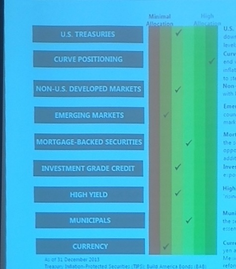

# Not a Designer but I Do Know rCharts ...

<style>
body{
  font-family: 'Oxygen', sans-serif;
  font-size: 15px;
  line-height: 22px;
}

h1,h2,h3,h4 {
  font-family: 'Raleway', sans-serif;
}

.tooltip{
  opacity:1 !important
}
</style>

```{r echo = F, warning=F, error=F, message=F}
require(knitr)
opts_chunk$set(warning=F, error=F, message=F, fig.width = 10, fig.height = 6, results='asis', cache = F, tidy = F)
options(rcharts.mode="inline")
```

Yesterday I saw this chart (<strong>these are not my views</strong>) in a presentation by an undisclosed fixed income shop (unless they tell me they want me to disclose their identity).  Likely due to my immersion in `d3` and `rCharts` I paid no attention to the content and my mind went immediately to<br>

<blockquote>
Could this be better designed?    
</blockquote>

... and soon after ...

<blockquote>
Could I do it with <code>rCharts</code> and <code>dimplejs</code>?    
</blockquote>

<em style="font-size:10px;">source: not me</em>

---
### Little Data <- Manual Input
Since the data is a summary view, manually inputting it into a `data.frame` is really easy.  We'll name it `views` and express our view with a scale 1 (don't like) to 6 (really like).

```{r}
require(rCharts)

options(stringsAsFactors=F)

views <- data.frame(
  Asset = c(
    "U.S. Treasuries"
    ,"Curve Positions"
    ,"Non US Developed"
    ,"Emerging Markets"
    ,"Mortgage-Backed Securities"
    ,"Investment Grade Credit"
    ,"High Yield"
    ,"Municipals"
    ,"Currency"
  ),
  View = c(
    3
    ,6
    ,3
    ,2
    ,4
    ,3
    ,3
    ,4
    ,2
  )
)
```

---
### And the Iteration Begins
The beauty of rCharts is that we do not have to break our workflow as we explore and iterate.  Often the hardest part of iteration is finding a starting point when we are staring at a blank page or canvas.  I overcome this by just doing something and expecting it to be bad.

```{r}
dP <- dPlot(
  Asset ~ View,
  data = views,
  type = "bar",
  height = 600,
  width = 600,
  bounds = list( x= 240, y = 50 , width = 360, height = 500)
)
dP$xAxis( type = "addMeasureAxis" )
dP$yAxis( type = "addCategoryAxis" )
dP$show(chartId = "example1")
```

<div id = "example1"></div>

---
### Add Some Color
Some color might help.  `dimplejs` makes a color scale easy.  Although there is `colorbrewer.js`, we can avoid a js dependency and plug in `RColorBrewer` colors from `R`.  With a couple lines of new code we can get a heat map type color scheme with red, yellow, and green.  Sorry to the color blind readers, but I thought I would try to match the color scheme from the original.

```{r}
#need some color
dP$colorAxis(
  type = "addColorAxis",
  colorSeries = "View",
  palette = RColorBrewer::brewer.pal(n=5,"RdYlGn") 
)
dP$show(chartId = "example2")
```

<div id = "example2"></div>

---
### Dimple Calls This a Block Matrix
This `dimplejs` [block matrix example](http://dimplejs.org/examples_viewer.html?id=bars_matrix) might be a better option than a traditional bar chart.  Block matrix charts have two categorical or discrete axes.  Let's make our `xAxis` categorical.

```{r}
#probably need x to be Category Axis
dP$xAxis( type = "addCategoryAxis" )
dP$show(chartId = "example3")
```

<div id = "example3"></div>

---
### Where are 1 and 5?
Now that our `xAxis` is categorical, we lost 1 and 5 since we don't have this view on any of the opportunities.  As of now, I do not think `dimplejs` allows us to manually specify a domain for our categorical axes, but we can fool `dimplejs` by providing a dummy 1 and 5 then deleting it with javascript.

```{r}
#but what about views without an asset
#in this case 1 and 5
#dimple does not allow easy way of specifying explicit
#categorical domain for axis scale
#we will fool it and then remove
dP$params$data = rbind(
  views,
  data.frame(
    Asset = rep("Currency",2),
    View = c(1,5)
  )
)
#now for the manual removal of the byproduct of fooling dimple
dP$setTemplate(
  afterScript = "
<script>
  d3.select('#example4').selectAll('#All_1_Currency_,#All_5_Currency_').remove()
</script>
  "
)
dP$show(chartId = "example4")
```

```{r echo=F}
cat(dP$templates$afterScript)
```

<div id = "example4"></div>


---
### Sort It Out
I did not make the original chart, but I will assume that the ordering of the opportunity set (`yAxis`) was intentional.  `dimplejs` will assume natural sort order or alphabetical for text, but we can manually specify our sort order with a different variable or by providing an array.  The `data.frame` is in the correct order so let's give `dimplejs` that with the following code.

```{r}
#now our y Axis gets sorted in a way we might not like
dP$yAxis(
  orderRule = rev(views$Asset)
)
dP$show(chartId = "example5")
```

```{r echo=F}
dP$setTemplate(
  afterScript = "
<script>
  d3.select('#example5').selectAll('#All_1_Currency_,#All_5_Currency_').remove()
</script>
  "
)
cat(dP$templates$afterScript)
```

<div id = "example5></div>


---

### Colored Labels
Not sure if this helps viewers understand our chart or not, but colored labels for the `xAxis` might get style points.  A little `d3.js` can help us make the change.

```{r}
#one last bit of cleanup
#label the axes as in the original
dP$setTemplate(
  afterScript = "
<script>
  //get rid of dummy data
  d3.select('#example6').selectAll('#All_1_Currency_,#All_5_Currency_').remove()
  //get rid of text labels on x axis
  d3.select('#example6').select('.axis:nth-child(2)').selectAll('.tick text').remove()
  //label with text from original
  d3.select('#example6').select('.axis:nth-child(2)').select('.tick').append('text')
    .text('Minimum Allocation')
    .attr('dy','1.5em')
    .style('fill',myChart.axes[0].colors[0])
  d3.select('#example6').select('.axis:nth-child(2)').select('.tick:last-of-type').append('text')
    .text('Maximum Allocation')
    .attr('text-anchor','end')
    .attr('dy','1.5em')
    .style('fill',myChart.axes[0].colors[4])
</script>
  "
)
dP$show(chartId = "example6")
```

```{r echo=F}
cat(dP$templates$afterScript)
```

<div id = "example6></div>

---

### Can Sort Help Convey?
Here is where some formal training might help, but I wanted to see if a different sort order might help.  Let's sort and in effect group opportunities by our view.

```{r}
#but if we want to sort our y Axis by view
#could do this
dP$yAxis(
  orderRule = views$Asset[order(views$View,decreasing=T)]
)
dP$show(chartId = "example7")
```

```{r echo=F}
cat(gsub(x=dP$templates$afterScript,pattern="example6",replacement="example7"))
```

<div id = "example7"></div>

---

### Spread the Font Love
This is hard to show before and after, but I thought it would be nice to use the same fonts from html in our `dimplejs` charts.  `dimplejs` allows full custom formatting with [`noFormats`](https://github.com/PMSI-AlignAlytics/dimple/wiki/dimple.chart#noFormats), but I just want to change the font.  Let's use a little `d3.js` to change the font for our `svg text`.

```{r eval = F}
<script>
  d3.selectAll('svg text').style("font-family",d3.select("body").style("font-family"))
</script>
```

<script>
  d3.selectAll('svg text').style("font-family",d3.select("body").style("font-family"))
</script>

---

### More to Do

I still have many things I want to try to improve this chart and its interactivity, but we'll stop here.  If anybody really wants a part 2, please let me know.

---

### Thanks
As I hope you can tell, this post was more a function of the efforts of others than of my own.

Thanks specifically:
- [Ramnath Vaidyanathan](http://ramnathv.github.io/) for [rCharts](http://rcharts.io/site) and [slidify](http://slidify.org).
- [John Kiernander](https://twitter.com/jkiernander) for [dimplejs](http://dimplejs.org)
- Nameless Fixed Income Shop for the original chart.
- [Mike Bostock](http://bost.ocks.org/mike/) for everything.
- Google fonts [Raleway](http://www.google.com/fonts/specimen/Raleway) and [Oxygen](http://www.google.com/fonts/specimen/Oxygen)
